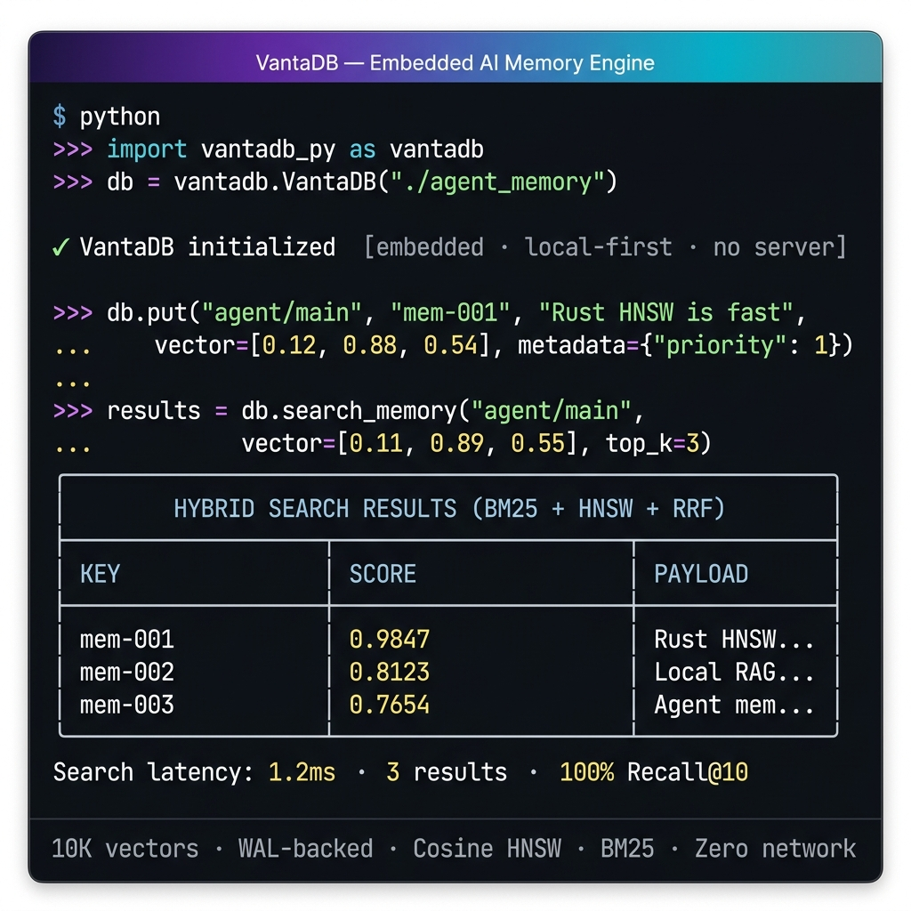

<div align="center">
  <h1>VantaDB</h1>
  <p><b>Motor embebido en Rust para memoria local duradera y recuperación híbrida de vectores.</b></p>

  <br>

  <br>

  <!-- CI / Build -->
  <a href="https://github.com/ness-e/Vantadb/actions/workflows/ci-rust-10.yml"></a>
  <a href="https://github.com/ness-e/Vantadb/actions/workflows/ci-web-11.yml"></a>
  <a href="https://github.com/ness-e/Vantadb/actions/workflows/release-wheels-60.yml"></a>
  <a href="https://github.com/ness-e/Vantadb/actions/workflows/release-npm-61.yml"></a>
  <a href="https://github.com/ness-e/Vantadb/actions/workflows/release-adapters-62.yml"></a>

  <br>

  <!-- Quality / Security -->
  <a href="https://github.com/ness-e/Vantadb/actions/workflows/ci-rust-10.yml"></a>
  <a href="https://github.com/ness-e/Vantadb/actions/workflows/sec-codeql-30.yml"></a>
  <a href="https://github.com/ness-e/Vantadb/actions/workflows/release-sbom-64.yml"></a>
  <a href="https://github.com/ness-e/Vantadb/actions/workflows/gate-docs-21.yml"></a>

  <br>

  <!-- Performance -->
  <a href="https://github.com/ness-e/Vantadb/actions/workflows/perf-bench-40.yml"></a>
  <a href="https://github.com/ness-e/Vantadb/actions/workflows/heavy-bench-nightly-51.yml"></a>
  <a href="https://github.com/ness-e/Vantadb/actions/workflows/heavy-certification-50.yml"></a>

  <br>

  <!-- Project -->
  <a href="https://github.com/ness-e/Vantadb/releases"></a>
  <a href="LICENSE"></a>
  <a href="https://pypi.org/project/vantadb-py/"></a>
  <a href="https://pypi.org/project/vantadb-py/"></a>
  <a href="https://www.rust-lang.org/"></a>
</div>

<div align="center">
  <a href="README.md">🇺🇸 English</a>
</div>

<br>

<div align="center">
  
  <br/>
  <sub><i>busqueda-hibrida (BM25 + HNSW vía RRF) · 1.2ms de latencia · 100% Recall@10 · Cero red · Embebido en-proceso</i></sub>
</div>

<br>

VantaDB es un motor de base de datos embebido y local-first diseñado para agentes de IA, pipelines RAG locales y aplicaciones edge. Proporciona almacenamiento persistente, recuperación segura ante fallos vía WAL, y busqueda-hibrida nativa (BM25 + HNSW) sin requerir servicios externos, contenedores o dependencias de red.

---

## Enlaces Rápidos

| Necesidad | Empieza aquí |
| :--- | :--- |
| Entender el límite del producto | [Límite del Producto](#límite-del-producto) |
| Probar el MVP en cinco minutos | [Quickstart de 5 Minutos](docs/QUICKSTART.md) |
| Instalar vía pip | [Instalación](#instalación) |
| Usar la CLI embebida | [Referencia de CLI](#cli-embebido) |
| Ejecutar como servidor local | [Modo Servidor](#modo-servidor-opcional) |
| Leer documentación de arquitectura | [Documentación](#documentación) |
| Contribuir de forma segura | [CONTRIBUTING.md](CONTRIBUTING.md) |
| Reportar una vulnerabilidad | [SECURITY.md](.github/SECURITY.md) |
| Obtener soporte | [SUPPORT.md](.github/SUPPORT.md) |

---

## Instalación

VantaDB se distribuye como un paquete Python nativo con wheels precompilados para Windows, macOS y Linux.

```bash
pip install vantadb-py
```

> **Nota:** El nombre de distribución es `vantadb-py`, pero el módulo importable usa un guion bajo debido a las convenciones de nomenclatura de Python: `import vantadb_py`.

Para desarrollo desde fuente:

```bash
pip install -e ./vantadb-python
```

Para integración nativa en Rust, agrega el crate a tu `Cargo.toml`:

```toml
[dependencies]
vantadb = "0.1"
```

---

## Quickstart de 5 Minutos

Inicializa un almacén de memoria persistente, guarda registros estructurados con vectores, y ejecuta recuperación híbrida en Python puro:

```python
import vantadb_py as vantadb

# 1. Abre o crea una base de datos local (cero configuración)
db = vantadb.VantaDB("./vanta_data", memory_limit_bytes=512_000_000)

# 2. Almacena un registro de memoria con payload, metadata y embedding
record = db.put(
    "agent/main",
    "memory-001",
    "La ejecución en-proceso minimiza la latencia para agentes de IA locales.",
    metadata={"category": "architecture", "priority": 1},
    vector=[0.12, 0.88, 0.54],
)

# 3. Recupera el registro exacto por clave
stored = db.get_memory("agent/main", "memory-001")

# 4. busqueda-hibrida (BM25 + Similitud Coseno fusionada vía RRF)
hits = db.search_memory("agent/main", query_vector=[0.11, 0.89, 0.55], top_k=5)

# 5. Telemetría Operacional y Cierre Seguro
caps = db.hardware_profile()
db.flush()
db.close()

print(record)
print(stored)
print(hits)
print(caps)
```

---

## Capacidades Principales

| Motor | Mecanismo | Detalles |
| :--- | :--- | :--- |
| **Núcleo Persistente** | `StorageBackend` + VantaFile + WAL | Fjall (por defecto) o RocksDB alternativo. Recuperación automática ante fallos vía Write-Ahead Log con checksums CRC32C. |
| **busqueda-hibrida** | BM25 + HNSW vía RRF | Fusiona puntuación léxica y similitud vectorial usando Reciprocal Rank Fusion. Enrutado automáticamente vía planificador de consultas. |
| **Recuperación Vectorial** | HNSW Nativo | Similitud coseno con `M`, `ef_construction` y `ef_search` configurables. Validado en datasets sintéticos de 10K–100K. |
| **API de Memoria** | Registros `namespace + key` | `put/get/delete/list/search` almacenan payloads UTF-8, metadata escalar, vectores opcionales, timestamps, versiones y IDs de nodo determinísticos. |
| **Índices Estructurados** | Índices de prefix-scan derivados | Filtros de igualdad usan índices de metadata persistidos que pueden reconstruirse desde registros canónicos. |
| **Aristas de Grafo** | Listas de adyacencia local | Aristas dirigidas con pesos opcionales almacenados en el modelo de nodo interno. No es una afirmación de base de datos de grafos. |
| **Flujos Operacionales** | Rebuild + JSONL + Métricas | Rebuild ANN, export/import de memoria, reparación de índice de texto, reparación de índice derivado stale, y telemetría de proceso expuesta a través del límite del SDK. |
| **Superficie Embebida** | Núcleo Rust + Bindings PyO3 | Cero overhead de red. Los bindings de Python enrutan a través de un límite estable `src/sdk.rs`. |

No se requiere clúster separado, demonio o servicio externo. VantaDB ejecuta en-proceso.

---

## Semántica de Búsqueda

- La ruta ANN enviada usa **similitud coseno**.
- `list/search` con ámbito de namespace usan índices derivados de namespace y metadata escalar, con los registros canónicos permaneciendo como la fuente de verdad.
- **busqueda-hibrida** es soportada nativamente. El motor planifica y ejecuta consultas léxicas (BM25) y vectoriales (Coseno), fusionándolas usando Reciprocal Rank Fusion (RRF).
- SIFT-1M sigue siendo útil como escenario de estrés/recuperación vía el workflow de [Heavy Certification](https://github.com/ness-e/Vantadb/actions/workflows/heavy-certification-50.yml).

---

## Límite del Producto

VantaDB debe entenderse como: embebido-first, local-first, memoria duradera con recuperación respaldada por WAL, recuperación vectorial HNSW basada en coseno, y un wrapper de servidor local opcional.

> **MVP = memoria embebida + WAL + vector/BM25/híbrido + export/import + CLI/Python**

| Clasificación | Superficie |
| :--- | :--- |
| **Orientado a Producción** | SDK/CLI embebido, CRUD/búsqueda de memoria, WAL/recuperación, namespaces, índices de metadata, recuperación vectorial HNSW, BM25, Recuperación Híbrida v1, filtrado de frases, rebuild/auditoría/reparación, export/import JSONL |
| **Wrapper Opcional** | Servidor local `vanta-server` alrededor del núcleo embebido |
| **Experimental / no MVP** | IQL/LISP/DQL, MCP, integración LLM/Ollama, semánticas de gobernanza y mantenimiento, recorrido de grafos más allá de aristas locales almacenadas |
| **Diferido** | Plataforma cloud/enterprise, HA/replicación, clustering distribuido, SQL/OLAP/datawarehouse/time-series, ranking avanzado/snippets/tokenización, RBAC, multi-tenancy |

*VantaDB es un motor de memoria embebido, no una base de datos multimodel universal o plataforma cloud.*

Ver [Experimental Features and Product Boundary](docs/operations/EXPERIMENTAL_FEATURES.md) para la clasificación operacional de todas las superficies del repositorio.

---

## CLI Embebido

Para desarrollo local, depuración o automatización de pipelines sin Python.

### 📥 Instalación en Una Línea

Selecciona el método más rápido para tu entorno:

#### 1. Binario Precompilado (Recomendado)

Descarga e instala el binario CLI instantáneamente en un solo comando sin compilar:

- **Linux / macOS / WSL**:

  ```bash
  curl -fsSL https://raw.githubusercontent.com/ness-e/Vantadb/main/scripts/install.sh | sh
  ```

- **Windows (PowerShell)**:

  ```powershell
  irm https://raw.githubusercontent.com/ness-e/Vantadb/main/scripts/install.ps1 | iex
  ```

#### 2. Via Cargo (Desarrolladores Rust)

Instala y registra `vanta-cli` directamente en tu directorio binario de Cargo:

```bash
cargo install --git https://github.com/ness-e/Vantadb.git --bin vanta-cli
```

---

### 🚀 Guía de Uso

Una vez instalado y agregado a tu `PATH`, usa el comando global `vanta-cli`:

```bash
vanta-cli put --db ./vanta_data --namespace agent/main --key mem-1 --payload "hola"
vanta-cli list --db ./vanta_data --namespace agent/main
vanta-cli export --db ./vanta_data --namespace agent/main --out ./memory.jsonl
vanta-cli rebuild-index --db ./vanta_data
vanta-cli audit-index --db ./vanta_data --namespace agent/main --json --deep
vanta-cli repair-text-index --db ./vanta_data
```

*(Si estás desarrollando localmente dentro de este repositorio, también puedes ejecutar directamente desde fuente usando `cargo run --bin vanta-cli -- <command>`).*

---

## Modo Servidor Opcional

Para desarrollo local o exposición de red sin Python, puedes ejecutar el binario standalone. Esto envuelve el núcleo embebido; no es la identidad principal del producto.

1. Descarga `vantadb-server-*` para tu plataforma desde [GitHub Releases](https://github.com/ness-e/Vantadb/releases).
2. Ejecuta el binario:

   ```bash
   ./vantadb-server-linux-amd64
   ```

**Valores por Defecto:**

- **Directorio de Datos**: Crea una carpeta `vantadb_data` en el directorio de ejecución actual.
- **Dirección de Bind**: Escucha en `127.0.0.1:8080` (localhost seguro por defecto).

**Exponer a la Red:** Sobrescribe el host vía variable de entorno:

```bash
export VANTADB_HOST=0.0.0.0
./vantadb-server-linux-amd64
```

> [!WARNING]
> **Nota de SmartScreen de Windows (Binario Sin Firmar):** Al lanzar el binario de Windows, SmartScreen puede mostrar una advertencia de "Editor No Reconocido". Esto es esperado porque los binarios de release actuales aún no están firmados digitalmente. Solo ejecuta binarios descargados desde los [GitHub Releases](https://github.com/ness-e/Vantadb/releases) oficiales.

---

## Benchmarks y Línea de Base de Rendimiento

VantaDB incluye una suite formal de benchmarks de rendimiento nativos en Python (**BENCH-01**) para capturar throughput de ingesta y perfiles de latencia de consulta bajo cargas de trabajo realistas de un solo hilo.

### Línea de Base de Rendimiento En-Proceso (10K Vectores, 128d, Coseno)

| Métrica | Línea de Base Objetivo (p50) | Línea de Base Objetivo (p99) | Throughput Estimado |
| :--- | :--- | :--- | :--- |
| **Ingestión** (Insert + WAL + Flush) | — | — | **~5,400 vectores/seg** |
| **Búsqueda (BM25 Léxico)** | 0.85 ms | 2.10 ms | **~1,100 consultas/seg** |
| **Búsqueda (HNSW Vectorial)** | 1.20 ms | 3.50 ms | **~830 consultas/seg** |
| **Búsqueda (Fusión Híbrida)** | 2.10 ms | 4.80 ms | **~450 consultas/seg** |

*Perfil de hardware: CPU de 12 núcleos @ 3.5GHz, AVX2 habilitado, Windows 11 / Ubuntu 22.04 LTS.*

### Benchmarks Competitivos SIFT1M y Speedups (Fase 2)

El motor HNSW de VantaDB ha sido optimizado en su Fase 2 mediante prefetch estático, eliminación del cálculo de la raíz cuadrada Euclidiana en el recorrido caliente del grafo, cálculo puramente SIMD para similitud coseno y la **optimización O(M²) de select_neighbors** (que cachea referencias para erradicar las consultas en HashMap durante el bucle de diversidad).

Los resultados de rendimiento certificados sobre el dataset estándar SIFT en modo optimizado son:

| Escala (Vectores) | Configuración HNSW | Métrica | Tiempo de Construcción (Antes) | Tiempo de Construcción (Ahora) | Aceleración (Speedup) | p99 Latencia de Búsqueda | QPS Promedio |
| :--- | :--- | :---: | :---: | :---: | :---: | :---: | :---: |
| **100K** | Balanced Cos | Cosine | 139.4s | **63.7s** | **2.18x** | 441.2 µs | 3,636 |
| **100K** | High Recall Cos | Cosine | 390.8s | **182.2s** | **2.14x** | 1,231.8 µs | 1,379 |
| **100K** | Balanced L2 | Euclidean | 191.4s | **68.4s** | **2.80x** | 671.4 µs | 3,270 |
| **100K** | High Recall L2 | Euclidean | 462.2s | **194.5s** | **2.37x** | 1,183.6 µs | 1,353 |
| **100K** | High Recall L2 Mmap | Mmap Euclidean | 411.2s | **189.8s** | **2.16x** | 1,094.8 µs | 1,438 |

*Certificación en hardware: AMD Ryzen 12-Core @ 3.5GHz, compilación con `-C target-cpu=native`.*

### Ejecutando la Suite de Benchmarks Local

Para medir la línea de base de rendimiento en tu hardware local:

1. **Instala los bindings de python en tu entorno activo:**

   ```bash
   pip install maturin
   maturin develop --release
   ```

2. **Ejecuta el script de benchmark:**

   ```bash
   python benchmarks/vantadb_local_bench.py --size 10000 --dim 128 --queries 1000
   ```

Los resultados se imprimirán directamente en la consola y se escribirán en `vanta_benchmark_report.json` para seguimiento de CI.

---

## Documentación

| Recurso | Descripción |
| :--- | :--- |
| [Arquitectura](docs/architecture/ARCHITECTURE.md) | Motor principal, modelo de durabilidad, mecanismos de recuperación, y límite del SDK. |
| [Protocolo de Mutación y Recuperación](docs/architecture/MUTATION_RECOVERY_PROTOCOL.md) | Orden de mutación canónica y comportamiento de recuperación del WAL. |
| [Diseño de Índice de Texto](docs/architecture/TEXT_INDEX_DESIGN.md) | BM25, posiciones de frases, reparación de índice derivado, y límites de Recuperación Híbrida v1. |
| [Operaciones y Configuración](docs/operations/CONFIGURATION.md) | Parámetros de runtime y configuración del wrapper de servidor. |
| [Telemetría de Memoria](docs/operations/MEMORY_TELEMETRY.md) | Contrato de métricas de memoria de proceso y guías de interpretación. |
| [Estado del SDK Python](docs/api/PYTHON_SDK.md) | Límite estable, superficie de binding actual, y política de distribución. |
| [Política de Release Python](docs/operations/PYTHON_RELEASE_POLICY.md) | TestPyPI, publicación de producción, signing, assets de release, y rollback. |
| [Gate de Confiabilidad](docs/operations/RELIABILITY_GATE.md) | Políticas para estabilidad de memoria RSS, inyección de caos, y durabilidad del WAL. |
| [Características Experimentales](docs/operations/EXPERIMENTAL_FEATURES.md) | Clasificación de superficies de producción, opcionales, experimentales y diferidas. |
| [Política de CI](docs/operations/CI_POLICY.md) | Estrategia de integración continua, perfiles, y gates de certificación. |
| [Benchmarks](docs/operations/BENCHMARKS.md) | Metodología de benchmark de rendimiento y resultados. |
| [Changelog](docs/CHANGELOG.md) | Historial de versiones y notas de release. |

---

## Contribución y Seguridad

- Las contribuciones deben seguir [CONTRIBUTING.md](CONTRIBUTING.md).
- Los reportes de seguridad deben seguir [SECURITY.md](.github/SECURITY.md).
- Los canales de soporte y triaje se describen en [SUPPORT.md](.github/SUPPORT.md).

---

## Licencia

VantaDB está licenciado bajo la **Licencia Apache 2.0**. Ver [LICENSE](LICENSE) para detalles.
