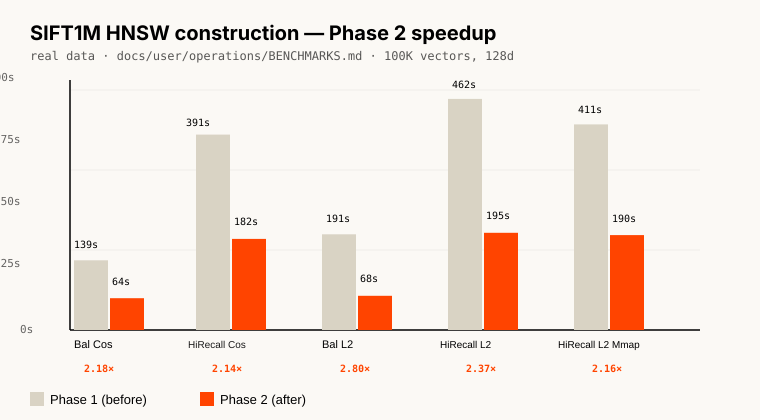

<div align="center">
  
</div>

<br>

<div align="left">
  <a href="https://github.com/ness-e/Vantadb/actions/workflows/ci-rust-10.yml"></a>
  <a href="https://github.com/ness-e/Vantadb/actions/workflows/gate-docs-21.yml"></a>
  <a href="https://github.com/ness-e/Vantadb/actions/workflows/sec-codeql-30.yml"></a>

  <br>

  <a href="https://github.com/ness-e/Vantadb/releases"></a>
  <a href="https://pypi.org/project/vantadb-py/"></a>
  <a href="https://www.npmjs.com/package/vantadb"></a>

  <br>

  <a href="https://pypi.org/project/vantadb-py/"></a>
  <a href="https://www.rust-lang.org/"></a>
  <a href="LICENSE"></a>

  <br>

  <a href="https://discord.gg/g8nqB3NtXt"></a>
  <a href="https://colab.research.google.com/github/ness-e/Vantadb/blob/main/examples/colab/vantadb_quickstart.ipynb"></a>
</div>

<div align="center">
  <a href="README.md">🇺🇸 English</a>
</div>

VantaDB es un motor de base de datos embebido, local-first, diseñado para agentes de IA, pipelines locales de RAG y aplicaciones edge. Proporciona almacenamiento persistente, recuperación resistente a fallos vía WAL y búsqueda híbrida nativa (BM25 + HNSW) sin necesidad de servicios externos, contenedores o dependencias de red.

---

## Enlaces rápidos

| Necesidad | Empieza aquí |
| :--- | :--- |
| Comprender el límite del producto | [Límite del producto](#límite-del-producto) |
| Probar el MVP en cinco minutos | [Quickstart de 5 minutos](docs/QUICKSTART.md) |
| Instalar vía pip | [Instalación](#instalación) |
| Usar la CLI embebida | [Referencia de CLI](#cli-embebida) |
| Ejecutar como servidor local | [Modo servidor](#modo-servidor-opcional) |
| Seguir un tutorial | [Tutoriales](docs/tutorials/) |
| Leer las FAQ | [FAQ](docs/FAQ.md) |
| Leer el blog | [Entradas del blog](docs/blog/) |
| Leer la documentación de arquitectura | [Documentación](#documentación) |
| Contribuir de forma segura | [CONTRIBUTING.md](CONTRIBUTING.md) |
| Reportar una vulnerabilidad | [SECURITY.md](SECURITY.md) |
| Obtener soporte | [SUPPORT.md](SUPPORT.md) |

---

## Instalación

VantaDB se distribuye como un paquete nativo de Python con wheels precompilados para Windows, macOS y Linux.

```bash
pip install vantadb-py
```

> **Nota:** El nombre de distribución es `vantadb-py`, y el import canónico es
> `import vantadb` (igual que el crate de Rust y el paquete de npm). `import vantadb_py`
> sigue disponible sin cambios.
>
> **Convención de nombres:** el producto es **VantaDB**; el crate de Rust es `vantadb`,
> el paquete de PyPI es `vantadb-py`, los paquetes de npm son `vantadb` (TypeScript/WASM)
> y `vantadb-node` (nativo), y el repositorio de GitHub es `ness-e/Vantadb`.
> Ver [ADR-030](docs/architecture/adr/ADR-030-brand-identity-naming-convention.md)
> para la auditoría completa y la justificación.

Para desarrollo desde el código fuente:

```bash
pip install -e ./vantadb-python
```

Para integración nativa con Rust, añade el crate a tu `Cargo.toml`:

```toml
[dependencies]
vantadb = { git = "https://github.com/ness-e/Vantadb" }
```

---

## Quickstart en 5 minutos


Inicializa un almacén de memoria persistente, guarda registros estructurados con vectores y ejecuta una búsqueda híbrida en Python puro:

```python
import vantadb

# 1. Abre o crea una base de datos local (cero configuración)
db = vantadb.VantaDB("./vanta_data", memory_limit_bytes=512_000_000)

# 2. Guarda un registro de memoria con payload, metadatos y embedding
record = db.put(
    "agent/main",
    "memory-001",
    "In-process execution minimizes latency for local AI agents.",
    metadata={"category": "architecture", "priority": 1},
    vector=[0.12, 0.88, 0.54],
)

# 3. Recupera el registro exacto por clave
stored = db.get_memory("agent/main", "memory-001")

# 4. Búsqueda híbrida (BM25 + Similitud del Coseno fusionada vía RRF)
hits = db.search_memory("agent/main", query_vector=[0.11, 0.89, 0.55], top_k=5)

# 5. Telemetría operativa y apagado seguro
caps = db.hardware_profile()
db.flush()
db.close()

print(record)
print(stored)
print(hits)
print(caps)
```

---

## Integraciones

VantaDB incluye ejemplos Python ejecutables que conectan el motor embebido con frameworks populares de memoria / RAG para IA. Cada ejemplo define una clase envolvente ligera sobre el SDK Python estable (`vantadb_py`) y se ejercita de extremo a extremo por la suite de ejemplo de humo del CI (`ci-examples-12.yml`).

### Mem0 — backend de persistencia

Usa VantaDB como backend de almacenamiento para las memorias de [Mem0](https://mem0.ai). [`VantaDBMem0Backend`](examples/python/mem0_integration.py) implementa la interfaz de CRUD/búsqueda de memoria (`add`, `get`, `search`, `update`, `delete`, `get_all`, `delete_all`) sobre un almacén híbrido con ámbito de namespace (`mem0/memories`):

```python
backend = VantaDBMem0Backend(namespace="mem0/memories")
backend.add(
    "User prefers dark mode in all applications",
    user_id="user-001",
    metadata={"category": "preference", "priority": "high"},
)
for r in backend.search("dark mode", user_id="user-001"):
    print(f"  Score: {r['score']:.3f}  Content: {r['content']}")
backend.close()
```

### Semantic Kernel — interfaz de memoria

Usa la recuperación híbrida de VantaDB para la superficie de memoria / contexto del **Microsoft Semantic Kernel**. [`VantaDBSemanticMemory`](examples/python/semantic_kernel_memory.py) expone las operaciones de almacén (`add`, `get`, `search`, `remove`) que usa un entorno aumentado por IA, todo respaldado por un motor embebido sin red:

```python
memory = VantaDBSemanticMemory(collection_name="demo-app")
memory.save_information(
    "User prefers concise technical answers with code examples",
    metadata={"category": "preference", "priority": "high"},
)
for r in memory.retrieve("Semantic Kernel", limit=5):
    print(f"  Relevance: {r['relevance']:.3f}  Text: {r['text'][:80]}...")
memory.close()
```

### DSPy — recuperador

Usa VantaDB como recuperador para los pipelines de [DSPy](https://github.com/stanfordnlp/dspy). [`VantaDBRetriever`](examples/python/dspy_retriever.py) implementa la interfaz recuperadora invocable (`__call__`) para encajar directamente en los pipelines de DSPy, respaldada por búsqueda híbrida de vectores + texto sobre `dspy/documents`:

```python
retriever = VantaDBRetriever(namespace="dspy/documents", k=3)
retriever.add([
    {"id": "doc-001", "text": "VantaDB is an embedded persistent memory and vector retrieval engine for local-first AI applications."},
    {"id": "doc-002", "text": "DSPy is a framework for algorithmically optimizing LM prompts and weights."},
])
for doc in retriever("vector database"):
    print(f"  Score: {doc['score']:.3f}  Text: {doc['text'][:80]}...")
retriever.close()
```

Ejecuta cualquiera de los ejemplos directamente (reflejan los comandos smoke del CI):

```bash
python examples/python/mem0_integration.py
python examples/python/semantic_kernel_memory.py
python examples/python/dspy_retriever.py
```

---

## Capacidades centrales

| Motor | Mecanismo | Detalles |
| :--- | :--- | :--- |
| **Núcleo persistente** | `StorageBackend` + VantaFile + WAL | Fjall (por defecto) o fallback a RocksDB. Recuperación automática de fallos mediante Write-Ahead Log con checksums CRC32C. |
| **Búsqueda híbrida** | BM25 + HNSW vía RRF | Fusiona la puntuación léxica y la similitud de vectores usando Reciprocal Rank Fusion. Se enruta automáticamente por el planificador de consultas. |
| **Recuperación vectorial** | HNSW nativo | Similitud del coseno con `M`, `ef_construction` y `ef_search` configurables. Validado en datasets sintéticos de 10 K–100 K. |
| **API de memoria** | Registros `namespace + key` | `put/get/delete/list/search` almacenan payloads UTF-8, metadatos escalares, vectores opcionales, marcas de tiempo, versiones e IDs de nodo deterministas. |
| **Índices estructurados** | Índices derivados por prefijo | Los filtros de igualdad usan índices de metadatos persistidos que pueden reconstruirse desde los registros canónicos. |
| **Aristas de grafo** | Listas de adyacencia locales | Aristas dirigidas con pesos opcionales almacenadas en el modelo de nodo interno. No pretende ser una base de datos de grafos. |
| **Flujos operativos** | Rebuild + JSONL + Métricas | Rebuild de ANN, export/import de memoria, reparación de índice de texto, reparación de índice derivado obsoleto y telemetría de proceso expuesta a través del límite del SDK. |
| **Superficie embebida** | Núcleo en Rust + Bindings PyO3 | Overhead de red cero. Los bindings de Python pasan por un límite estable `src/sdk.rs`. |

No se requiere clúster, daemon ni servicio externo. VantaDB se ejecuta en-proceso.

---

## Semántica de búsqueda

- El camino de ANN incluido usa **similitud de coseno**.
- `list/search` con ámbito de namespace usan índices derivados de namespace y metadatos escalares, y los registros canónicos siguen siendo la fuente de verdad.
- La **búsqueda híbrida** se soporta de forma nativa. El motor planifica y ejecuta consultas léxicas (BM25) y vectoriales (Coseno), fusionándolas con Reciprocal Rank Fusion (RRF).
- SIFT-1M sigue siendo útil como un escenario de estrés/recuperación mediante el workflow de [Certificación Pesada](https://github.com/ness-e/Vantadb/actions/workflows/heavy-certification-50.yml).

---

## Límite del producto

Debe entenderse VantaDB como: memoria durable, embedded-first, local-first, con recuperación basada en WAL, recuperación vectorial HNSW basada en coseno y un envoltorio opcional de servidor local.

> **MVP = memoria embebida + WAL + recuperación de vectores/BM25/híbrida + export/import + CLI/Python**

| Clasificación | Superficie |
| :--- | :--- |
| **Producción** | SDK/CLI embebido, CRUD/búsqueda de memoria, WAL/recuperación, namespaces, índices de metadatos, recuperación de vectores HNSW, BM25, Recuperación híbrida v1, filtrado de frases, rebuild/audit/repair, export/import JSONL |
| **Envoltorio opcional** | Binario local `vantadb-server` alrededor del núcleo embebido |
| **Nuevo** | Servidor MCP para agentes de IA ([guía de configuración](docs/api/MCP.md)) |
| **Experimental / no es MVP** | IQL/LISP/DQL, integración con LLM/Ollama, semánticas de gobierno y mantenimiento, recorrido de grafos más allá de las aristas locales almacenadas |
| **Diferido** | Plataforma en la nube/empresa, HA/replicación, clúster distribuido, serie SQL/OLTP/warehouse/time, ranking avanzado/snippets/tokenization, RBAC, multi-tenencia |

*VantaDB es un motor de memoria embebido, no una base de datos universal multimodelo ni una plataforma en la nube.*

Consulta [Funcionalidades experimentales y límites del producto](docs/operations/EXPERIMENTAL_FEATURES.md) para la clasificación operativa de todas las superficies del repositorio.

---

## CLI embebida

Para desarrollo local, depuración o automatización de pipelines sin Python.

### 📥 Instalación en una línea

Selecciona el método más rápido según tu entorno:

#### 1. Binario precompilado (recomendado)

Descarga e instala el binario de la CLI al instante en un solo comando, sin compilación:

- **Linux / macOS / WSL**:

  ```bash
  curl -fsSL https://raw.githubusercontent.com/ness-e/Vantadb/main/scripts/install.sh | sh
  ```

- **Windows (PowerShell)**:

  ```powershell
  irm https://raw.githubusercontent.com/ness-e/Vantadb/main/scripts/install.ps1 | iex
  ```

> [!NOTE]
> Fuente vigente: `README.md` § One-Line Installation y `docs/QUICKSTART.md` §0
> (one-liner FIND-105 + verificación `.sha256` + wizard `--no-wizard`/`-NoWizard`
> + `--dry-run`/`-DryRun`). Si este bloque difiere, manda la fuente.

#### 2. Vía Cargo (desarrolladores Rust)

Instala y registra `vanta-cli` directamente en tu directorio binario de Cargo:

```bash
cargo install --git https://github.com/ness-e/Vantadb.git --bin vanta-cli
```

> [!NOTE]
> Los binarios precompilados de [GitHub Releases](https://github.com/ness-e/Vantadb/releases) (y los scripts de instalación de arriba) ya incluyen la feature del servidor HTTP. Si instalas desde fuente con `cargo install` y necesitas `vanta-cli server --http`, actívala explícitamente:
>
> ```bash
> cargo install --git https://github.com/ness-e/Vantadb.git --bin vanta-cli --features server
> ```

---

### 🚀 Guía de uso

Una vez instalado y añadido a tu `PATH`, puedes usar el comando global `vanta-cli`:

```bash
vanta-cli put --db ./vanta_data --namespace agent/main --key mem-1 --payload "hello"
vanta-cli list --db ./vanta_data --namespace agent/main
vanta-cli export --db ./vanta_data --namespace agent/main --out ./memory.jsonl
vanta-cli rebuild-index --db ./vanta_data
vanta-cli audit-index --db ./vanta_data --namespace agent/main --json --deep
vanta-cli repair-text-index --db ./vanta_data
```

*(Si estás desarrollando localmente dentro de este repositorio, también puedes ejecutar directamente con `cargo run --bin vanta-cli -- <comando>`).*

---

## Modo servidor opcional

Para desarrollo local o exposición a la red sin Python, puedes ejecutar el binario independiente. Envuelve el núcleo embebido; no es la identidad principal del producto.

1. Descarga el tarball de tu plataforma desde [GitHub Releases](https://github.com/ness-e/Vantadb/releases) (p. ej. `vantadb-x86_64-unknown-linux-gnu.tar.gz`).
2. Extrae y ejecuta el binario:

   ```bash
   tar xzf vantadb-x86_64-unknown-linux-gnu.tar.gz
   ./vantadb-server
   ```

**Predeterminados:**

- **Directorio de datos**: crea una carpeta `vantadb_data` en el directorio actual de ejecución.
- **Dirección de bind**: escucha en `127.0.0.1:8080` (por defecto, localhost seguro).

**Exponer a la red:** sobrescribe el host mediante la variable de entorno:

```bash
export VANTADB_HOST=0.0.0.0
./vantadb-server
```

> [!WARNING]
> **Nota de Windows SmartScreen (binario sin firmar):** Al lanzar el binario de Windows (`vantadb-server.exe`), SmartScreen puede mostrar una advertencia de "Editor no reconocido". Esto es esperado porque los binarios de lanzamiento actuales aún no están firmados digitalmente. Sólo ejecuta binarios descargados de los [GitHub Releases](https://github.com/ness-e/Vantadb/releases) oficiales.

---

## Benchmarks y línea base de rendimiento

VantaDB incluye una suite formal de benchmarks nativos de Python (**BENCH-01**) para capturar la tasa de ingesta y los perfiles de latencia de consultas bajo cargas de trabajo realistas de un solo hilo.

### Línea base de rendimiento en proceso (10K vectores, 128d, Coseno)

Las líneas base medidas del SDK de un solo hilo (incluido el límite PyO3/GIL) están publicadas en [docs/operations/BENCHMARKS.md](docs/operations/BENCHMARKS.md): latencias de operación del SDK (`put`, BM25, HNSW, híbrido) y los resultados certificados del stress protocol Rust (10K–100K, recall, memoria, escalado). Los números dependen del hardware y del build — regenera localmente con la suite inferior para reproducirlos en tu máquina.

| Métrica | Línea base local más reciente (`vanta_benchmark_report.json`, 10K×128d, regenerar localmente) |
| :--- | :--- |
| **Ingesta** (Insert + WAL + Flush) | 74,0 registros/seg (p50 13,2 ms) |
| **Búsqueda (HNSW vectorial)** | p50 2,0 ms (~500 consultas/seg) |
| **Búsqueda (fusión híbrida)** | p50 3,1 ms (~320 consultas/seg) |

*Fuente: [`benchmarks/vanta_benchmark_report.json`](benchmarks/vanta_benchmark_report.json) — regenerable con `python benchmarks/vantadb_local_bench.py --size 10000 --dim 128 --queries 1000` (gitignored; no es un artefacto commiteado).* La latencia de búsqueda de texto BM25 se excluye arriba porque el artefacto local reporta un outlier degenerado (p50 0,0035 ms para una consulta de texto de documento único); ver la tabla completa de la serie CI en [BENCHMARKS.md §2](docs/operations/BENCHMARKS.md).

### Benchmarks competitivos SIFT-1M (escala 100K) — Fase 2

El motor HNSW de VantaDB se optimizó en la Fase 2 mediante prefetch estático, eliminación del cálculo de raíz cuadrada euclidiana en el recorrido caliente del grafo, cálculo SIMD puro para la similitud del coseno y la **optimización `select_neighbors` O(M²)** (que guarda referencias en caché para eliminar consultas a HashMap durante el bucle de diversidad).

Los resultados de rendimiento certificados en el dataset estándar de SIFT en modo optimizado son:

| Escala (vectores) | Configuración HNSW | Métrica | Tiempo de construcción (Antes) | Tiempo de construcción (Ahora) | Speedup | Latencia de búsqueda p99 | QPS promedio |
| :--- | :--- | :---: | :---: | :---: | :---: | :---: | :---: |
| **100K** | Balanced Cos | Cosine | 139,4 s | **63,7 s** | **2,18×** | 441,2 µs | 3,636 |
| **100K** | High Recall Cos | Cosine | 390,8 s | **182,2 s** | **2,14×** | 1.231,8 µs | 1,379 |
| **100K** | Balanced L2 | Euclidiana | 191,4 s | **68,4 s** | **2,80×** | 671,4 µs | 3,270 |
| **100K** | High Recall L2 | Euclidiana | 462,2 s | **194,5 s** | **2,37×** | 1.183,6 µs | 1,353 |
| **100K** | High Recall L2 Mmap | Euclidiana Mmap | 411,2 s | **189,8 s** | **2,16×** | 1.094,8 µs | 1,438 |

*Hardware de certificación: AMD Ryzen 12-Core @ 3,5 GHz, compilado con `-C target-cpu=native`.*

*Fuente: [docs/operations/BENCHMARKS.md §5](docs/operations/BENCHMARKS.md) — "Impact of Loop and HNSW Distance Optimization (Phase 2)" (2026-07-21). Historial completo de optimización en [docs/benchmarks/docs/BENCHMARK_OPTIMIZATION_2026.md](docs/benchmarks/docs/BENCHMARK_OPTIMIZATION_2026.md).*

<p align="center">
  
</p>

### Ejecutar la suite de benchmarks local

Para medir la línea base de rendimiento en tu hardware local:

1. **Instala los bindings Python en tu entorno activo:**

```bash
pip install maturin
maturin develop --release --manifest-path vantadb-python/Cargo.toml
```

2. **Ejecuta el script de benchmark:**

```bash
python benchmarks/vantadb_local_bench.py --size 10000 --dim 128 --queries 1000
```

Los resultados se imprimen directamente en la consola y se escriben en `vanta_benchmark_report.json` para el seguimiento del CI.

---

## Documentación

| Recurso | Descripción |
| :--- | :--- |
| [Arquitectura](docs/architecture/ARCHITECTURE.md) | Motor central, modelo de durabilidad, mecanismos de recuperación y límites del SDK. |
| [Protocolo de Mutaciones y Recuperación](docs/architecture/MUTATION_RECOVERY_PROTOCOL.md) | Orden canónico de mutaciones y comportamiento de recuperación del WAL. |
| [Diseño del índice de texto](docs/architecture/TEXT_INDEX_DESIGN.md) | BM25, posiciones de frases, reparación del índice derivado y límites de la Recuperación Híbrida v1. |
| [Operaciones y Configuración](docs/operations/CONFIGURATION.md) | Parámetros en tiempo de ejecución y configuración del envoltorio del servidor. |
| [Telemetría de memoria](docs/operations/MEMORY_TELEMETRY.md) | Contrato de métricas de memoria del proceso y guía de interpretación. |
| [Estado del SDK Python](docs/api/PYTHON_SDK.md) | Límite estable, superficie de bindings actual y política de distribución. |
| [Política de release de Python](docs/operations/PYTHON_RELEASE_POLICY.md) | TestPyPI, publicación en producción, firmado, activos de release y rollback. |
| [Puerta de fiabilidad](docs/operations/RELIABILITY_GATE.md) | Políticas de estabilidad de memoria RSS, inyección de caos y durabilidad del WAL. |
| [Funcionalidades experimentales](docs/operations/EXPERIMENTAL_FEATURES.md) | Clasificación de superficie de producción, opcional, experimental y diferida. |
| [Política de CI](docs/operations/CI_POLICY.md) | Estrategia de integración continua, perfiles y puertas de certificación. |
| [Benchmarks](docs/operations/BENCHMARKS.md) | Metodología y resultados del benchmark de rendimiento. |
| [Changelog](docs/CHANGELOG.md) | Historial de versiones y notas de lanzamiento. |
| [Blog: Cómo funciona la búsqueda híbrida](docs/blog/how_hybrid_search_works.md) | Cómo funcionan juntos BM25 + HNSW + RRF en el motor de consultas de VantaDB. |
| [Blog: SQLite para agentes de IA](docs/blog/sqlite_for_ai_agents.md) | Benchmarks y decisiones de arquitectura detrás del almacenamiento LSM de VantaDB. |
| [Blog: Por qué construí VantaDB](docs/blog/why_i_built.md) | La motivación de un motor de memoria local para agentes de IA en Rust. |

---

## Contribución y Seguridad

- Las contribuciones deben seguir [CONTRIBUTING.md](CONTRIBUTING.md).

---

## Licencia

VantaDB se distribuye bajo la **Licencia Apache 2.0**. Consulta [LICENSE](LICENSE) para más detalles.
