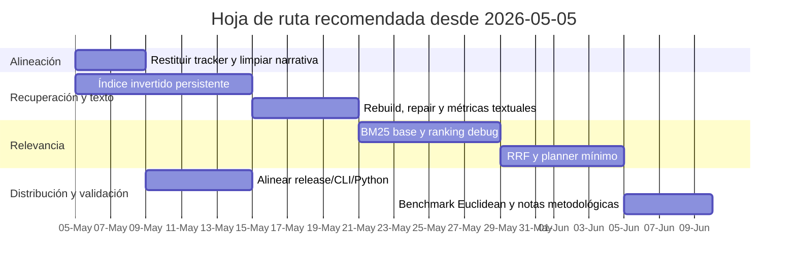

# Auditoría analítica del estado actual de VantaDB

## Resumen ejecutivo

La revisión se basa en el snapshot consolidado `todo.md`, generado el **2026-05-04** sobre la rama `main` y el commit `ae198c7`, además de la documentación, el código, las pruebas y los workflows incluidos en ese snapshot. fileciteturn0file0 fileciteturn2file9

La conclusión central es clara: **VantaDB ya cerró su fase de “primitivas de memoria confiable” y su cuello de botella ya no es persistencia básica, sino relevancia de búsqueda, narrativa de producto y distribución**. El core embebido, la recuperación por WAL, el rebuild manual del índice ANN, los namespaces, el CRUD/search de memoria, la exportación/importación JSONL, los índices derivados reconstruibles y la telemetría operacional ya están implementados y respaldados por pruebas específicas. El siguiente corte técnico real no debería dispersarse: debe concentrarse en **índice invertido persistente**, luego **BM25/RRF**, y recién después en claims de competitividad o expansión de canal de distribución. fileciteturn4file0 fileciteturn13file1 fileciteturn13file2 fileciteturn13file4

Hay una limitación crítica: **no se encontró el archivo `seguimiento de proyecto.csv`** entre los insumos disponibles. Por eso, la comparación contra el tracker solicitado no puede certificarse de forma estricta. Para no inventar datos, usé como **proxy documental** `NEXT_5_TASKS.md`, `REPO_CHECKLIST.md`, `MILESTONE_V0.2.0.md`, `RELIABILITY_GATE.md`, `MEMORY_MVP_BASELINE.md`, plus evidencia en pruebas y workflows. Con ese proxy, el bloque `memory-mvp-core` está esencialmente cerrado, mientras que las tareas abiertas están concentradas en texto/híbrido, benchmark Euclidean serio y distribución. fileciteturn13file0 fileciteturn6file1 fileciteturn13file1

Los dos desajustes más importantes no son de código, sino de **coherencia estratégica**. Primero, el repositorio moderno ya reposicionó el producto como “embedded persistent memory + vector retrieval + structured filters”, pero el changelog histórico de `v0.1.0` todavía conserva wording de “embedded multimodel engine”, que hoy es demasiado amplio frente al boundary real. Segundo, el discurso “embedded-first / CLI-first / source-install Python” no está completamente alineado con el workflow de release, que genera binarios de `vanta-server` para tres sistemas operativos, mientras la distribución de CLI y Python sigue sin un canal equivalente endurecido. Eso erosiona claridad comercial y crea deuda de posicionamiento. fileciteturn11file2 fileciteturn11file4 fileciteturn12file2

Mi diagnóstico ejecutivo es este: **el proyecto está más maduro técnicamente de lo que parece y menos listo para competir de lo que su volumen de pruebas podría sugerir**. Si el siguiente ciclo mantiene foco, VantaDB puede diferenciarse como motor embebido de memoria persistente con recuperación seria. Si dispersa esfuerzos en server, distribución y marketing antes de resolver el gap de texto/híbrido, va a quedar atrapado entre competidores que ya ofrecen hybrid/BM25 o una adopción local mucho más simple. fileciteturn5file4 fileciteturn11file0 citeturn0search8turn1search4turn0search18turn1search11

## Alcance real y completitud actual

El alcance actual del proyecto está bastante bien delimitado en la arquitectura y el README: **motor embebido de memoria persistente**, recuperación vía WAL, recuperación/reconstrucción de HNSW desde estado canónico, búsqueda vectorial HNSW con similitud coseno, metadata estructurada, server wrapper opcional y boundary estable del SDK en `src/sdk.rs`. Lo que **no** forma parte del producto embarcado hoy es igualmente explícito: BM25, RRF, hybrid lexical real, posicionamiento enterprise/managed cloud y distribución Python endurecida. Esa honestidad técnica es un activo importante y, de hecho, es de las partes mejor resueltas del repo. fileciteturn4file0 fileciteturn11file2 fileciteturn5file4

El bloque `memory-mvp-core` está documentado como implementado con superficie clara en Rust, Python y CLI. El baseline enumera `put/get/delete/list/search/list_namespaces`, `rebuild_index`, `export_namespace`, `export_all`, `import_records/import_file`, más índices derivados persistidos y reconstruibles desde registros canónicos. La propia suite de validación incluye `memory_api`, `memory_export_import`, `derived_indexes`, `derived_index_prefix_scan`, `derived_index_recovery`, `operational_metrics`, `memory_brutality` y `pytest` del SDK Python. Eso no es una demo; eso ya es una base operativa coherente. fileciteturn13file2 fileciteturn6file0 fileciteturn9file3 fileciteturn10file3

Con base en el proxy documental, mi conteo es el siguiente: `MILESTONE_V0.2.0` aparece **cerrado**, `NEXT_5_TASKS` muestra **5 de 5 tareas operativas completadas**, y `REPO_CHECKLIST` deja **4 ítems abiertos** o en continuidad, de los cuales tres pertenecen al siguiente corte técnico y uno es una exclusión operacional permanente del ciclo actual. En términos prácticos, eso describe un proyecto con el bloque de confiabilidad y memoria **cerrado**, y con el bloque de relevancia/distribución **abierto**. Esa lectura es una inferencia mía sobre los checklists incluidos. fileciteturn13file0 fileciteturn13file1 fileciteturn6file1

### Matriz de alcance y estado

| Bloque del tracker proxy | Entregable actual observado | Estado | Comentario analítico |
|---|---|---:|---|
| Repo alignment | Narrativa, claims y límites realineados al boundary embebido actual. fileciteturn13file1 fileciteturn5file4 | Cerrado | Bien ejecutado; evita vender humo técnico. |
| Memory MVP core | Namespaces, modelo canónico, CRUD/search, rebuild ANN, JSONL, índices derivados. fileciteturn13file2 fileciteturn13file3 | Cerrado | Este ya es el activo principal del proyecto. |
| Validación y recovery | Pruebas de replay, repair on open, prefix scans, import/export, brutalidad 10K. fileciteturn9file3 fileciteturn10file3 fileciteturn8file3 | Cerrado | Muy buena cobertura para un motor joven. |
| Telemetría | Contrato explícito de memoria y métricas operacionales; no aptas para marketing agresivo. fileciteturn8file1 fileciteturn13file4 | Cerrado | Correcto para ingeniería; sano que no se sobrevendan números. |
| Índice textual persistente | Solo scaffold y contrato mínimo; no está conectado a búsqueda pública. fileciteturn5file3 fileciteturn10file3 | Pendiente | Es el siguiente cuello de botella real. |
| BM25 / RRF / planner | Marcados como diferidos y fuera de superficie actual. fileciteturn5file3 fileciteturn11file1 | Pendiente | Gap funcional frente al mercado. |
| Distribución Python | Source-install only; sin wheels/PyPI ni hardening externo. fileciteturn3file4 fileciteturn11file2 | Pendiente | Frena adopción. |
| Benchmark competitivo serio | Repo advierte que SIFT1M/L2 no es comparativo para el engine actual cosine-only. fileciteturn11file0 fileciteturn5file4 | Pendiente | Bien advertido, pero comercialmente limita. |
| Decisión de producto sobre server wrapper | Sigue diferida; el wrapper no es la frontera principal del producto. fileciteturn5file2 fileciteturn4file0 | Pendiente | Hoy es un borde difuso del posicionamiento. |

### Tabla comparativa de tareas vs entregables

| Tarea esperada | Entregable actual | Veredicto |
|---|---|---|
| Modelo canónico separado de `UnifiedNode` | Confirmado en milestone, reliability gate y baseline. fileciteturn13file1 fileciteturn13file4 | Cumplida |
| Namespaces first-class | Confirmado en checklist, baseline, tests y SDK. fileciteturn6file1 fileciteturn13file2 fileciteturn6file0 | Cumplida |
| CRUD/search de memoria | Confirmado en baseline, SDK y `memory_api`. fileciteturn13file2 fileciteturn7file4 fileciteturn6file0 | Cumplida |
| Rebuild ANN manual | Confirmado en baseline, checklist y `memory_brutality`. fileciteturn13file2 fileciteturn6file1 fileciteturn8file3 | Cumplida |
| Export/import JSONL | Confirmado en baseline y `memory_export_import`. fileciteturn13file2 fileciteturn7file2 | Cumplida |
| Índices derivados persistentes + filters | Confirmado en baseline, mutation protocol y prefix-scan tests. fileciteturn13file2 fileciteturn9file0 fileciteturn9file3 | Cumplida |
| Reparación de índices corruptos/stale | Confirmado en protocol, reliability gate y `derived_index_recovery`. fileciteturn9file0 fileciteturn13file4 fileciteturn10file3 | Cumplida |
| Métricas operacionales | Confirmado en configuración, baseline y `operational_metrics`. fileciteturn9file2 fileciteturn13file2 fileciteturn9file3 | Cumplida |
| Índice invertido persistente | Solo diseño y scaffold. fileciteturn5file3 fileciteturn10file3 | No cumplida |
| BM25 / RRF | Explícitamente diferidos. fileciteturn5file3 fileciteturn11file1 | No cumplida |
| Euclidean/SIFT benchmark serio | Sigue abierto como habilitador de benchmark. fileciteturn6file1 fileciteturn11file0 | No cumplida |
| PyPI / wheels / signing | Sigue fuera de ciclo. fileciteturn3file4 fileciteturn6file1 | No cumplida |

## Discrepancias, tareas faltantes y consistencia de fuentes

La primera discrepancia es operativa, no técnica: **sin el CSV del tracker no existe trazabilidad certificable entre tarea, responsable, fecha compromiso y entregable**. Eso impide responder con rigor dos puntos que pediste: qué estaba “faltando” según el tablero y qué está realmente “overdue”. A día de hoy sí puedo listar pendientes abiertos; no puedo etiquetarlos como vencidos sin fechas de compromiso. Esa diferencia importa, porque confundir “abierto” con “atrasado” contamina la gobernanza del proyecto.

La segunda discrepancia es documental y sí pega directo contra la credibilidad. El changelog de `v0.1.0` todavía habla de “embedded multimodel engine unifying vector, graph, and relational metadata operations”, mientras el README, la arquitectura y la reliability gate actual ya restringen el producto a memoria persistente embebida, HNSW cosine y filtros estructurados, dejando fuera la interpretación de “universal multimodel database”. En otras palabras: **el repositorio moderno corrigió la narrativa, pero el historial publicado todavía conserva una frase que hoy sobrestima el producto**. fileciteturn11file4 fileciteturn11file2 fileciteturn5file4

La tercera discrepancia está entre **posicionamiento** y **release engineering**. Los documentos actuales insisten en que el server wrapper es opcional y que el flujo útil inicial es embebido vía SDK/CLI; sin embargo, el workflow de release genera artefactos de `vanta-server` para Linux, macOS y Windows, con checksums, mientras no hay un endurecimiento de distribución equivalente para CLI ni para Python. Esto no rompe el código, pero sí rompe la historia de producto: el canal de distribución visible todavía prioriza el wrapper de red más de lo que la narrativa strategicamente debería permitir. fileciteturn13file4 fileciteturn11file2 fileciteturn12file2

La cuarta discrepancia es más sutil: el README enumera capacidades de “graph edges” y otras piezas del modelo unificado, mientras la arquitectura aclara que el registro interno `UnifiedNode` no implica que todo eso esté igualmente productizado en la superficie pública. No es una contradicción frontal, pero sí un borde peligroso: si esa tabla de capacidades se usa comercialmente sin matiz, vuelve a inflar el boundary del producto. Mi recomendación es endurecer la diferencia entre **capacidad interna del modelo** y **capacidad soportada del producto**. fileciteturn11file2 fileciteturn4file0

La quinta discrepancia es de benchmark y evidencia fuente. Tanto `BENCHMARKS.md` como `RELIABILITY_GATE.md` dicen lo correcto: los resultados actuales son sobre vectores sintéticos, cosine-only, y SIFT1M con ground truth L2/Euclidean no es comparativo “apples-to-apples”. Eso está bien dicho, pero tiene una consecuencia dura: **el proyecto todavía no dispone de una base de fuentes externas o benchmarks estándar que sostengan claims competitivos serios**. Técnicamente es honestidad; comercialmente es una restricción. fileciteturn11file0 fileciteturn13file4

### Registro de hallazgos críticos

| Hallazgo | Impacto | Severidad |
|---|---|---:|
| Falta `seguimiento de proyecto.csv` | No se puede reconciliar tracker, responsables ni overdue real | Alta |
| Histórico de changelog demasiado amplio | Riesgo de claims inconsistentes si se reutiliza en releases o marketing | Alta |
| Release workflow centrado en `vanta-server` | Incoherencia con narrativa embedded-first | Alta |
| Índice textual solo en scaffold | Principal brecha funcional actual | Alta |
| Benchmark competitivo todavía no comparable | Limita posicionamiento frente a mercado | Media-Alta |
| Sin fechas de compromiso en el proxy documental | Abiertos sí; atrasados no certificables | Media |
| Sin canal PyPI/wheels/signing | Baja fricción de adopción todavía no resuelta | Media |

## FODA competitivo y riesgos

**Fortalezas.** VantaDB tiene un núcleo técnico con disciplina poco común para su etapa: boundary limpio en SDK, recuperación por WAL, rebuild manual, reparación de índices derivados al abrir, export/import consistente, prefix scans para filtros/namespace y suites específicas para replay, rebuild, import errors y smoke de 10K registros. El proyecto además se protege contra claims falsos al separar telemetría de proceso de footprint lógico y al desautorizar benchmarks de marketing no comparables. Esa combinación de **honestidad técnica + recovery-first engineering** sí es diferenciadora. fileciteturn4file0 fileciteturn13file2 fileciteturn9file3 fileciteturn10file3 fileciteturn8file1

**Debilidades.** Hoy el proyecto no compite por relevancia de búsqueda, sino por robustez del core. Eso sirve para ingeniería, pero el mercado compra experiencia de recuperación **y** calidad de retrieval. El texto/híbrido sigue ausente de la superficie pública; Python sigue siendo source-install only; las métricas no deben usarse como footprint competitivo; y el benchmark serio sobre datasets estándar sigue pendiente. Si mañana intentaran vender “search engine” de propósito general, el repo mismo los contradice. fileciteturn5file3 fileciteturn3file4 fileciteturn11file0 fileciteturn13file4

**Oportunidades frente al mercado.** Frente a **entity["company","Qdrant","vector search vendor"]** y **entity["company","Weaviate","vector db vendor"]**, VantaDB no debería intentar ganar hoy por breadth de features; ambos ya documentan hybrid search/BM25, filtros potentes y capacidades de control de acceso en sus ofertas. La oportunidad real de VantaDB es otra: **posicionarse como motor embebido, local-first y recovery-first**, con identidad determinista (`namespace + key`), rebuild explícito y repair-on-open como propuesta principal. Frente a **entity["company","LanceDB","vector db vendor"]** y **entity["company","Chroma","ai data infrastructure"]**, que ya tienen una historia fuerte en uso local/embebido y documentación de full-text o hybrid/local retrieval, VantaDB todavía puede diferenciarse si convierte su disciplina de confiabilidad en una ventaja visible de producto, no solo en tests internos. citeturn0search8turn0search22turn0search0turn1search4turn1search2turn1search1turn0search18turn0search3turn1search11turn0search2turn0search17

**Amenazas y riesgos.** La amenaza externa es directa: el mercado ya conoce productos que ofrecen hybrid/BM25, filtros, auth/RBAC o adopción local simple. La amenaza interna es más sutil: si VantaDB intenta ampliar narrativa antes de resolver índice textual persistente, BM25/RRF y distribución coherente, va a quedar mal posicionado en ambos frentes. Ni va a ser el más completo, ni el más simple. Además, la ausencia del tracker CSV es un riesgo de gobernanza: hoy el repo tiene pruebas; lo que le falta es una fuente de verdad operativa verificable sobre plan, fechas y owners. fileciteturn6file1 fileciteturn12file2 citeturn0search8turn1search4turn1search20turn1search11turn0search18

## Próximos pasos priorizados

Mi recomendación no es repartir esfuerzo; es **cerrar el siguiente cuello de botella funcional y luego ordenar distribución y narrativa**. Si el equipo hace eso, la base actual aguanta. Si se dispersa, se diluye el valor diferencial.

| Prioridad | Paso recomendado | Racional | Esfuerzo | Dependencias |
|---|---|---|---|---|
| Crítica | Implementar **índice invertido persistente** derivado de registros canónicos | Es el siguiente corte técnico explícito del repo y la base obligatoria para BM25/RRF; hoy es el gap más serio frente al mercado. fileciteturn6file1 fileciteturn5file3 citeturn0search8turn1search4turn0search3 | Alta | `TEXT_INDEX_DESIGN`, `MUTATION_RECOVERY_PROTOCOL`, particiones backend, rebuild/repair |
| Alta | Añadir **rebuild, recovery y métricas** del índice textual con el mismo estándar del ANN | El proyecto ya construyó una reputación interna de confiabilidad; el índice textual no puede nacer con una barra menor. fileciteturn9file0 fileciteturn9file3 | Media-Alta | Paso anterior |
| Alta | Implementar **BM25 base** con salida de depuración de ranking y sin claims prematuros | Cierra la brecha de relevancia textual sin mezclar todavía marketing y feature rollout. fileciteturn5file3 fileciteturn11file1 | Alta | Índice invertido persistente |
| Alta | Implementar **RRF + planner mínimo** para texto/vector/filtros | Es el cierre natural del roadmap actual y la única forma de responder al gap competitivo en hybrid. fileciteturn5file3 citeturn1search4turn0search3turn1search19 | Alta | BM25 base |
| Media | Alinear **release engineering** con narrativa embedded-first | Hoy el empaquetado visible sobrerrepresenta `vanta-server`; eso debe corregirse con assets de CLI o una decisión explícita sobre canal. fileciteturn12file2 fileciteturn13file4 | Media | Decisión de producto sobre wrapper/server |
| Media | Corregir **inconsistencias documentales** y reinstalar un tracker fuente-de-verdad | El changelog y el release story deben dejar de arrastrar claims antiguos; además, sin tracker no hay gestión seria de overdue. fileciteturn11file4 fileciteturn11file2 | Baja | Ninguna |
| Media | Diseñar **benchmark Euclidean/SIFT** como validación técnica, no como claim comercial | Útil para comparabilidad metodológica, pero después del valor de producto inmediato. fileciteturn11file0 fileciteturn6file1 | Media | Trabajo de índice textual suficientemente estable |

La secuencia recomendada es la siguiente. Es una propuesta de ejecución, no una lectura del tracker faltante.




## Prompt de Codex para la siguiente fase

El siguiente prompt está diseñado para atacar **la fase correcta**, no la más vistosa. El objetivo no es “agregar hybrid search” de golpe, sino construir la base persistente y recuperable que el propio repo ya exige.

```text
Quiero que implementes la siguiente fase de VantaDB en Rust, sin inventar alcance fuera del repo actual.

Objetivo principal:
Implementar un índice invertido persistente para payload de memoria, derivado de los registros canónicos, reconstruible en open/rebuild, consistente con el protocolo de mutación/recovery ya existente, y todavía sin exponer búsqueda textual pública completa si eso rompe el boundary actual.

Contexto del repo:
- El producto actual es embedded persistent memory + cosine HNSW + structured filters.
- `text_query` hoy se rechaza explícitamente hasta BM25/RRF.
- El diseño base del índice textual ya existe en `docs/architecture/TEXT_INDEX_DESIGN.md` y `src/text_index.rs`.
- El protocolo de mutación/recovery está en `docs/architecture/MUTATION_RECOVERY_PROTOCOL.md`.
- Los índices derivados actuales (`namespace_index`, `payload_index`) ya se reparan y reconstruyen desde registros canónicos.
- El estándar del repo exige pruebas específicas, rebuild manual, repair on open y métricas operacionales.

Quiero que hagas esto:

1. Extiende la infraestructura de almacenamiento
   - Agrega una partición persistente para el text index.
   - Agrega un state marker/versionado del text index similar a los derivados actuales.
   - Mantén el diseño key shape: `namespace + "\0" + token + "\0" + key`.

2. Implementa indexación derivada desde registros canónicos
   - Tokeniza `payload` con la regla actual `lowercase-ascii-alnum`.
   - Escribe postings persistentes para cada token.
   - Asegura idempotencia ante put/update/delete.
   - Si cambia el payload, elimina postings viejos y escribe postings nuevos.
   - No cambies el contrato público del record de memoria.

3. Implementa rebuild y repair
   - Integra rebuild del text index dentro del flujo de `rebuild_index` o un flujo estructurado equivalente sin romper compatibilidad.
   - En `open`, valida el state marker y repara si está ausente, corrupto, incompatible o inconsistente en conteos.
   - Mantén al registro canónico como source of truth.

4. Añade métricas operacionales
   - Propón y añade campos como:
     - `text_index_rebuild_ms`
     - `text_postings_written`
     - `text_index_repairs`
   - Mantén la semántica actual: métricas operacionales, no claims de marketing.

5. Pruebas obligatorias
   - Nuevo test de rebuild del text index desde estado canónico.
   - Nuevo test de repair on open si faltan postings o el state marker está corrupto.
   - Nuevo test de update/delete para asegurar limpieza de postings stale.
   - Nuevo test de tokenización y key contract.
   - Nuevo test de import/export round-trip conservando capacidad de reconstrucción textual.
   - Mantén y no rompas `memory_api`, `memory_export_import`, `derived_index_recovery`, `derived_index_prefix_scan`, `operational_metrics` y `memory_brutality`.

6. Documentación obligatoria
   - Actualiza:
     - `docs/architecture/TEXT_INDEX_DESIGN.md`
     - `docs/architecture/MUTATION_RECOVERY_PROTOCOL.md`
     - `docs/operations/RELIABILITY_GATE.md`
     - `docs/operations/NEXT_5_TASKS.md`
     - `CHANGELOG.md`
   - Deja explícito qué está implementado y qué sigue diferido.
   - Si aún no implementas BM25, deja `text_query` deshabilitado públicamente y documenta por qué.

Restricciones:
- No conviertas esto en una plataforma enterprise.
- No introduzcas claims de hybrid search competitiva antes de BM25/RRF.
- No rompas los consumers actuales de Rust/Python/CLI.
- No expongas internals innecesarios fuera del boundary del SDK.
- Mantén estilo y naming actuales del repo.

Definition of done:
- El text index es persistente, derivado y reconstruible.
- `open` repara estado textual corrupto o faltante.
- Las pruebas nuevas y existentes pasan.
- La documentación queda alineada con el estado real.
- Si BM25 no está listo, la API pública sigue rechazando `text_query` de forma explícita y honesta.

Entrega:
- Diff por archivo
- Resumen técnico de decisiones
- Lista de riesgos remanentes
- Comandos exactos para ejecutar la validación local
```

## Artefactos y criterios de aceptación

Para la siguiente fase, yo exigiría estos artefactos concretos. Sin esto, el avance sería técnicamente incompleto aunque compile.

| Artefacto | Propósito | Criterio de aceptación |
|---|---|---|
| Documento técnico `TEXT_INDEX_PHASE_1.md` o expansión equivalente del diseño | Aterrizar invariantes, particiones y estrategia de rebuild | Describe key shape, state marker, repair-on-open, y qué sigue diferido |
| Implementación del índice invertido persistente | Crear la base real antes de BM25 | Postings persistentes por token, idempotentes y derivados del estado canónico |
| Mecanismo de repair/rebuild textual | Mantener estándar de confiabilidad del proyecto | `open` y `rebuild_index` reparan/reconstruyen sin corrupción detectable |
| Suite de pruebas textual | Evitar que la fase nazca frágil | Cobertura de put/update/delete/reopen/corrupt-state/import-export |
| Métricas operacionales textuales | Hacer observable la nueva fase | Existen contadores/latencias textuales y no se venden como claims de marketing |
| Actualización de docs y changelog | Evitar nueva deriva narrativa | README/arquitectura/gate/changelog no prometen más de lo implementado |
| Tracker regenerado | Restituir gobernanza | Existe un CSV o reemplazo equivalente con owner, prioridad, estado y fecha |

Los criterios de aceptación que sí importan, y los que yo usaría para dar por cerrada esta fase, son estos: el índice textual se reconstruye desde registros canónicos; el sistema reabre y se autorrepara ante state marker faltante o corrupto; `put/update/delete` no dejan postings huérfanos; `import/export` no rompen la capacidad de reconstrucción; la métrica textual aparece en `operational_metrics`; y la API pública **no** se infla antes de que exista BM25/RRF real. Ese orden no es negociable si el proyecto quiere conservar coherencia técnica. La propia documentación del repo ya apunta en esa dirección. fileciteturn5file3 fileciteturn9file0 fileciteturn13file4

## Insumos faltantes y límites

Los insumos faltantes o insuficientemente especificados son estos:

- **`seguimiento de proyecto.csv`**: no se encontró, por lo que el contraste exacto contra el task tracker solicitado quedó incompleto.
- **Fechas compromiso / owners / prioridad del tracker**: sin eso no se puede certificar qué está realmente overdue.
- **Documentación de producto/mercado**: no vi ICP, pricing, roadmap comercial, métricas de adopción ni entrevistas de usuario; por eso el análisis competitivo es principalmente técnico y de superficie de producto.
- **Benchmark externo comparable**: el propio repo aclara que los resultados actuales son sobre datos sintéticos y que SIFT1M/L2 no debe leerse como benchmark competitivo equivalente. fileciteturn11file0
- **Decisión formal sobre el server wrapper**: sigue como tema diferido; hay implementación y release server-side, pero no una narrativa cerrada de SKU o canal. fileciteturn5file2 fileciteturn12file2

Mi recomendación final, sin rodeos, es esta: **no intentes “expandir producto” todavía; termina de convertir el diseño textual en infraestructura confiable y después sube a BM25/RRF**. VantaDB ya hizo la parte difícil de la confiabilidad base. Lo que falta ahora es convertir esa solidez en una propuesta funcional que el mercado entienda y que el repositorio pueda defender sin contradicciones. fileciteturn5file3 fileciteturn11file2 citeturn0search8turn1search4turn0search18turn1search11