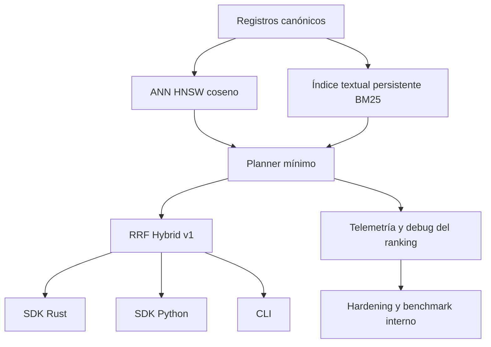
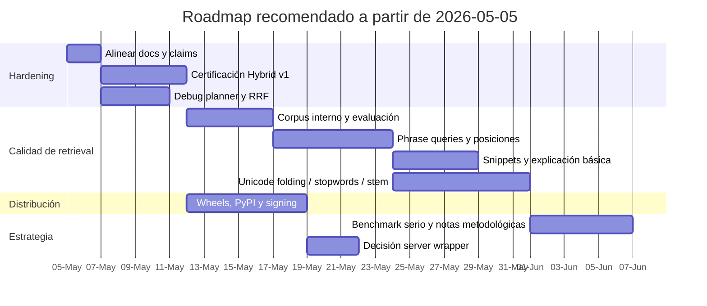

# Estado actual de VantaDB después de Hybrid Retrieval v1

## Resumen ejecutivo

VantaDB ya no está en la fase de “motor base con memoria persistente”, ni tampoco en la fase “índice textual interno sin uso público”. Con la evolución visible entre los snapshots `ae198c7`, `43cd3dc` y `e28e37a`, el proyecto pasó de tener un **índice textual persistente reconstruible**, a **BM25 texto-only**, y finalmente a **Hybrid Retrieval v1** con planner mínimo y fusión por RRF. En términos prácticos, el core ya soporta tres rutas de recuperación: **vector-only**, **BM25 text-only** y **hybrid text+vector**. Eso cambia el estado del proyecto de “infraestructura de memoria confiable” a **motor embebido de retrieval local con cobertura híbrida inicial**. fileciteturn14file2 fileciteturn14file1 fileciteturn14file0

La lectura ejecutiva correcta es esta: **el proyecto quedó técnicamente mucho más sólido y comercialmente más defendible, pero todavía no está listo para venderse como un buscador híbrido competitivo de primer nivel**. El propio diseño actualizado deja claro que la implementación actual es conservadora: BM25, planner mínimo, RRF, métricas operacionales y una postura explícita de no hacer claims agresivos de paridad competitiva. Esa honestidad es una fortaleza, pero también delata el siguiente cuello de botella: ahora el problema ya no es “tener hybrid”, sino **endurecerlo, medirlo, explicarlo y distribuirlo bien**. fileciteturn14file0

Mi conclusión directa es que VantaDB está entrando en una etapa nueva. **La fase fundacional ya está cerrada**. El siguiente ciclo no debería gastar energía en más primitives básicas. Debería concentrarse en cuatro frentes: **hardening del hybrid**, **calidad de recuperación léxica**, **distribución/release engineering**, y **validación comparativa seria sin vender humo**. Si haces eso, el producto gana forma. Si te dispersas con features laterales o marketing prematuro, el repositorio mismo te va a desmentir. fileciteturn14file0 fileciteturn14file1

## Cómo quedó el proyecto

La trayectoria reciente del repo es bastante clara. En el snapshot `ae198c7`, el índice textual persistente ya existía, se reconstruía desde registros canónicos y reparaba estado corrupto en apertura writable, pero `text_query` seguía deshabilitado públicamente hasta tener BM25/RRF/planner. En `43cd3dc`, ese gap se cerró parcialmente con **BM25 texto-only**, incluyendo TF, DF, longitudes de documento, estadísticas de corpus por namespace y auditoría estructural del índice textual. En `e28e37a`, el diseño interno ya documenta **Hybrid Retrieval v1**, con planner mínimo, ejecución separada de vector y BM25, y fusión por **Reciprocal Rank Fusion** sobre `namespace + key`. fileciteturn14file2 fileciteturn14file1 fileciteturn14file0

La lectura técnica actual del producto es: **motor embebido de memoria persistente**, con registros canónicos como source of truth, WAL para recuperación, reconstrucción manual del índice ANN, índices derivados persistentes para namespace/metadata, índice textual persistente con estadísticas BM25, y búsqueda híbrida inicial sin mezclar scores crudos BM25/cosine. El diseño actualizado además fija un comportamiento concreto: BM25 usa `k1 = 1.2` y `b = 0.75`; hybrid ejecuta ambos rankings por separado, fusiona con RRF, usa `60.0` como constante interna y un candidate budget dependiente de `top_k`, y luego trunca el resultado final a `top_k`. fileciteturn14file0

Según tu propio reporte, también se extendieron las métricas y las pruebas Rust/Python para hybrid, filtros, namespace, ordenamiento determinista, reapertura, import/export y read-only. Tomando eso junto con el diseño del snapshot más reciente, el resultado es que el proyecto ya no tiene solo “soporte técnico interno” para texto, sino **una ruta pública utilizable para retrieval híbrido v1**, aunque todavía bajo una narrativa conscientemente conservadora. fileciteturn14file0

### Matriz de estado actual

| Bloque | Estado actual | Lectura ejecutiva |
|---|---|---|
| Core embebido + WAL + VantaFile + ANN | Cerrado | Ya no es el problema principal |
| Memory MVP con namespaces, CRUD, list/search | Cerrado | Base estable del producto |
| Export/import JSONL | Cerrado | Útil operativamente, todavía no es un sistema de backup “enterprise” |
| Índices derivados namespace/payload | Cerrado | Filtros estructurados ya son parte seria del core |
| Índice textual persistente | Cerrado | Ya no es scaffold; es infraestructura real |
| BM25 texto-only | Cerrado | El texto ya tiene ranking léxico concreto |
| Hybrid Retrieval v1 | Cerrado | Ya existe, pero en versión conservadora y mínima |
| Explainability / debug de ranking | Abierto | Necesario para endurecer el feature |
| Calidad lingüística avanzada | Abierto | Sin phrases, snippets, stemming, stopwords ni Unicode folding |
| Distribución Python/packaging | Abierto | Sigue siendo deuda real de adopción |
| Benchmark competitivo serio | Abierto | Todavía no deberías vender “paridad” |

La base documental que respalda esa lectura es consistente en la dirección general, aunque no perfecta en su coherencia interna. `TEXT_INDEX_DESIGN.md` ya habla de Hybrid Retrieval v1; `MUTATION_RECOVERY_PROTOCOL.md` también lo reconoce; `MEMORY_MVP_BASELINE.md` ya no describe el producto como solo vector + filtros. Pero hay señales de deriva documental: parte de la arquitectura general todavía arrastra wording que niega BM25/RRF/planner como “shipped claim”, algo que ya no coincide con el diseño textual actualizado. Eso no rompe el software, pero sí rompe la narrativa del repositorio si no lo corriges de inmediato. fileciteturn14file0

## Estado operativo y nivel de madurez real

Hoy sí puedes describir VantaDB, con bastante precisión, como un **embedded persistent memory engine** con tres rutas de recuperación: recuperación vectorial HNSW por coseno, recuperación léxica BM25 sobre índice persistente, y recuperación híbrida texto+vector mediante planner mínimo y RRF. También puedes sostener que el sistema mantiene un estándar serio de confiabilidad: registros canónicos como fuente de verdad, índices derivados reconstruibles, repair-on-open para estado corrupto o stale, export/import simple y métricas operacionales explícitas. Esa combinación ya no es trivial; es una base bastante decente para un producto local-first. fileciteturn14file0

Lo que **no** deberías afirmar todavía es igual de importante. No deberías venderlo como “hybrid retrieval competitivo” frente a motores maduros. No deberías presentar el paquete Python como listo para distribución externa. No deberías sugerir que existe explainability rica del ranking, soporte lingüístico serio, phrase search, snippets o tuning avanzado del planner. Tampoco deberías mover el posicionamiento hacia enterprise/managed/server-first, porque la propia documentación sigue ubicando la frontera principal del producto en el core embebido y el SDK estable. fileciteturn14file0 fileciteturn14file1

La validación que mostraste también importa. Aunque aquí no tengo un log del snapshot híbrido equivalente al de la fase textual previa, tu reporte indica que pasaron `cargo fmt --check`, la suite de tests Rust clave, `memory_brutality`, build del wheel con `maturin`, reinstalación del wheel y el `pytest` del SDK Python. Si eso se sostiene también en CI limpia, el proyecto queda en un estado que yo llamaría **feature-complete para Hybrid v1 local**, pero **todavía no production-complete como experiencia de búsqueda**. Esa distinción importa porque evita saltar de “funciona” a “ya está listo para competir” sin evidencia suficiente. La fase textual previa ya mostraba una disciplina fuerte de validación en Rust y Python, lo que vuelve creíble tu progresión actual. fileciteturn14file3

### Claims que ya puedes hacer y claims que todavía no

| Ya puedes decir | Todavía no deberías decir |
|---|---|
| Motor embebido de memoria persistente | Motor híbrido competitivo al nivel de líderes del mercado |
| Recuperación por WAL y reconstrucción de índices derivados | Search platform generalista con relevancia avanzada |
| BM25 texto-only sobre índice persistente | Soporte lingüístico serio multiidioma |
| Hybrid Retrieval v1 con planner mínimo y RRF | Explainability completa del ranking |
| Repair/rebuild desde registros canónicos | SDK Python distribuible a escala vía PyPI sin deuda |
| Métricas operacionales de startup/rebuild/lexical/hybrid | Benchmarks de marketing fuertes basados en SIFT o una sola métrica local |

## Riesgos y gaps que siguen abiertos

El riesgo principal ya no está en la persistencia. Está en la **calidad de retrieval** y en la **coherencia de producto**. El propio diseño textual actualizado enumera lo que falta: queries por frase, posiciones, snippets, stemming, stopwords, Unicode folding y explicaciones de ranking. Traducido a negocio: hoy puedes recuperar; mañana necesitas **recuperar bien y explicar por qué devolviste eso**. Sin esa capa, Hybrid v1 es funcional, pero todavía rudimentario. fileciteturn14file0

El segundo riesgo es la **deriva documental**. El snapshot más nuevo ya documenta Hybrid Retrieval v1 en el diseño textual, pero la arquitectura general todavía conserva wording previo que lo contradice o lo minimiza como si no existiera. Si dejas esa inconsistencia viva, el repo pierde credibilidad porque distintas fuentes internas cuentan historias diferentes del mismo producto. Eso se arregla rápido, pero hay que hacerlo ya. fileciteturn14file0

El tercer riesgo es de **adopción**. El packaging sigue siendo deuda: el Python SDK sigue arrastrando trabajo pendiente de wheels/PyPI/signing y release automation, y esa fricción limita cualquier intento serio de validación externa con usuarios. Tecnología sin canal de distribución no escala adopción; solo escala deuda interna. Ese problema sigue señalado en los snapshots previos y no aparece como cerrado en el estado actual. fileciteturn14file1 fileciteturn14file2

El cuarto riesgo es de **gobernanza**. En un snapshot anterior el checklist marca como restituido el tracker fuente de verdad en `seguimiento de proyecto.csv`, lo cual es bueno, pero en esta conversación ese CSV no está disponible para auditar fechas, owners y overdue real. Eso significa que sí puedo darte un roadmap técnico serio, pero no una lectura confiable de gestión operativa por SLA o por responsable. Si quieres control de ejecución, ese archivo tiene que entrar en la revisión y permanecer alineado con el repo truth. fileciteturn14file1

## Siguientes pasos, tareas y fases

La prioridad correcta ahora no es “más features”. Es **cerrar la fase de hardening y convertir Hybrid v1 en una capacidad defendible**. Después de eso sí tiene sentido expandir calidad léxica y distribución.

### Prioridades inmediatas

| Prioridad | Tarea | Por qué va ahora | Esfuerzo | Dependencias |
|---|---|---|---|---|
| Crítica | Alinear totalmente la documentación de arquitectura, checklist, Python SDK y changelog con el estado hybrid actual | Hoy hay evidencia de deriva documental; eso contamina repo truth y posicionamiento | Baja | Ninguna |
| Crítica | Añadir certificación específica de Hybrid v1 | Necesitas medir calidad, determinismo y estabilidad de la fusión, no solo que compile y pase smoke | Media | Estado actual del planner |
| Alta | Exponer debug/telemetría del planner y de la fusión RRF | Sin observabilidad del ranking, arreglar relevancia será lento y opaco | Media | Métricas ya existentes |
| Alta | Construir corpus interno de evaluación para lexical/hybrid | Sin queries oro y expectativas mínimas, cualquier mejora será anecdótica | Media | BM25 + Hybrid v1 cerrados |
| Alta | Endurecer read-only / reopen / import-export / stale-state para hybrid bajo más escenarios | La confiabilidad es parte del diferencial del proyecto; aquí no puedes bajar el estándar | Media | Suite actual de recovery |
| Media | Cerrar deuda de packaging Python | Te hace falta un canal de adopción más serio | Alta | API suficientemente estable |
| Media | Decidir si el server wrapper sigue siendo accesorio o entra a fase de producto real | Hoy el proyecto sigue siendo embedded-first; no conviene dejar esa frontera ambigua mucho tiempo | Media | Estrategia de distribución |

### Fases recomendadas

| Fase | Objetivo | Entregables concretos |
|---|---|---|
| Hardening de Hybrid v1 | Volver defendible el feature actual | Docs alineadas, tests/certificación hybrid, métricas y debugging, corpus interno |
| Calidad léxica v2 | Mejorar relevancia y UX de texto | Phrase queries, posiciones, snippets, tokenizer versionado más rico, normalización |
| Distribución y DX | Bajar fricción de adopción | Wheels multiplataforma, flujo PyPI/TestPyPI, release automation, smoke CI de instalación |
| Credibilidad comparativa | Medir sin sobreactuar | Benchmark interno serio, Euclidean solo si aporta comparabilidad, notas metodológicas |
| Decisión de producto | Fijar frontera del sistema | Decisión explícita sobre embedded-first vs server wrapper más productizado |

### Hoja de ruta sugerida

## Mi lectura final del estado del proyecto

VantaDB quedó **mucho mejor parado** que antes. Ya no es solo un motor persistente con búsqueda vectorial y filtros. Ahora es un **retrieval engine embebido**, con base de memoria confiable, BM25 texto-only y un primer hybrid usable con RRF. Eso es un salto real, no cosmético. El progreso entre `ae198c7`, `43cd3dc` y `e28e37a` lo demuestra con bastante claridad. fileciteturn14file2 fileciteturn14file1 fileciteturn14file0

Pero también te digo la parte incómoda: **todavía no ganaste la guerra**. Ahora que ya tienes Hybrid v1, lo que sigue no es celebrar demasiado tiempo. Lo que sigue es volverlo **confiable, explicable, medible y distribuible**. Si haces eso, el proyecto entra en una fase de producto seria. Si no, se va a quedar en el peor punto posible: técnicamente interesante, pero comercialmente difícil de sostener. fileciteturn14file0

La recomendación más pragmática es esta: **cierra primero hardening + observabilidad + corpus de evaluación**, luego entra a **calidad léxica v2**, y solo después invierte fuerte en **packaging y benchmark público**. Ese orden maximiza valor y minimiza riesgo de vender una historia que el repo todavía no puede respaldar del todo. fileciteturn14file0 fileciteturn14file1