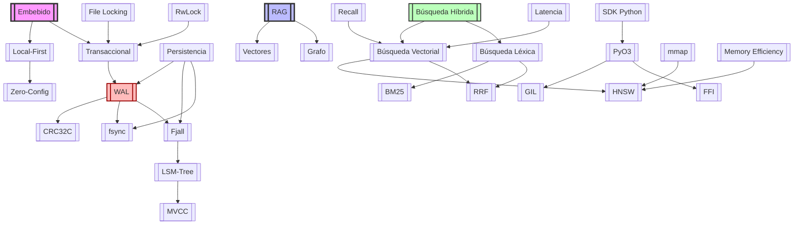

# Glosario de Conceptos Técnicos — VantaDB

> Referencia completa de todos los conceptos técnicos, arquitectónicos y de producto mencionados en la documentación de VantaDB.

---

## Conceptos de Producto y Arquitectura

| Concepto | Descripción Breve | Relevancia en VantaDB |
|----------|-------------------|----------------------|
| [Embebido](Glosario/Embebido.md) | Base de datos que corre in-process, sin servidor separado | Identidad central del producto |
| [Local-First](Glosario/Local-First.md) | Filosofía de diseño que prioriza operación local sobre red | Principio arquitectónico fundamental |
| [Transaccional](Glosario/Transaccional.md) | Garantía ACID sobre mutaciones de datos | Contrato de durabilidad del core |
| [Zero-Config](Glosario/Zero-Config.md) | Experiencia de uso sin configuración manual | Ventaja competitiva vs alternativas |
| [RAG](Glosario/RAG.md) | Retrieval-Augmented Generation | Caso de uso primario |
| [Vectores](Glosario/Vectores.md) | Representaciones numéricas de alta dimensionalidad | Tipo de dato central |
| [Grafo](Glosario/Grafo.md) | Estructura de nodos y aristas con propiedades | Modelo de datos complementario |

---

## Mecanismos de Persistencia

| Concepto | Descripción Breve | Relevancia en VantaDB |
|----------|-------------------|----------------------|
| [Persistencia](Glosario/Persistencia.md) | Capacidad de mantener datos más allá del ciclo de vida del proceso | Concepto general de durabilidad |
| [WAL](Glosario/WAL.md) | Write-Ahead Log — journaling de mutaciones | Garantía de durabilidad antes de ACK |
| [Fjall](Glosario/Fjall.md) | Motor LSM-tree 100% Rust | Backend canónico por defecto |
| [RocksDB](Glosario/RocksDB.md) | Motor LSM-tree de Facebook (C++) | Backend alternativo / benchmarking |
| [mmap](Glosario/mmap.md) | Memory-Mapped I/O | Zero-copy para lectura de vectores |
| [fsync](Glosario/fsync.md) | Sincronización a disco físico | Garantía de persistencia real |
| [CRC32C](Glosario/CRC32C.md) | Checksum hardware-accelerated | Integridad de registros WAL |
| [LSM-Tree](Glosario/LSM-Tree.md) | Log-Structured Merge-Tree | Estructura de storage subyacente |
| [MVCC](Glosario/MVCC.md) | Multi-Version Concurrency Control | Aislamiento transaccional |

---

## Índices y Búsqueda

| Concepto | Descripción Breve | Relevancia en VantaDB |
|----------|-------------------|----------------------|
| [Búsqueda Vectorial](Glosario/Búsqueda Vectorial.md) | Búsqueda por similitud semántica usando vectores | Caso de uso principal |
| [Búsqueda Léxica](Glosario/Búsqueda Léxica.md) | Búsqueda por coincidencia exacta de términos | Complemento a búsqueda vectorial |
| [Búsqueda Híbrida](Glosario/Búsqueda Híbrida.md) | Combinación de búsqueda vectorial + léxica | Diferenciador competitivo |
| [HNSW](Glosario/HNSW.md) | Hierarchical Navigable Small World | Índice vectorial ANN principal |
| [BM25](Glosario/BM25.md) | Best Matching 25 — scoring léxico | Índice de texto completo |
| [RRF](Glosario/RRF.md) | Reciprocal Rank Fusion | Fusión de rankings híbridos |
| [Vector Similarity](Glosario/Vector Similarity.md) | Métricas de distancia entre vectores | Coseno, euclidiana, dot product |
| [ANN](Glosario/ANN.md) | Approximate Nearest Neighbor | Familia de algoritmos de búsqueda |
| [Payload Indexes](Glosario/Payload Indexes.md) | Índices sobre metadata | Filtrado eficiente en búsquedas |

---

## Concurrencia y Seguridad

| Concepto | Descripción Breve | Relevancia en VantaDB |
|----------|-------------------|----------------------|
| [SDK Python](Glosario/SDK Python.md) | Interfaz Python mediante bindings PyO3 | API principal para usuarios |
| [GIL](Glosario/GIL.md) | Global Interpreter Lock (Python) | Cuello de botella que PyO3 debe liberar |
| [FFI](Glosario/FFI.md) | Foreign Function Interface | Frontera Python-Rust |
| [PyO3](Glosario/PyO3.md) | Framework de bindings Rust↔Python | Tecnología de SDK |
| [File Locking](Glosario/File Locking.md) | Bloqueo advisory a nivel de proceso | Prevención de corrupción multi-proceso |
| [RwLock](Glosario/RwLock.md) | Lock de lectura/escritura | Concurrencia interna del core |

---

## Operaciones y CI/CD

| Concepto | Descripción Breve | Relevancia en VantaDB |
|----------|-------------------|----------------------|
| [CI/CD](Glosario/CI_CD.md) | Continuous Integration / Deployment | Automatización de releases |
| [Benchmarks](Glosario/Benchmarks.md) | Pruebas de rendimiento estandarizadas | Validación de claims de performance |
| [Chaos Testing](Glosario/Chaos Testing.md) | Inyección de fallos controlada | Validación de durabilidad WAL |
| [Failpoints](Glosario/Failpoints.md) | Puntos de inyección de errores | Testing de recovery |
| [OIDC](Glosario/OIDC.md) | OpenID Connect | Publicación segura a PyPI |
| [Sigstore](Glosario/Sigstore.md) | Firma de artefactos | Provenance verificable |
| [SLSA](Glosario/SLSA.md) | Supply-chain Levels | Framework de seguridad |

---

## Casos de Uso y Protocolos

| Concepto | Descripción Breve | Relevancia en VantaDB |
|----------|-------------------|----------------------|
| [RAG](Glosario/RAG.md) | Retrieval-Augmented Generation | Caso de uso primario |
| [GraphRAG](Glosario/GraphRAG.md) | RAG con traversal de grafo | Reducción de tokens 40-60% |
| [Agentes de IA](Glosario/Agentes de IA.md) | Sistemas autónomos con memoria | Target user principal |
| [MCP](Glosario/MCP.md) | Model Context Protocol | Integración con IDEs y agentes |

---

## Performance y Optimización

| Concepto | Descripción Breve | Relevancia en VantaDB |
|----------|-------------------|----------------------|
| [Recall](Glosario/Recall.md) | Métrica de calidad: % de vecinos reales recuperados | Validación de HNSW |
| [Latencia](Glosario/Latencia.md) | Tiempo de respuesta de operaciones (p50, p95, p99) | Métrica de performance |
| [Memory Efficiency](Glosario/Memory Efficiency.md) | Bytes de RAM por vector indexado | Optimización de recursos |
| [SIMD](Glosario/SIMD.md) | Single Instruction, Multiple Data | Aceleración de distancias |
| [Zero-Copy](Glosario/Zero-Copy.md) | Sin copias de memoria | Performance de lectura |
| [DashMap](Glosario/DashMap.md) | HashMap concurrente sharded | Concurrencia sin contención |
| [Backpressure](Glosario/Backpressure.md) | Control de flujo bajo carga | Prevención de OOM |

---

## Enterprise (Planeado)

| Concepto | Descripción Breve | Relevancia en VantaDB |
|----------|-------------------|----------------------|
| [RBAC](Glosario/RBAC.md) | Role-Based Access Control | Seguridad granular |
| [Multi-tenancy](Glosario/Multi-tenancy.md) | Aislamiento por tenant | VantaDB Cloud |

---

## Navegación Rápida

### Por Categoría

**¿Nuevo en VantaDB?** Empieza por:
1. [Embebido](Glosario/Embebido.md) → Entiende la identidad del producto
2. [Local-First](Glosario/Local-First.md) → Comprende la filosofía
3. [RAG](Glosario/RAG.md) → Conoce el caso de uso primario
4. [Persistencia](Glosario/Persistencia.md) → Entiende la garantía de durabilidad
5. [Búsqueda Vectorial](Glosario/Búsqueda Vectorial.md) → Comprende la búsqueda por similitud
6. [Búsqueda Híbrida](Glosario/Búsqueda Híbrida.md) → Conoce el diferenciador competitivo

**¿Perfil Técnico?** Profundiza en:
- [Fjall](Glosario/Fjall.md) vs [RocksDB](Glosario/RocksDB.md) → Decisión de backend
- [GIL](Glosario/GIL.md) + [FFI](Glosario/FFI.md) + [PyO3](Glosario/PyO3.md) + [SDK Python](Glosario/SDK Python.md) → Concurrencia Python-Rust
- [mmap](Glosario/mmap.md) + [fsync](Glosario/fsync.md) → Persistencia y rendimiento
- [MVCC](Glosario/MVCC.md) + [LSM-Tree](Glosario/LSM-Tree.md) → Internals del storage
- [Recall](Glosario/Recall.md) + [Latencia](Glosario/Latencia.md) + [Memory Efficiency](Glosario/Memory Efficiency.md) → Métricas de performance

**¿Perfil de Producto?** Enfócate en:
- [Zero-Config](Glosario/Zero-Config.md) → Ventaja competitiva
- [Transaccional](Glosario/Transaccional.md) → Contrato con el usuario
- [Vectores](Glosario/Vectores.md) + [Grafo](Glosario/Grafo.md) → Modelo de datos multimodal
- [Búsqueda Híbrida](Glosario/Búsqueda Híbrida.md) + [RRF](Glosario/RRF.md) → Diferenciador competitivo
- [Búsqueda Vectorial](Glosario/Búsqueda Vectorial.md) + [Búsqueda Léxica](Glosario/Búsqueda Léxica.md) → Tipos de búsqueda soportados

---

## Relaciones entre Conceptos

---

## Convenciones

- Los conceptos en **wikilinks** son páginas independientes con definición completa
- Los conceptos vinculados a documentos principales aparecen como `[Documento](Documento.md#sección)`
- Las definiciones incluyen: qué es, por qué importa, cómo lo usa VantaDB, y alternativas comunes

---

*Este glosario se expande continuamente. Si encuentras un concepto sin página propia, márcalo como `[PENDIENTE]` y notifícalo al equipo técnico.*
