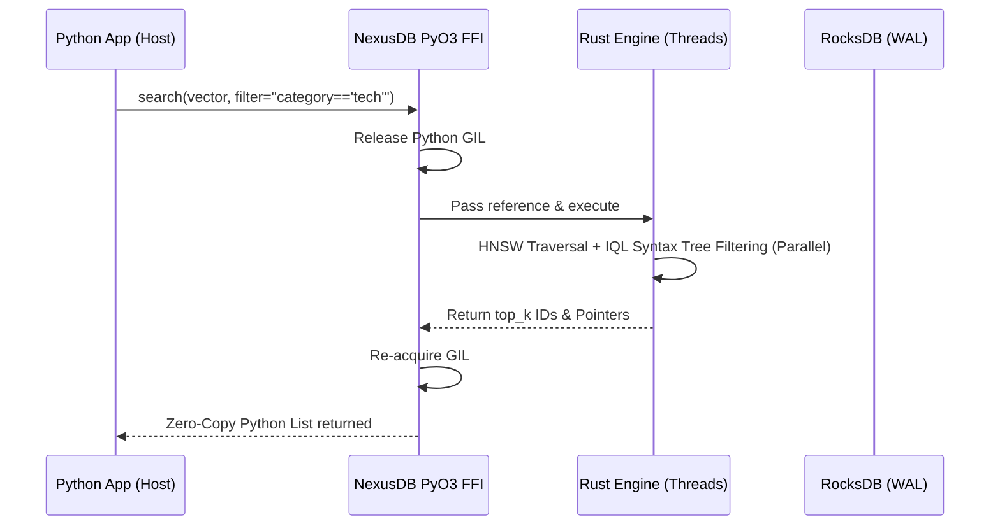

# NexusDB Internal Architecture (Sensitives & Internals)

This document provides a deep structural overview of NexusDB's Rust internals, targeting Senior Systems Engineers, Database Architects, and HackerNews peers who wish to understand *how* it operates at a hardware and memory-management level.

## 1. Memory Layout: The `UnifiedNode`

Traditional applications stitch together multiple memory spaces across different DB limits dynamically allocating JSONs or blobs. NexusDB collapses this into the `UnifiedNode` struct.

Every inserted record lives in Rust memory structurally defined as:

```rust
pub struct UnifiedNode {
    pub id: String,                              // Hash or UUID
    pub vector: Box<[f32]>,                      // Contiguous heap slice ensuring SIMD cache-locality
    pub edges: Vec<Edge>,                        // Adjacency list for O(1) graph traversals
    pub relational_data: BTreeMap<String, Value> // Deterministic schemaless metadata mapping
}
```

**Why this layout?** 
By combining the high-dimensional Vector (dense slice), the Graph edges (Adjacency Lists), and Relational metadata (BTreeMap) into a single struct contiguous in memory, NexusDB guarantees that when the HNSW algorithm isolates top candidates based on vector distance, the CPU already has the graph edges and the relational fields in the L3 Cache. There is no Secondary Index lookup required.

## 2. The Zero-Copy Pipeline (PyO3)

To solve the orchestration bottleneck, NexusDB runs strictly in-process.

When you pass a dictionary in Python:
1. **PyDict to Struct (Rust):** PyO3 bridges the Python GIL directly to the Rust engine heap. Data is unpacked once.
2. **Execution:** Rust handles the querying lock-free. The Python GIL is released exclusively during `compute(search)`.
3. **Struct to PyRef:** Instead of serializing returning data into a massive JSON payload over TCP (like network DBs do), Rust yields memory pointers back to Python objects natively.



## 3. Biomimetic Governance (Memory Constraints & Survival Mode)

Memory is the major enemy of vector search. NexusDB utilizes an internal background thread pool ("SleepWorker", originally conceptualized from biological sleep cycles) to perform active memory governance.

When NexusDB is initialized, it is injected with `memory_limit_bytes` (e.g., 512MB).
*   **Active Monitoring (Cgroups Detection):** The DB continuously queries the OS (and container Cgroups if running in Docker) to survey actual memory pressure.
*   **Survival Mode Swap (MMap):** If RAM usage exceeds 85% of the threshold, the system triggers `Survival Mode`. Instead of allowing the kernel to hit an OOM (Out-of-Memory) panic and crash the DB, NexusDB dynamically flushes non-critical HNSW subgraph tiers and historical raw metadata chunks onto SSD.
*   **Virtual Memory Fallback:** It immediately swaps references to `memmap2`, taking a slight latency penalty to guarantee absolute software survival.

## 4. Persistence Layer (RocksDB Integration)

To prevent data loss in a strictly in-process architecture:
1. **Write-Ahead Logging (WAL):** Every mutation to the `UnifiedNode` logic is synchronously streamed to an underlying embedded RocksDB instance.
2. **Startup Rehydration:** On crash or restart, the DB reads the RocksDB SSTables and rapidly rebuilds the HNSW spatial tiers in RAM.
3. **Compaction ("Apoptosis"):** The background GC selectively drops Tombstoned vectors and truncates RocksDB logs during low-traffic moments, ensuring minimal disk blooming.
