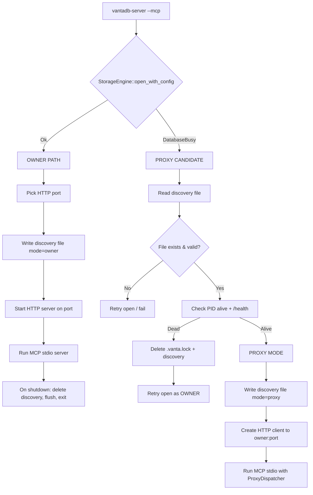

# Spec: MCP-35 HTTP Fallback Discovery for Multi-Instance MCP

## Objective

Enable N simultaneous `vanta-cli server --mcp --db <same-path>` instances to share a single database. The first instance becomes the **owner** (holds the exclusive lock, serves HTTP + MCP stdio). Subsequent instances become **proxies** (forward MCP tool calls via HTTP to the owner). If the owner crashes, a proxy promotes to owner automatically.

**Success Criteria:**
- ✅ 2+ OpenCode sessions simultaneously connected to same DB via MCP
- ✅ Both sessions have full tools parity (76 tools) — `tools/list` returns identical set
- ✅ Owner crash (`kill -9`) → proxy promotes within 30s, no data corruption
- ✅ `cargo check -p vantadb --tests` exits 0

---

## Tech Stack

- **Language:** Rust 2021 edition
- **Core crates:** `vantadb` (storage), `vantadb-mcp` (MCP protocol), `vantadb-server` (HTTP + binary)
- **HTTP:** axum 0.7, tokio 1.x
- **File locking:** fs2 (cross-platform exclusive/shared locks)
- **Serialization:** serde_json, postcard (WAL)
- **Process management:** std::process, tokio::process

---

## Commands

```bash
# Build
cargo build --workspace --features server,custom-allocator

# Test contract (manual)
# Terminal 1:
vanta-cli server --mcp --db /tmp/test-mcp-35.db
# Terminal 2 (simultaneous):
vanta-cli server --mcp --db /tmp/test-mcp-35.db

# Both should show "MCP stdio server started" and respond to tools/list

# Automated verification
cargo test -p vantadb-mcp --test mcp_integration -- --test-threads=1
cargo check -p vantadb --tests
```

---

## Project Structure

```
src/
├── storage/
│   └── engine/
│       └── init.rs          # Lock acquisition + discovery file write (OWNER path)
├── cli_handlers/
│   └── server.rs            # cmd_server_mcp: spawns vantadb-server --mcp
vantadb-server/
├── src/
│   ├── main.rs              # Entry: --mcp → run_stdio_server OR HTTP server
│   └── lib.rs               # Re-exports
vantadb-mcp/
├── src/
│   ├── server.rs            # run_stdio_server + serve_lines + dispatch_request
│   ├── proxy.rs             # NEW: ProxyDispatcher (HTTP client + tool→REST mapping)
│   ├── config.rs            # McpConfig + ProxyConfig
│   ├── discovery.rs         # NEW: DiscoveryFile read/write/validate
│   └── handlers/
│       └── tools.rs         # handle_tools_call (owner) + handle_tools_call_proxy (proxy)
```

---

## Code Style

**Discovery file atomic write:**
```rust
// GOOD: Atomic write via temp + rename
fn write_discovery_file(path: &Path, content: &DiscoveryFile) -> Result<()> {
    let tmp = path.with_extension("json.tmp");
    std::fs::write(&tmp, serde_json::to_vec(content)?)?;
    std::fs::rename(&tmp, path)?;  // atomic on POSIX, replace on Windows
    Ok(())
}
```

**Proxy dispatcher pattern:**
```rust
// GOOD: Async HTTP client with connection pooling
pub struct ProxyDispatcher {
    client: reqwest::Client,
    base_url: String,
    auth_token: Option<String>,
}

impl ProxyDispatcher {
    pub async fn call(&self, tool: &str, args: &Value) -> Result<Value> {
        let (method, endpoint, body) = map_tool_to_rest(tool, args)?;
        let mut req = self.client.request(method, &format!("{}{}", self.base_url, endpoint));
        if let Some(token) = &self.auth_token {
            req = req.bearer_auth(token);
        }
        let resp = req.json(&body).send().await?;
        resp.json().await.map_err(Into::into)
    }
}
```

---

## Testing Strategy

| Level | Scope | Location |
|-------|-------|----------|
| Unit | DiscoveryFile serialization, tool→REST mapping, health check | `vantadb-mcp/src/discovery.rs`, `proxy.rs` |
| Integration | 2× simultaneous MCP servers on same DB | `vantadb-mcp/tests/mcp_integration.rs` |
| Chaos | Kill owner → verify proxy promotion | `vantadb-chaos` (delegated) |
| Contract | `tools/list` parity, all 76 tools callable | `vantadb-mcp/tests/contract.rs` |

**Coverage:** All new modules ≥90% line coverage. Integration test runs in CI.

---

## Boundaries

| Category | Rule |
|----------|------|
| **Always** | Discovery file atomic write (temp + rename); lock file is source of truth |
| **Always** | Proxy forwards auth token; owner validates per existing RBAC |
| **Always** | Owner graceful shutdown deletes discovery file |
| **Ask first** | Changing discovery file schema (version bump) |
| **Ask first** | Adding new tool→REST mapping (requires endpoint exists) |
| **Never** | Proxy holds exclusive lock (only owner) |
| **Never** | Bypass health check for owner liveness |
| **Never** | Two owners simultaneously (split-brain) |

---

## Detailed Design

### 1. Discovery File (`<data_dir>/.vanta.server.json`)

```json
{
  "version": 1,
  "pid": 12345,
  "http_port": 8080,
  "started_at_ms": 1725234567890,
  "mode": "owner",
  "instance_id": "uuid-v4"
}
```

**Fields:**
- `version`: Schema version (1 = initial)
- `pid`: Owner process ID (for `kill 0` liveness check)
- `http_port`: Owner's HTTP listener port
- `started_at_ms`: Owner start time (Unix ms)
- `mode`: `"owner"` | `"proxy"` — this instance's role
- `instance_id`: Unique per-process UUID (distinguishes multiple proxies)

**Location:** `<db_path>/data/.vanta.server.json` (same dir as `.vanta.lock`)

**Atomic write:** Write to `.vanta.server.json.tmp` then `rename()` (POSIX atomic, Windows replace).

### 2. Startup Flow (in `vantadb-server/src/main.rs`)



### 3. Proxy Dispatcher (`vantadb-mcp/src/proxy.rs`)

**Responsibilities:**
- HTTP client with connection pooling (reqwest)
- Tool name → REST endpoint + method mapping (76 tools)
- Request/response translation (MCP JSON-RPC ↔ REST JSON)
- Auth token propagation (Bearer)
- Timeout handling (30s default)

**Tool → REST Mapping (exhaustive):**

| MCP Tool | REST Endpoint | Method | Notes |
|----------|---------------|--------|-------|
| `memory_put` | `/api/v2/records` | POST | |
| `memory_put_batch` | `/api/v2/records/batch` | POST | |
| `memory_get` | `/api/v2/records/{ns}/{key}` | GET | |
| `memory_delete` | `/api/v2/records/{ns}/{key}` | DELETE | |
| `memory_delete_by_filter` | `/api/v2/records` | DELETE | query: `namespace`, `filter` |
| `memory_list` | `/api/v2/list` | GET | query: `namespace`, `limit`, `cursor`, `filter_ops` |
| `memory_list_namespaces` | `/api/v2/list` | GET | no namespace → all |
| `memory_versions` | `/api/v2/records/{ns}/{key}/versions` | GET | |
| `memory_supersede` | `/api/v2/query` | POST | IQL: `SUPERSEDE ...` |
| `search_memory` / `memory_search` | `/api/v2/search` | POST | body: `VantaMemorySearchRequest` |
| `search_semantic` | `/api/v2/search` | POST | vector only |
| `search_with_method` | `/api/v2/search` | POST | + `method` field |
| `search_multi` | `/api/v2/search` | POST | + `namespaces` array |
| `query_iql` | `/api/v2/query` | POST | body: `{query}` |
| `get_node_neighbors` | `/api/v2/graph/v2/bfs` | POST | depth=1, direction=forward |
| `graph_page_rank` | `/api/v2/graph/pagerank` | POST | |
| `graph_degree_centrality` | `/api/v2/graph/degree` | POST | |
| `graph_traverse` | `/api/v2/graph/v2/bfs\|dfs` | POST | |
| `graph_topological_sort` | `/api/v2/query` | POST | IQL: `TOPO ...` |
| `graph_is_dag` | `/api/v2/query` | POST | IQL: `IS_DAG ...` |
| `remove_edge` | `/api/v2/query` | POST | IQL: `UNRELATE ...` |
| `inject_context` | `/api/v2/threads/{id}` | POST | body: `{role, content}` |
| `read_axioms` | `/api/v2/query` | POST | IQL: `FROM _axioms` |
| `write_axiom` | `/api/v2/query` | POST | IQL: `INSERT INTO _axioms ...` |
| `delete_axiom` | `/api/v2/query` | POST | IQL: `DELETE FROM _axioms ...` |
| `collection_stats` | `/api/v2/metrics` | GET | filter by namespace |
| `collection_list` | `/api/v2/list` | GET | all namespaces |
| `collection_delete` | `/api/v2/query` | POST | IQL: `DROP NAMESPACE ...` |
| `rehydrate` | `/api/v2/query` | POST | IQL: `REHYDRATE ...` |
| `purge_expired` | `/api/v2/maintenance/purge` | POST | |
| `compact_wal` | `/api/v2/maintenance/compact` | POST | |
| `flush` | `/api/v2/maintenance/flush` | POST | |
| `compact_layout` | `/api/v2/query` | POST | IQL: `COMPACT ...` |
| `vacuum` | `/api/v2/query` | POST | IQL: `VACUUM ...` |
| `rebuild_index` | `/api/v2/maintenance/rebuild-index` | POST | |
| `audit_text_index` | `/api/v2/query` | POST | IQL: `AUDIT_TEXT_INDEX ...` |
| `repair_text_index` | `/api/v2/query` | POST | IQL: `REPAIR_TEXT_INDEX ...` |
| `capabilities` | `/api/v2/health` | GET | extended with capabilities |
| `generate_snippet` | **LOCAL** | — | no DB access |
| `list_snapshots` | `/api/v2/snapshots` | GET | |
| `snapshot_create` | `/api/v2/snapshots/{name}` | POST | |
| `snapshot_restore` | `/api/v2/query` | POST | IQL: `RESTORE SNAPSHOT ...` |
| `export` | `/api/v2/export` | POST | |
| `import` | `/api/v2/import` | POST | |
| `bulk_import_file` | **LOCAL** | — | host filesystem |
| `bulk_import_stream` | `/api/v2/import` | POST | streaming |
| `embed_texts` | **LOCAL** | — | ONNX if available |

**Tools executed locally in proxy (no HTTP):**
- `generate_snippet` — pure text processing
- `embed_texts` — local ONNX embeddings
- `bulk_import_file` — host filesystem access

### 4. Health Check & Failover

**Owner Health Endpoint:** `GET /health` (already exists, returns `HealthReportV2`)

**Proxy Health Check Loop:**
```rust
async fn health_check_loop(dispatcher: &ProxyDispatcher) {
    let mut consecutive_failures = 0;
    loop {
        tokio::time::sleep(Duration::from_secs(10)).await;
        match dispatcher.health_check().await {
            Ok(report) if report.status == "healthy" => consecutive_failures = 0,
            _ => {
                consecutive_failures += 1;
                if consecutive_failures >= 3 {
                    attempt_promotion().await;
                    break;
                }
            }
        }
    }
}
```

**Promotion Protocol:**
1. Proxy detects owner dead (3 failed health checks)
2. Proxy attempts `fs2::FileExt::try_lock_exclusive(.vanta.lock)`
3. If lock acquired:
   - Delete stale discovery file
   - Write new discovery file with own PID/port/mode=owner
   - Start HTTP server on new port
   - Hot-swap dispatcher: `ProxyDispatcher` → `OwnerDispatcher` (embedded)
   - Continue MCP stdio loop
4. If lock not acquired → another proxy won; continue as proxy to new owner

### 5. Graceful Shutdown

**Owner Shutdown:**
```rust
async fn owner_shutdown(discovery_path: &Path, storage: &StorageEngine) {
    // 1. Delete discovery file (signals "no owner")
    let _ = std::fs::remove_file(discovery_path);
    // 2. Flush storage (WAL + mmap)
    let _ = storage.flush();
    // 3. Lock file released automatically on process exit
    // 4. Exit
}
```

**Proxy Shutdown:**
```rust
async fn proxy_shutdown(discovery_path: &Path) {
    // Only remove own proxy entry if tracking multiple proxies
    // (current design: single proxy entry per file; overwrite on restart)
    let _ = std::fs::remove_file(discovery_path);
}
```

---

## Open Questions

| # | Decision | Options | Default |
|---|----------|---------|---------|
| 1 | Proxy tracks multiple proxies in discovery file? | Single entry (overwrite) / Array of proxies | Single entry |
| 2 | Health check interval | 5s / 10s / 30s | 10s |
| 3 | Consecutive failures before promotion | 2 / 3 / 5 | 3 |
| 4 | Proxy HTTP client timeout | 10s / 30s / 60s | 30s |
| 5 | Ephemeral port range for owner | OS-assigned (port 0) / 8080-8180 | OS-assigned |

**All questions require human input before implementation.**

---

## Verification Checklist

Before implementation complete:

- [ ] Discovery file atomic write tested under concurrent startup (100 parallel processes)
- [ ] Proxy dispatcher maps all 76 MCP tools to REST endpoints
- [ ] `tools/list` returns identical tool set in owner and proxy mode
- [ ] All 76 tools callable via proxy (integration test)
- [ ] Owner kill (`kill -9`) → proxy promotes within 30s
- [ ] No data corruption after promotion (verify with `audit_text_index`)
- [ ] `cargo check -p vantadb --tests` exits 0
- [ ] `cargo test -p vantadb-mcp --test mcp_integration` passes
- [ ] ADR-036 approved by vanta-lead

---

## Related Docs

- ADR-036: MCP-35 HTTP Fallback Discovery for Multi-Instance MCP
- ADR-026: Vanta Studio Fase 3 REST Dashboard (established `/api/v2/*`)
- `docs/operations/DURABILITY_GUARANTEES.md` — lock file semantics
- `vantadb-mcp/SKILL.md` — MCP tool annotations & profiles