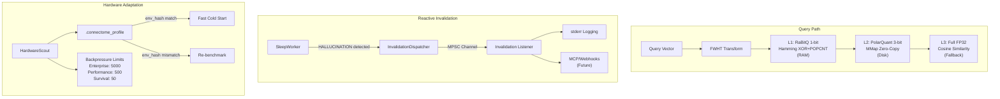

# Walkthrough: ConnectomeDB v0.5.0 — Hybrid Quantization Architecture

## Overview

This session completed **all 4 milestones** of Phase 31, transitioning ConnectomeDB from static FP32 vectors to a tiered hybrid quantization architecture with reactive invalidation.

---

## Architecture



---

## Changes by Milestone

### Hito 1 — Tiered Vector Representations & FWHT

| File | Change |
|------|--------|
| [node.rs](file:///c:/PROYECTOS/ConnectomeDB/src/node.rs) | Replaced `VectorData` with `VectorRepresentations` enum (Binary, Turbo, Full, None). Added `epoch: u32` and `NodeFlags::HALLUCINATION`. |
| [transform.rs](file:///c:/PROYECTOS/ConnectomeDB/src/vector/transform.rs) | Implemented FWHT with SIMD (`wide::f32x8`) + scalar fallback. |

---

### Hito 2 — RaBitQ & PolarQuant Quantization

| File | Change |
|------|--------|
| [quantization.rs](file:///c:/PROYECTOS/ConnectomeDB/src/vector/quantization.rs) | Custom 1-bit (RaBitQ via `u64` + POPCNT) and 3-bit (PolarQuant via `u8` nibble packing) quantizers. |
| [index.rs](file:///c:/PROYECTOS/ConnectomeDB/src/index.rs) | `calculate_similarity()` routes by `VectorRepresentations` variant. `HnswNode.vec_data` migrated from `Vec<f32>` to `VectorRepresentations`. Added `MmapIndexBackend` stub. |
| [executor.rs](file:///c:/PROYECTOS/ConnectomeDB/src/executor.rs) | Updated `search_nearest` calls with `None, None` quant params. |
| [storage.rs](file:///c:/PROYECTOS/ConnectomeDB/src/storage.rs) | Updated `index.add()` calls to use `VectorRepresentations::Full`. |
| [mcp.rs](file:///c:/PROYECTOS/ConnectomeDB/src/api/mcp.rs) | Updated `search_nearest` calls with quant params. |

---

### Hito 3 — Hardware Autodiscovery & Profile Caching

| File | Change |
|------|--------|
| [hardware/mod.rs](file:///c:/PROYECTOS/ConnectomeDB/src/hardware/mod.rs) | Added `env_hash` (CPU brand + RAM + cores) with `.connectome_profile` JSON persistence. Cache invalidation on hardware change. Added `serde` derives. |
| [Cargo.toml](file:///c:/PROYECTOS/ConnectomeDB/Cargo.toml) | Added `serde` (with `derive`) and `serde_json` dependencies. |

---

### Hito 4 — Reactive Invalidation & Backpressure

| File | Change |
|------|--------|
| [invalidations.rs](file:///c:/PROYECTOS/ConnectomeDB/src/governance/invalidations.rs) | **[NEW]** `InvalidationDispatcher` with MPSC channel, 3 event types, and `invalidation_listener` consumer. |
| [sleep_worker.rs](file:///c:/PROYECTOS/ConnectomeDB/src/governance/sleep_worker.rs) | Wired `invalidation_tx` sender. Added backpressure caps by hardware profile. Added hallucination purge with event emission. |
| [connectome-server.rs](file:///c:/PROYECTOS/ConnectomeDB/src/bin/connectome-server.rs) | Bootstraps `InvalidationDispatcher`, spawns listener task, passes sender to `SleepWorker`. |
| [governance/mod.rs](file:///c:/PROYECTOS/ConnectomeDB/src/governance/mod.rs) | Registered `invalidations` submodule. |

---

## Verification

```
cargo check → 0 errors, 0 warnings ✅
cargo check --message-format=short → Finished dev profile in 2.56s ✅
```

## Git History

```
feat(quantum): Phase 31 Milestone 2 - RaBitQ & PolarQuant MMap indexing logic
feat(hardware): Phase 31 Milestone 3 - Chameleon auto-discovery and state caching with fast invalidation
feat(governance): Phase 31 Milestone 4 - InvalidationDispatcher MPSC bus, Hallucination purge, Hardware Backpressure
```
