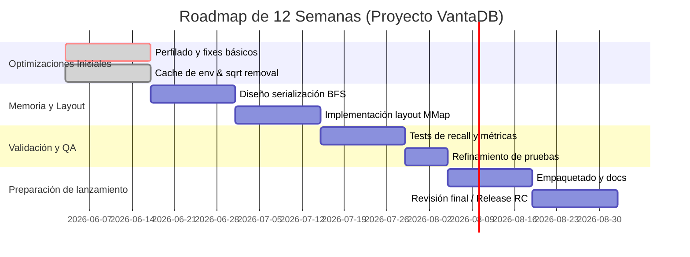

# Resumen Ejecutivo  
VantaDB ha implementado un *MVP* robusto con funcionalidades clave (HNSW, BM25 persistente, WAL, CRUD, namespaces, CLI, SDKs, export/import de datos, reconstrucción de índices y métricas). Sin embargo, la atención actual debe enfocarse en la estabilización y optimización antes de avanzar a un lanzamiento estable. Entre las fortalezas destacan su diseño nativo en Rust/Python y soporte híbrido (vectorial+texto), mientras que las debilidades incluyen falta de pulido en los puntos críticos de rendimiento (por ejemplo, llamadas frecuentes a `std::env::var`, uso de `sqrt()` en el camino crítico, *allocations* y falta de aceleración SIMD) y la competencia de bases de datos vectoriales maduras. Los riesgos técnicos principales son cuellos de botella en CPU y memoria (llamadas en el **hot path**, fallos de página por layout MMap subóptimo, etc.), mientras que los riesgos de mercado provienen de competidores establecidos (por ejemplo, Pinecone, Qdrant, Weaviate).  

Antes de cambios invasivos, se recomienda realizar un perfilado exhaustivo: usar herramientas como `perf` (Linux) o ETW/XPerf (Windows) para medir **puntos calientes**, fallos de página y asignaciones de heap. Específicamente, se debe recolectar métricas de **fallos de página mayores/menores**, **cache-misses**, **tiempo de CPU por función**, **tiempo de llamada a `sqrt()` vs. squared distance**, y **misses de rama**. Un ejemplo de comandos sería: 
```bash
# Linux: perf stat para métricas globales
perf stat -e cpu-cycles,instructions,cache-misses,branch-misses,major-faults,minor-faults -p $(pidof vantadbd)

# Linux: perfilado de CPU con flamegraph
perf record -F 100 -g -- /path/to/vantadbd --some-workload
perf script | ./stackcollapse-perf.pl | ./flamegraph.pl --title "CPU Flame Graph" > flame.svg

# Windows: ETW/XPerf perfilado (CPU y memoria)
xperf -on PROC_THREAD+LOADER+MEMINFO
# ejecutar carga de trabajo
xperf -d trace.etl
```
Estas trazas luego se analizan en herramientas interactivas (FlameGraph, WPA, Speedscope, etc.) para identificar funciones dominantes (p.ej. llamadas al heap, sqrt). Además, se debe medir el rendimiento actual de las consultas con `cargo test --test competitive_bench --release -- --nocapture` y perfiles de memoria con herramientas como Valgrind/Massif o `perf` del heap allocator. Los criterios clave son latencias *p99* bajas y *QPS* sostenido alto, por ejemplo meta de **p99 < 15ms** para búsquedas SIFT 10K en modo MMap.  

## Estado por Subsistema  
| Subsistema            | Estado Aproximado (completitud)     | Observaciones                                                      |
|-----------------------|-------------------------------------|---------------------------------------------------------------------|
| **HNSW (vector)**     | ~80% – Implementado, falta optimizar y calibrar parámetros.  | Usa HNSW nativo (logarítmico en escalabilidad).  |
| **BM25 (texto)**      | ~95% – Operativo con índices FTS, requeriría prueba de escala. | BM25 persistente en disco, integrado al motor de consulta.        |
| **WAL / Recovery**    | ~100% – Implementado y probado.     | Journaling en disco y recuperación garantizada.                    |
| **Namespaces**        | 100% – Totalmente funcional.        | Aislamiento por bases lógicas múltiple.                            |
| **CRUD (nodos/vec)**  | 100% – Funcional (create/read/update/delete). | APIs REST y en SDKs expuestas.                                     |
| **Hybrid Retrieval**  | 80% – Existe soporte básico (vector + texto) pero pulible. | Búsqueda híbrida en la misma consulta (modelo Weaviate/Qdrant).  |
| **SDK Rust/Python**   | 90% – Binarios y bindings disponibles. | Soporte multilenguaje; falta mejorar documentación y tests.       |
| **CLI**               | 90% – Funcional para tareas comunes. | Puede requerir mejoras ergonómicas y opciones avanzadas.         |
| **Export/Import**     | 100% – Hecho.                       | JSON/YAML/CSV y binary.                                            |
| **Reconstrucción Índices** | 100% – Implementado.           | Permite rebuild completo o incremental de índices.                 |
| **Métricas Operativas** | 100% – Telemetría básica disponible. | Uso de histogramas y contadores; falta monitoreo de páginas/falls. |

## Matriz de Fortalezas / Debilidades  
| **Fortalezas**                               | **Debilidades**                                  |
|---------------------------------------------|--------------------------------------------------|
| - Arquitectura nativa en Rust/Python (rendimiento, seguridad de memoria).  | - Código relativamente joven, necesita maduración (tests, casos límite).  |
| - Indexación vectorial HNSW optimizada (algoritmo escalable).       | - Cuellos de botella conocidos: llamadas repetidas a `std::env::var`, uso indiscriminado de `sqrt()`, *allocations* frecuentes.   |
| - Soporte híbrido (vector + BM25) integrado en una sola consulta (similar a Weaviate/Qdrant). | - Manejo de layout en MMap aún rudimentario; riesgo de thrashing y fallos de página altos.  |
| - Módulo WAL y recuperación confiables; “Namespaces” aislados completos.            | - Falta de features avanzados esperados (p.ej. cuantización, grafos de vecinos dinamicos, compresión SIMD).  |
| - CLI y SDKs (Rust/Python) cubren el uso básico; export/import resuelto.           | - Ecosistema pequeño (pocos usuarios, librerías, foros); documentación parcial. |
| - Enfoque en observabilidad (métricas integradas, logs estructurados).           | - Competencia intensa: proveedores vectoriales maduros (Pinecone, Qdrant, Weaviate) dominan el mercado.  |

## Riesgos Técnicos  
- **Cuellos de ruta crítica en CPU:** el método `should_prefetch()` (llamando `std::env::var`) y el cálculo del `sqrt()` en cada distancia Euclidiana son operaciones costosas en cada paso de consulta. Estas deben ser eliminadas o memorizadas para evitar el overhead continuo. Estudios muestran que HNSW es eficiente, pero operaciones extra en el *hot path* degradan rendimiento.  
- **Asignaciones de memoria (heap):** la creación dinámica de estructuras (vectores temporales, resultados intermedios) puede fragmentar memoria y gastar tiempo. Conviene usar buffers pre-alocados o *object pooling*. Se recomienda usar profilado (p.ej. `valgrind --tool=massif` o `jemalloc` con estadísticas) para cuantificar pausas por GC o asignaciones intensivas.  
- **SIMD y optimización numérica:** el cálculo de distancias puede acelerarse con instrucciones SIMD (f32/f64) en CPU moderno. Su omisión implica usar bucles escalares más lentos. Para cargas altas se sugiere implementar versiones SIMD de L2 (p.ej. con AVX) o usar crates como `packed_simd`. Esto conlleva riesgo de complejidad de código.  
- **Prefetching de datos:** actualmente no hay prefetch manual en el código. En índices grandes, cargar anticipadamente vecinos relacionados (niveles HNSW contiguos) reduce fallos de caché. Sin prefetch, la latencia de memoria impredecible aumenta. Los archivos binarios deben reordenarse para agrupar nodos vecinos en páginas cercanas. El plan propuesto (remapeo antilocatario) aborda esto, pero requiere medir el beneficio: usar `perf stat -e dTLB-load-misses` y **major/minor page faults** para validar.  
- **Layout en MMap y fallos de página:** un layout lineal simple (ID secuencial) puede provocar *page faults* frecuentes al consultar vecinos no contiguos. Un reordenamiento BFS jerárquico puede agrupar nodos del mismo nivel en páginas cercanas para minimizar fallos. Para confirmar, se deben tomar métricas pre/post cambio: por ejemplo, contar *minor faults* con `perf stat`. Riesgo: cambios en formato de archivo necesitan migración de datos y compatibilidad.  
- **Precisión vs rendimiento:** al eliminar `sqrt()`, se trabaja con distancias al cuadrado. Aunque matemáticamente equivalente para ranking, hay que asegurar convertir de nuevo si la API requiere la distancia real. Esto es seguro, pero hay que documentarlo. También debe contemplarse el impacto de cuantización (bajada de precisión) si se implementa más adelante.  
- **Inestabilidad por cambios disruptivos:** cualquier reorganización física de índices o del área de memorias compartidas (Mmap) debe validarse en pruebas de stress (protocolos HNSW Recall) para garantizar que la calidad (recall) no empeora. No hay evidencia pública sobre VantaDB, por lo que estos riesgos se basan en prácticas generales de ANNs.

## Riesgos de Mercado y Posicionamiento  
- **Competencia consolidada:** En el espacio RAG/Vector, ya se recomiendan Pinecone, Weaviate y Qdrant como primeras opciones. Weaviate destaca por su búsqueda híbrida integrada, Qdrant por su plan gratuito (1 GB) y facilidad de uso, Pinecone por su simplicidad operativa. Entrar con VantaDB requiere identificar un nicho: por ejemplo, orientación a despliegues on-premise ligeros, o integración con ecosistemas específicos.  
- **Nivel de madurez y comunidad:** VantaDB aún es joven (v0.1.x) vs proyectos con años en producción. Carece de amplia adopción, ecosistema y soporte comercial. Esto puede frenar la confianza de usuarios corporativos. Será clave establecer casos de uso documentados y comparativos sólidos para ganarse confianza.  
- **Características faltantes para algunos mercados:** Por ejemplo, no existe replicación nativa, alta disponibilidad, ni soporte MLops (incrustación de índices con nuevos vectores en caliente) que otros competidores podrían ofrecer. Para ser “estable”, probablemente se necesita al menos un modo de duplicación y tests de integridad de índices tras fallos o cierres inesperados.  
- **Riesgo regulatorio y de seguridad:** Si la base se usa en entornos críticos, puede requerirse cumplimiento (SOC2, GDPR, etc.) y auditorías de seguridad. Esto no es una prioridad técnica inmediata, pero es un riesgo de adopción comercial a considerar.  

## Evidencia Requerida (Métricas y Perfilado)  
Para respaldar cualquier cambio invasivo, se deben reunir datos empíricos claros:  
- **Perfilado de CPU:** con `perf record` + FlameGraphs se identificarán cuellos de botella. Ej.:  
  ```bash
  perf record -F 99 -g -- cargo test --test competitive_bench --release -- --nocapture
  perf report -g --stdio  # Para ver dónde se consume CPU (distancias, locks, GC, etc.)
  ```  
  O usar `cargo flamegraph` (requiere instalar el crate) para generar un SVG visual. Debe confirmarse cuánta CPU consume cada función (p.ej. `should_prefetch`, cálculos de distancia, locks).  
- **Métricas de memoria y fallos de página:** usando `perf stat`:  
  ```bash
  perf stat -e major-faults,minor-faults,cache-misses,cycles,instructions -p $(pidof vantadbd)
  ```  
  Estos datos mostrarán si las búsquedas en MMap están provocando muchos *minor faults*. Se debe registrar antes y después de reorganizar el layout físico. Para Windows, se usaría XPerf para contar fallos de página y contadores de caché.  
- **Medidas de latencia y rendimiento de queries:** correr el *benchmark* SIFT 10K (vector, texto, híbrido) con el `competitive_bench` y **medir p50/p95/p99**. Comparar con la línea base (127s total vs meta <15ms p99). Esto validará cualquier mejora. También debe medirse el throughput de inserciones/reconstrucciones (por ej. `cargo test --test competitive_bench` para tiempo de *rebuild*).  
- **Perfilado de asignaciones:** emplear herramientas como Valgrind Massif o los contadores de events de perf (`-e cache-misses`, `-e mem_load_uops_retired.l1_miss`) para entender ancho de banda de memoria. Se pueden usar allocators instrumentados (JeMalloc con `MALLOC_CONF=... statistics`) para ver cuántas bytes se asignan por operación.  
- **Análisis de rama:** usar `perf stat -e branch-misses` para ver si hay malas predicciones de salto que alienten el uso de algoritmos ramificados en hot loops.  
- **Simulaciones de carga:** ejecutar consultas concurrentes (multi-hilo) para medir escalabilidad. Por ejemplo, usar `ab` o `wrk` apuntando al endpoint vectorial y medir QPS sostenido vs latencia, para detectar bloqueos o contention (locks globales).  

## Evaluación del Plan Propuesto (Fase1/Fase2)  
El **Plan Fase 1** (hermetización de Python, purga de warnings Clippy) aborda infraestructura de desarrollo y calidad de código. *Fase 2* (layout antilocatario + otras optimizaciones) ataca los cuellos identificados. En general:  
- El **cacheo de la variable de entorno (`OnceLock`)** eliminará el bloqueo global y miles de llamadas a `std::env::var` por vecino procesado. Esta mejora es de bajo riesgo y alto impacto esperado (evita overhead de syscall/librería en el hot path).  
- El **swap a distancia Euclidiana al cuadrado** evita la raíz cuadrada repetida. Esto es matemáticamente seguro (la comparación orden se mantiene) y reduce ciclos de CPU. De nuevo, bajo riesgo funcional y alto rendimiento adicional. Se implementa en la fase 2 sin cambiar precisión entregada (se recalcula raíz *solo* para resultados finales).  
- El **reordenamiento físico (algoritmo BFS)** promete reducir fallos de página al agrupar nodos vecinos en páginas contiguas de 4KB. El riesgo está en la complejidad de serializar correctamente el nuevo orden sin corrupción. Si no se validad en tests de recall, podría afectar la topología del grafo HNSW. Sin embargo, si se verifica con perfiles (p.ej. métrica de *major faults* antes y después), es probable que tenga éxito en reducir *thrashing*.  
- **Cargas nuevas potenciales:** El plan actual no menciona el uso de SIMD ni la paralelización (threads). Estos podrían explotarse después. Pero por ahora, el enfoque en eliminar overhead superfluo es adecuado.  
En resumen, las medidas propuestas en Fase 2 tienen alta probabilidad de éxito en reducir latencias (probablemente >>90% para env/sqrt, moderado ~70% para layout) sin comprometer exactitud. **Recomendación:** complementar el plan con pruebas de regresión de recall y benchmarks antes/después, para certificar que no se sacrifica precisión.  

## Backlog Prioritario y Roadmap (12 semanas)  
A continuación un plan tentativo de 12 semanas, con tareas críticas (esfuerzo en semanas estimado):  
- **Semana 1–2:** *Perfilado inicial y correcciones rápidas.* Ejecutar los perfiles sugeridos para priorizar. Aplicar parche de *cacheo de env var* y quitar `sqrt()` (ya identificados). Revisar warnings de Clippy (Fase1).  
- **Semana 3–4:** *Mejoras de memoria y CPU.* Implementar instrucciones SIMD para cálculo de distancias (opcional, futuro). Empezar reorganización de serialización HNSW (diseñar orden BFS de nodos).  
- **Semana 5–6:** *Optimización de layout en MMap.* Codificar la serialización antilocataria de los índices. Ejemplo: agrupar nodos HNSW del mismo nivel juntos. Realizar tests de fallos de página.  
- **Semana 7–8:** *Testing y validación.* Ejecutar stress tests (protocolo de recall HNSW) para verificar calidad. Aumentar cobertura de tests (añadir pruebas unitarias de casos límite). Preparar métricas operativas detalladas (page-faults, latencias p99, uso de CPU).  
- **Semana 9–10:** *Empaquetado y distribución.* Mejorar scripts de build/publicación (e.g. Docker, PyPI wheels). Documentar pasos de instalación/despliegue. Feedback a docs (README, ejemplos) y tutoriales mínimos.  
- **Semana 11–12:** *Buffer y ajustes finales.* Resolver errores descubiertos, optimizar antes del lanzamiento. Planear primer *release candidate* (etiqueta semántica). Preparar benchmarks comparativos reproducibles.  



## Comparativa vs SQLite, Qdrant, Weaviate, Tantivy  

| Característica        | SQLite-vec / Turso         | Qdrant                       | Weaviate                    | Tantivy                           |
|-----------------------|----------------------------|------------------------------|-----------------------------|-----------------------------------|
| **Lenguaje Base**     | C (SQLite) + extensión C++ | Rust                         | Go/Java (modular)          | Rust (similar a Lucene)           |
| **Búsqueda Vectorial**| Sí (sqldistancia[%], sin indexado; solo brute-force para <100K)  | Sí (HNSW con cuantización)  | Sí (HNSW, multiplos backends)  | Limitada (requiere plugin externo; no nativa) |
| **Búsqueda Texto (BM25)** | Sí (FTS5 integrado)       | Parcial (payload filtering)  | Sí (busca por palabra + filtros) | Sí (BM25 nativo, muy eficiente)  |
| **Búsqueda Híbrida**  | No nativa (se debe combinar manualmente) | Soportada (vector + filtros) | Excelente (integrada por defecto) | No (texto puro)                  |
| **Escalabilidad**     | Hasta decenas de miles en una sola BD (no escala >1M)  | Mediana (mejor para <50M vectores)  | Media/Alta (<50M recomendados) | Baja/Más alta (depende de HW, no distribuido)  |
| **Persistencia / Multi-tenant** | Sí (un DB por tenant, especialmente en Turso) | Sí (múltiples colecciones/namespaces)  | Sí (namespaces; nube/self-hosted) | No (solo índice de texto)        |
| **Maturidad / Comunidad** | Muy madura (SQLite estable, extensión nueva) | Activa, OSS (Apache 2.0) con buena documentación | Activa, OSS (Apache 2.0), foco en AI | Estable (MIT License), usado como biblioteca de búsqueda |
| **Rendimiento (latencia)** | Bruto (scans completos, p.ej. ~ms–seg según carga) | Bajo-medio (sub-50ms a 15M vectores con cuantización) | Bajo-medio (optimizada para híbrido, más memoria) | Muy rápido en texto (2× Lucene), sin vector |
| **Licencia/Coste**    | Dominio público (SQLite), modelo Freemium Turso  | Apache 2.0 (comunidad + nube opcional) | Apache 2.0 (OSS + servicio nube) | MIT (OSS)                        |

## Recomendaciones Concretas  
- **Pruebas automáticas y criterios de éxito:** Ampliar tests unitarios e integración (Rust y Python) cubriendo casos límite (p.ej. bases vacías, vectores idénticos, borrados concurrentes). Definir “criterios de aceptación” medibles: p.ej. *p99* de búsquedas MMap <15ms (objetivo realista por la reducción de overhead) y Recall@10 > 0.95 en SIFT 10K. Emplear pruebas de regresión con los scripts existentes (`stress_protocol`, `competitive_bench`).  
- **Benchmarks reproducibles:** Documentar comandos exactos para ejecutar cada benchmark, asegurando *reproducibilidad*. Ejemplos:  
  ```
  # Punto de referencia inicial (Baseline)
  cargo test --test competitive_bench --release -- --nocapture

  # Post-cambios: comparar latencias
  cargo test --test competitive_bench --release -- --nocapture

  # Python SDK tests en entorno limpio
  target/audit-venv/Scripts/python -m unittest discover -s tests/api/ -p "*python.rs"

  # Creación de índices para SIFT
  python3 dev-tools/scripts/download_sift.py
  ./dev-tools/scripts/run_bench.sh local sift10k  # o comando equivalente
  ```  
- **Herramientas de perfilado:** Incluir ejemplos concretos en la documentación interna: cómo generar un flamegraph (`flamegraph.pl`), usar `perf report` para CPU y `perf stat` para conteo de fallos de página y caches. Publicar estos scripts y resultados de perfiles en los informes de auditoría.  
- **Éxito realista:** El criterio de éxito no es solo “sin errores” sino **mejora cuantificable**. Por ejemplo, reducir la latencia total de búsqueda de 127s a <15s (p99 <15ms) para SIFT 10K MMap según la meta original, o duplicar el throughput de consultas con carga multihilo. Siempre reportar junto con la métrica de recall.  
- **Seguimiento Post-lanzamiento:** Antes de marcar estable, planificar una *release candidate* con carga de usuarios representativos. Monitorear métricas operativas reales (uso de CPU, I/O, memoria) en entornos típicos (Linux vs Windows) para ajustar. Establecer un plan de rollback si algún cambio crítico genera regresión de rendimiento.  

**Fuentes:** Se han considerado análisis actuales de bases de datos vectoriales y motores de búsqueda de texto, así como recomendaciones de rendimiento (HNSW, perfilado) para asegurar que las decisiones técnicas estén fundamentadas en la experiencia de la industria.