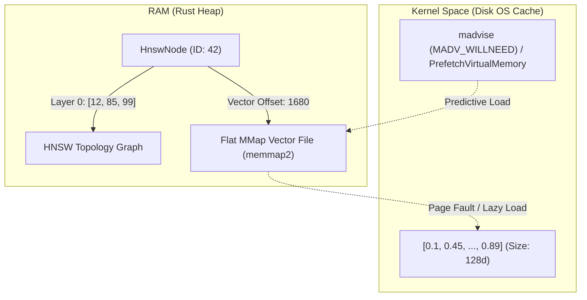

> **[Histórico — rescatado 2026-09-30]** Extracto literal de `PROYECT VANTADB.md` secciones 23-26 (líneas 4351-5796 del original). Diseño cognitivo original (NeuLISP retirado; IQL sobrevivió); no ejecutar sin re-validar.

---
## 23. ESPECIFICACIONES DE FASES AVANZADAS 20-26 — DETALLE TÉCNICO (LOTE 9)

> **Regla 2 aplicada:** Todas las metáforas biológicas de los archivos fuente (SleepWorker, Cortex, Lóbulos, Olvido Bayesiano, etc.) han sido traducidas al glosario técnico vigente de VantaDB. Los términos originales se preservan como referencias históricas entre corchetes donde aportan contexto de diseño.

> **Estado de implementación:** Según la sección 22.2 (Fase CUARENTENA-01), los módulos de gobernanza experimental (`src/governance/sleep_worker.rs`, `src/eval/`, `src/parser/lisp.rs`) fueron **movidos a cuarentena** y extraídos del core estable. Las especificaciones de este lote representan diseño conceptual avanzado, parcialmente implementado y ahora en estado de cuarentena/experimental.

### 23.1 Fase 20: Maintenance Worker — Consolidación Periódica de Datos

> **Archivo fuente:** `20_SleepWorker_Spec.md`  
> **Nombre original:** Mantenimiento Circadiano (Sleep Worker)  
> **Traducción semántica aplicada:** SleepWorker → Maintenance Worker, Cortex RAM → Volatile Node Cache, Fase REM → Consolidation Phase, STN/LTN → HotNode/ColdNode

#### 23.1.1 Meta Arquitectónica

Implementar un **ciclo de consolidación de datos** en VantaDB. Durante periodos de alta demanda de I/O, la base de datos debe ser extremadamente rápida alojando información transitoria (**Hot Nodes**) en arreglos RAM (**Volatile Node Cache**). Durante los periodos de inactividad, un hilo de limpieza en segundo plano (**Maintenance Worker**) ejecuta una **Consolidation Phase** para evaluar, degradar o consolidar los datos hacia la persistencia a largo plazo (**Cold Nodes** / Storage Backend).

#### 23.1.2 Componentes del Diseño

**Volatile Node Cache (Capa RAM Hot):**  
Actualmente el `StorageEngine` delega todo al backend, confiando ciegamente en el BlockCache subyacente. Para habilitar un control heurístico, se inyecta un HashMap Atómico (`volatile_cache`) que actúa como un L1 Cache explícito para nodos volátiles y mutaciones activas. Además, se añade un `last_query_timestamp` (AtomicU64) para perfilar los periodos de inactividad.

**Maintenance Worker Daemon (`src/governance/maintenance_worker.rs`):**  
Un loop de tokio desacoplado del pool principal.

| Parámetro | Valor | Descripción |
|:---|:---|:---|
| Cadencia | `X` segundos (configurable, ej. 10s) | Frecuencia de activación |
| Inception Condition | `now() - last_query_timestamp > 5000ms` | Solo opera en periodos de inactividad |
| Yield Interruption | `tokio::task::yield_now()` | Si llega una petición de usuario durante el barrido, cede inmediatamente |

#### 23.1.3 Algoritmos Heurísticos de Consolidación

| # | Algoritmo | Descripción | Traducción del Término Original |
|:---:|:---|:---|:---|
| 1 | **Exponential Decay** | Por cada Consolidation Phase sobre la RAM, el campo `hits` de los nodos se divide en 2 (`hits *= 0.5`) | Originalmente: "Olvido Bayesiano" |
| 2 | **Hot→Cold Migration** | Si `hits < UMBRAL` y no posee el flag `PINNED`, el nodo es movido del HashMap al backend (Column Family "default") | Originalmente: "Migración STN→LTN" |
| 3 | **Archive Pruning** | Si el nodo (al consolidarse o en storage primario) posee un `trust_score < 0.2`, se migra físicamente como lápida al Audit Partition | Originalmente: "Poda hacia Shadow Archive" |

### 23.2 Fase 21: Profiling y Aceleración SIMD del Índice Vectorial

> **Archivos fuente:** `21_Profiling_Results.md`, `21_SIMD_Optimization.md`  
> **Traducción semántica:** Neural Indexing → Vector Indexing, Abogado del Diablo → Consistency Validator, Nodo Fantasma → Phantom Reference

#### 23.2.1 Resultados de Profiling (Fase 18.5 — The Memory Abyss)

**Parámetros del Test:**

| Parámetro | Valor |
|:---|:---|
| Entorno | Local (Target 16GB RAM) |
| Tamaño Dataset | 100,000 Nodos (escalable a 1M) |
| BlockCache | 2GB LRU |
| WriteBufferSize | 128MB (×4 MemTables = 512MB Max RAM Write Spikes) |
| BloomFilter | 10 Bits por llave (~1% tasa de falso positivo) |

**Caso: Integridad Referencial vs Falsos Positivos:**

La decisión arquitectónica de confiar mecánicamente en el StorageEngine trae consigo una mitigación necesaria mediante filtros probabilísticos. Al intentar realizar una consulta a disco para establecer un **Axioma de Integridad Referencial** ("No Huérfanos"), el motor en su versión primitiva sufría latencias `>1ms / iteración` tratando de buscar el nodo vacío dentro del MemTable y posteriormente los SSTables profundos.

**Observaciones y Métricas:**

| Tipo de Lookup | Comportamiento |
|:---|:---|
| **Point Lookup Válido** (Node ID existente) | Impacto en block cache. Si está cacheado: nanosegundos/microsegundos predecibles |
| **Point Lookup Probabilístico** (Node ID inexistente, ej. ataque/error) | Bloom Filter actúa como embudo deteniendo la petición en nanosegundos ANTES de molestar al bus SSD PCIe |

**Phantom Reference Test (implementado):**

Cuando un atacante (o un LLM alucinante) forja el Statement `RELATE 1 -> 999` y la llave probabilística llegase a coincidir en la función Hash del Bloom Filter (escaso con 10 bits), la validación descarta el dato al invocar `.get() -> Ok(None)`, activando el `trigger_panic_state()` o la cancelación de la transacción desde el Executor mediante `Err("Referential Integrity Axiom violated")`.

**Conclusión Fase 18.5:**  
Con estos mecanismos, VantaDB mantiene su huella de memoria atada en todo momento al BlockCache estricto de 2GB. Sobrevive a estrés sin degradación silente.

#### 23.2.2 Fase 21: Aceleración SIMD del Vector Index

**Meta:** Reducir los tiempos de latencia del CP-Index explotando capacidades de vectorización hardware (SIMD). El Consistency Validator introduce una sobrecarga al tener que buscar en un grafo de HNSW a cada intento de escritura. Al implementar instrucciones avanzadas AVX-512/NEON bajo la arquitectura local del hardware edge, se reduce la latencia de validación al piso esperado de <0.5ms para 100k nodos.

**Mecanismo (Crate `wide`):**  
Implementar las dependencias SIMD reestructurando las métricas `cosine_similarity` en `src/node.rs` y las validaciones de búsqueda de HNSW (`src/index.rs`) para procesar iteradores f32 en bloques paralelos. Adicionalmente, refinar los `read_locks` en las capas altas de HNSW, minimizando contención.

**[⚠️ SOLAPAMIENTO: 21_SIMD_Optimization.md vs Sección 13.4 del snapshot maestro]**  
*El archivo fuente propone SIMD como optimización futura; el snapshot maestro ya documenta implementación parcial de SIMD con fallback escalar en `src/index.rs` (CPIndex, `searchlayer`, `euclideandistancesquared`, `cosinesim`). Se preservan ambas versiones.*

### 23.3 Fase 22: LISP Cognitivo y S-Expressions (Homoiconicidad)

> **Archivo fuente:** `22_Lisp_Cognition.md`  
> **Traducción semántica:** Cognitive IQL → Declarative Query Language con S-Expressions, Combustible Cognitivo → Execution Budget, Valencia Gated-Macros → Relevance-Gated Macros
>
> **Estado actual (post-CUARENTENA-01):** Este módulo fue **movido al subcrate `experimental-lisp`** (ver sección 22.2.1). El parser de LISP ya no forma parte del core estable de VantaDB. Las queries con sintaxis LISP (`(...)`) son rechazadas por el executor estándar con un error explícito.

#### 23.3.1 Meta Arquitectónica

Dotar a VantaDB de una capa teórica donde **el código es igual a los datos** (homoiconicidad). El motor es capaz de razonar funcionalmente, almacenando nodos que no solo representan "hechos pasivos", sino "reglas de negocio dinámicas" (S-Expressions).

#### 23.3.2 Mecanismo de Implementación

**1. Parsing (`src/parser/lisp.rs`):**  
Parser secundario basado en `nom` que identifica estructuras balanceadas de paréntesis.

| Elemento | Descripción |
|:---|:---|
| Átomos | Identificadores de funciones (`INSERT`, `MATCH`) |
| Keywords | Metadatos rápidos (`:label`, `:trust`) |
| Variables | Identificadores dinámicos que comienzan con `?` |
| Mapas | Representación de payloads complejos `{ :key "val" }` |

**Operaciones de Primer Orden Avanzadas:**

- **Operador de Similitud (`~`):** Enlace directo y nativo entre expresiones LISP y el clúster HNSW. Evalúa la distancia coseno. Ejemplo: `(if (~ query-vector node-vector 0.9) (allow) (reject))`
- **Relevance-Gated Macros:** Macros de ejecución condicionada a que el nodo posea un Relevance Score superior, ejecutables activamente por el Maintenance Worker.

**2. Sandbox de Ejecución (`src/eval/mod.rs`):**  
Para prevenir ataques de denegación de servicio (DoS) mediante recursión infinita o bucles lógicos, se implementa el `LispSandbox`.

| Parámetro | Valor |
|:---|:---|
| Execution Budget | Cada paso consume 1 unidad; límite por defecto: `1000` |
| Abort Condition | Si se agota: `Sandbox Abort: Out of Execution Budget` |
| Inmutabilidad | El evaluador opera sobre `std::borrow::Cow<'_, LispExpr>` para minimizar copias |

**3. Integración con el Executor:**  
Detección temprana del string de entrada en `src/executor.rs`:

```rust
if trimmed.starts_with('(') {
    // Redirigir al evaluador LISP (ahora en experimental-lisp crate)
} else {
    // Parser IQL estándar
}
```

**4. Homoiconicidad Transaccional:**  
Los nodos pueden contener S-Expressions como valores de campo. El Consistency Validator (`DevilsAdvocate`) tiene la capacidad de evaluar estas expresiones antes de permitir una mutación, asegurando que las reglas lógicas no entren en contradicción con el conocimiento ya establecido en el grafo.

### 23.4 Fase 23: Gobernanza de Integridad y Audit Layer

> **Archivo fuente:** `23_Sovereignty_Governance.md`  
> **Traducción semántica:** Soberanía Cognitiva → Data Integrity Governance, Shadow Kernel → Audit Layer, Abogado del Diablo → Consistency Validator, Árbitro de Confianza → Trust Resolver, Axiomas de Hierro → Data Integrity Axioms, Lóbulos → Storage Partitions
>
> **Estado actual (post-CUARENTENA-01):** Estos módulos fueron **movidos al subcrate `experimental-governance`** (ver sección 22.2.2). La gobernanza avanzada ya no forma parte del core estable.

#### 23.4.1 Meta Arquitectónica

Implementar un sistema de auditoría proactiva que proteja la integridad semántica de la base de datos. En VantaDB, las mutaciones no son simples escrituras en disco; son decisiones que deben ser validadas contra el conocimiento preexistente.

#### 23.4.2 Componentes de Gobernanza (`src/governance/`)

**1. Consistency Validator (`DevilsAdvocate`):**  
Filtro crítico durante las operaciones de `INSERT` y `UPDATE`.

- **Detección de Contradicciones:** Si se intenta insertar un nodo con una similitud vectorial muy alta (>0.95) a uno ya existente, pero con valores relacionales o etiquetas contradictorias, el sistema marca una alerta.
- **Evaluación de Trust:** Compara el `Trust Score` del "incumbente" (nodo existente) contra el "propuesto". Si el propuesto tiene un score significativamente menor, la mutación puede ser rechazada.

**2. Trust Resolver (`TrustArbiter`):**  
Resuelve los conflictos identificados por el Consistency Validator.

| ResolutionResult | Acción |
|:---|:---|
| `Accept` | La mutación es segura |
| `Reject(reason)` | Se bloquea la escritura para preservar la integridad (Sovereignty Rejected) |
| `Shadow(id)` | La escritura se permite pero se marca para revisión manual o se desvía al Audit Partition |

#### 23.4.3 Data Integrity Axioms

Reglas inmutables de bajo nivel que protegen el motor contra la entropía informacional.

**1. Aceleración vía Bloom Filters:**  
Para escalar a millones de nodos sin penalizar la latencia de escritura (`INSERT/RELATE`), VantaDB utiliza Filtros de Bloom en memoria por cada Storage Partition.

- **Mecanismo:** Antes de realizar un Point-Lookup en el backend para verificar un Axioma de Integridad Referencial ("¿existe el nodo destino?"), se consulta el Bloom Filter.
- **Resultado:** El 99% de las referencias inexistentes se descartan en nanosegundos sin tocar el disco.

**2. Panic State Proxy:**  
Si se detecta una violación de un Data Integrity Axiom que no puede ser resuelta (ej: bit-flip en RAM detectado por checksum), el sistema entra en Panic Mode:

- `std::process::exit(1)`: Interrupción forzada para evitar la propagación de corrupción.
- Emergency Dump: Antes del cierre, el motor intenta realizar un volcado de memoria de los últimos vectores procesados para análisis forense.

#### 23.4.4 Audit Layer (Forensic Storage)

**Borrados Atómicos y Lápidas (Tombstones):**  
VantaDB no utiliza borrados físicos inmediatos (`hard-delete`). En su lugar, implementa un sistema de Lápidas Auditables:

- Al borrar un nodo, se mueve al **Audit Archive** (Column Family dedicada).
- Se deja una lápida (tombstone) con metadatos sobre por qué y quién realizó el borrado.
- Esto permite la prevención de pérdida semántica y auditorías post-mortem.

**Garbage Collection Asíncrono (`src/gc.rs`):**  
Un worker en segundo plano se encarga de la purga física de datos basados en políticas de retención (TTL), el estado de las lápidas y el `Trust Score` acumulado, liberando espacio en el backend sin comprometer la latencia de las queries activas.

**Data Integrity Axioms (v0.4.0):**

| Axioma | Descripción |
|:---|:---|
| **Topological Consistency** | No se permiten relaciones hacia nodos ya tombstoned |
| **Life Insurance** | Checkpoints automáticos basados en hard-links del backend para recuperación instantánea ante fallos catastróficos |

### 23.5 Fase 24: Jerarquía de Memoria de Dos Niveles

> **Archivo fuente:** `24_Memory_Hierarchy.md`  
> **Traducción semántica:** STNeuron → HotNode / VolatileNode, LTNeuron → ColdNode / PersistentNode, Axon → WAL, Mantenimiento Circadiano → Consolidation Cycle, Calentamiento/Enfriamiento → Promotion/Demotion

#### 23.5.1 Meta Arquitectónica

Optimizar el rendimiento y la durabilidad mediante una estructura de memoria de dos niveles.

#### 23.5.2 Nivel 1: HotNode (VolatileNode — Memoria de Trabajo / Fase de Ingesta Activa)

| Atributo | Valor |
|:---|:---|
| **Ubicación** | HashMap atómico en RAM (`volatile_cache`) |
| **Propósito** | Alojar nodos con alta frecuencia de acceso o mutaciones recientes que aún no han sido consolidadas |
| **Acceso** | Latencia sub-microsegundo. Sin serialización |
| **Persistencia** | Protegida temporalmente por el WAL |

#### 23.5.3 Nivel 2: ColdNode (PersistentNode — Memoria Permanente)

| Atributo | Valor |
|:---|:---|
| **Ubicación** | Backend Storage (SST Files en SSD/NVMe) |
| **Propósito** | Almacenamiento masivo de conocimiento histórico y relaciones estables |
| **Acceso** | ~20ms (según I/O). Optimizado mediante el BlockCache |
| **Estructura** | Nodos serializados en `bincode` |

#### 23.5.4 Estrategia de Swapping (Consolidation Cycle)

El paso de HotNode a ColdNode no es binario, sino que depende de la relevancia del nodo:

- **Promotion (Calentamiento):** Al consultar un ColdNode con un `hits` alto, el motor puede decidir "subirlo" a RAM (HotNode) para acelerar futuras inferencias.
- **Demotion (Enfriamiento):** El Maintenance Worker degrada periódicamente los nodos en RAM hacia el disco si su frecuencia de uso cae por debajo del umbral de Exponential Decay.

#### 23.5.5 Optimización "Survival Mode" (mmap)

En hardware limitado (16GB RAM), VantaDB utiliza Memory-Mapped Files para el acceso directo a los vectores del HNSW Index:

1. Los descriptores vectoriales se mapean desde el disco al espacio de direcciones virtual.
2. El sistema operativo gestiona el paginado de memoria según la demanda.
3. Esto permite navegar grafos de 1M+ de nodos sin saturar la RAM física, manteniendo la ilusión de una base de datos 100% in-memory.

**[⚠️ SOLAPAMIENTO: 24_Memory_Hierarchy.md vs SCALE-01/implementation_plan.md (Lote 5)]**  
*El archivo fuente describe mmap como optimización implementada en Fase 24; el plan SCALE-01 documenta implementación real con benchmarks de prefetch y zero-copy paging. Se preservan ambas perspectivas.*

### 23.6 Fase 25: Segmentación por Storage Partitions

> **Archivo fuente:** `25_Lobe_Segmentation.md`  
> **Traducción semántica:** Lóbulos → Storage Partitions / Column Families, Corteza Activa → Primary Partition, Subconsciente → Audit Partition, Arqueología Semántica → Forensic Audit, Cirugía Lógica → Manual Data Surgery

#### 23.6.1 Meta Arquitectónica

Organizar el almacenamiento físico en **Storage Partitions**, aprovechando la funcionalidad de Column Families (CF) del backend. Esta compartimentación permite aplicar políticas de compresión, caché y auditoría diferenciadas por tipo de dato.

#### 23.6.2 Estructura de Storage Partitions Predefinidos

**1. Primary Partition (Default):**  
Contiene el Active Working Set del sistema.

- **Datos:** Nodos activos, relaciones (`edges`) y metadatos relacionales.
- **Optimización:** Cache agresivo en RAM. Prioridad alta en compactación L0/L1.
- **Uso:** Queries de tiempo real e inferencia inmediata.

**2. Audit Partition (Shadow Kernel):**  
El archivo forense.

- **Datos:** Nodos borrados (`AuditableTombstone`), registros de fallos de Axiomas y trazas de gobernanza rechazada.
- **Optimización:** Compresión alta (ej. Zstd). Almacenamiento en capas de disco lento (Glacier Storage pattern).
- **Uso:** Auditoría post-mortem y Forensic Audit.

**3. Archive Partition (Deep Memory):**  
Memoria consolidada de verdades inmutables.

- **Datos:** Summary Nodes (resultado del Knowledge Distillation) y snapshots de estados de alta confianza.
- **Optimización:** Read-only y Bloom Filters exhaustivos. Prohibidas las mutaciones sin Manual Data Surgery.
- **Uso:** Entrenamiento continuo y transferencia de conocimiento.

#### 23.6.3 Ventajas Técnicas

| # | Ventaja | Descripción |
|:---:|:---|:---|
| 1 | **Aislamiento de I/O** | Las escrituras constantes en Primary Partition no bloquean las búsquedas pesadas en Archive Partition |
| 2 | **Escalabilidad Selectiva** | Es posible exportar un único Partition (ej. el Archive) para moverlo a otro nodo de VantaDB (Federation) |
| 3 | **Mantenimiento Independiente** | El Maintenance Worker puede compactar el Audit Partition de forma independiente, eliminando físicamente lápidas que han expirado su TTL sin afectar al Primary |

### 23.7 Fase 26: Exponential Decay y Knowledge Distillation

> **Archivo fuente:** `26_Bayesian_Forgetfulness.md`  
> **Traducción semántica:** Olvido Bayesiano → Exponential Decay, Compresión Cognitiva → Knowledge Distillation, Poda de Entropía → Relevance Pruning, Neurona de Resumen → Summary Node, Onírico → Candidate for Distillation, Presupuesto de Amígdala → High-Value Protection Budget, Estados de Salud Neuronal → Node Lifecycle States

#### 23.7.1 Meta Arquitectónica

El crecimiento infinito de datos es insostenible en hardware local. VantaDB resuelve esto mediante el **Consolidation Cycle**, transformando el borrado de datos en un proceso de destilación de conocimiento.

#### 23.7.2 Relevance Pruning (Entropy Pruning)

Inspirado en el decaimiento de conexiones de baja relevancia.

- **Mecanismo:** El Maintenance Worker recorre el Volatile Cache y el Primary Partition durante periodos de baja actividad.
- **Acción:** Por cada ciclo, el valor `hits` (frecuencia de acceso) de los nodos que no han sido consultados recientemente se divide: `hits = hits * 0.5`.
- **Efecto:** Los datos "irrelevantes" pierden energía gradualmente hasta alcanzar un umbral crítico de evacuación.
- **Implementación:** `src/governance/maintenance_worker.rs` → Stage 1 dentro de `execute_consolidation_phase()`.

#### 23.7.3 Knowledge Distillation (Neural Summarization)

En lugar de simplemente borrar, VantaDB intenta "entender" qué se está perdiendo.

**Flujo Completo (Stage 3 del Maintenance Worker):**

```
┌────────────────────────────────────┐
│ Stage 1: Exponential Decay         │  hits *= 0.5 por Consolidation Cycle
│ Stage 2: Survival Evaluation       │  Purge (trust<0.2) / Consolidate (hits<10)
│ Stage 3: Knowledge Distillation    │  Compresión LLM de grupos candidatos
└────────────────────────────────────┘
```

**Detalle del Stage 3:**

| Paso | Acción |
|:---:|:---|
| 1 | **Clustering:** Los nodos con `hits < 5` y `!PINNED` se agrupan por el campo de edge `belongs_to_thread` |
| 2 | **Validación de Peso Mínimo:** Solo se resumen grupos con `≥ 2 nodos` y `sum(hits) >= 3`. Los nodos basura se purgan directamente sin gastar CPU en LLM |
| 3 | **Prompt Estructurado:** El motor invoca al LLM local (Ollama vía `VANTADB_LLM_SUMMARIZE_MODEL`) con prompt de sistema que incluye: contenido, `semantic_valence`, `trust_score`, keywords, `hits` |
| 4 | **Generación de Summary Node:** Se crea un nuevo nodo con propiedades específicas (ver abajo) |
| 5 | **Transacción de Seguridad:** El Summary Node se persiste PRIMERO en `archive` CF. Solo si esta operación tiene éxito, los nodos originales se mueven al `audit` CF como `AuditableTombstone`. Si falla, los originales se mantienen intactos |
| 6 | **Presupuesto de Tiempo:** Límite de ejecución de 8 segundos (`MAX_SUMMARIZATION_DURATION_MS`). Si se excede, los grupos pendientes se difieren al siguiente ciclo |

**Propiedades del Summary Node:**

| Propiedad | Valor |
|:---|:---|
| `node_type` | PersistentNode |
| `flags` | PINNED (inmutable) |
| `semantic_valence` | 0.9 (protegida por High-Value Protection Budget) |
| `trust_score` | Promedio de los nodos originales |
| `ancestors` | IDs originales (para Forensic Audit futuro) |
| Embedding | Generado vía `generate_embedding()` para búsqueda semántica |

**Implementación:**
- `src/governance/maintenance_worker.rs` → `execute_knowledge_distillation()`
- `src/llm.rs` → `LlmClient::summarize_context()`
- `src/storage.rs` → `StorageEngine::insert_to_cf()`, `StorageEngine::consolidate_node()`

#### 23.7.4 Node Lifecycle States

> **Traducción:** Originalmente "Estados de Salud Neuronal" (Lúcido, Dudoso, Onírico, Difunto).

| Estado Traducido | Estado Original | Condición | Acción del Maintenance Worker |
|:---:|:---:|:---|:---|
| **Active** | Lúcido | Hits / Trust Alto | Mantener en Primary Partition (RAM/Hot) |
| **Degraded** | Dudoso | Hits Medio/Bajo | Migrar de HotNode a ColdNode (Disco) |
| **Candidate** | Onírico | Hits Muy Bajo (<5) | Candidato a Knowledge Distillation vía LLM |
| **Archived** | Difunto | Trust < 0.1 | Mover al Audit Archive (Tombstone) |

#### 23.7.5 Corrección HNSW (Pre-Fase 26)

**[⚠️ SOLAPAMIENTO: 26_Bayesian_Forgetfulness.md vs Sección 18.1 (SEC-FFI walkthrough)]**  
*El archivo fuente reporta un gap crítico ya resuelto: cuando el Maintenance Worker consolidaba nodos Hot→Cold, lo hacía con `db.put()` directo, sin actualizar el índice HNSW en memoria. Esto causaba divergencia entre el índice vectorial y el disco. La solución fue el método `StorageEngine::consolidate_node()` que realiza escritura a disco Y actualización del HNSW atómicamente.*

#### 23.7.6 Axioma de Inmortalidad (Axiom Lock)

Si un nodo posee el flag `PINNED`, el Maintenance Worker tiene prohibido reducir sus `hits` o mutar su ubicación. Este mecanismo se reserva para "Verdades Fundamentales" definidas por el desarrollador o axiomas del sistema.

#### 23.7.7 High-Value Protection Budget (Presupuesto de Amígdala)

El 5% más alto de `volatile_cache` (medido por `semantic_valence >= 0.8`) está blindado contra el Exponential Decay. Estos nodos no se degradan ni se consolidan durante la Consolidation Phase, preservando los nodos de mayor relevancia semántica.

#### 23.7.8 Variables de Entorno (LLM Integration)

| Variable | Descripción | Default |
|:---|:---|:---|
| `VANTADB_LLM_URL` | URL de Ollama para embeddings y resúmenes | `http://localhost:11434` |
| `VANTADB_LLM_MODEL` | Modelo para embeddings | `all-minilm` |
| `VANTADB_LLM_SUMMARIZE_MODEL` | Modelo para Knowledge Distillation | `llama3` |

> **Nota de nomenclatura:** Las variables de entorno originales usaban el prefijo `CONNECTOME_*`. Han sido normalizadas a `VANTADB_*` para alinearse con el estándar actual del proyecto.

### 23.8 Resumen Cruzado: Fases 20-26

| Fase | Tema Técnico | Componente Principal | Estado Actual (post-CUARENTENA-01) |
|:---:|:---|:---|:---|
| 20 | Consolidation Cycle | Maintenance Worker + Volatile Cache | En cuarentena (`experimental-governance`) |
| 21 | Vector Indexing SIMD | Crate `wide` + AVX-512/NEON | **Parcialmente en core** (ver sección 13.4) |
| 22 | LISP S-Expressions | Parser + Sandbox + Executor | En cuarentena (`experimental-lisp`) |
| 23 | Data Integrity Governance | Consistency Validator + Trust Resolver + Audit Layer | En cuarentena (`experimental-governance`) |
| 24 | Two-Tier Memory Hierarchy | HotNode/ColdNode + mmap Survival Mode | **Concepto integrado** en arquitectura actual |
| 25 | Storage Partitions | Column Families (Primary/Audit/Archive) | **Concepto integrado** en StorageBackend |
| 26 | Exponential Decay + Distillation | 3-stage Consolidation + Summary Nodes | En cuarentena (`experimental-governance`) |

### 23.9 Solapamientos Cruzados del Lote 9

| # | Etiqueta | Fuentes | Sección Afectada |
|:---:|:---|:---|:---|
| 1 | `[⚠️ SOLAPAMIENTO]` | 21_SIMD_Optimization.md (propone SIMD futuro) vs snapshot maestro (SIMD ya implementado parcialmente) | 13.4, 23.2.2 |
| 2 | `[⚠️ SOLAPAMIENTO]` | 24_Memory_Hierarchy.md (mmap como feature Fase 24) vs SCALE-01/implementation_plan.md (implementación real con benchmarks) | 23.5.5 |
| 3 | `[⚠️ SOLAPAMIENTO]` | 26_Bayesian_Forgetfulness.md (consolidate_node como fix nuevo) vs SEC-FFI walkthrough (ya documentado como resuelto) | 18.1, 23.7.5 |
| 4 | `[⚠️ SOLAPAMIENTO]` | 22_Lisp_Cognition.md (LISP en core) vs CUARENTENA-01 (LISP movido a subcrate) | 22.2.1, 23.3 |
| 5 | `[⚠️ SOLAPAMIENTO]` | 23_Sovereignty_Governance.md (governance en core) vs CUARENTENA-01 (governance movido a subcrate) | 22.2.2, 23.4 |
| 6 | `[⚠️ SOLAPAMIENTO]` | Variables de entorno `CONNECTOME_*` (archivos fuente) vs nomenclatura actual `VANTADB_*` | 23.7.8 |

---

## 24. ESPECIFICACIONES DE FASES AVANZADAS 27-31B — Detalle Técnico (Lote 10)

> **Nota de Regla 2 (Traducción Semántica):** Los archivos fuente de este lote utilizan extensivamente metáforas biológicas. Todas han sido traducidas al glosario técnico vigente de VantaDB. Los identificadores de código Rust (`QuantumNeuron`, `UncertaintyBuffer`, `NeuLISP`) se preservan literalmente como referencias de implementación pero se documentan como términos deprecados en la API pública.

> **Nota de Estado:** Las Fases 27-31B representan **diseño conceptual avanzado**, no estado actual del core. La mayoría de sus componentes fueron movidos a subcrates en cuarentena durante la Fase CUARENTENA-01 (Lote 6) o permanecen como especificaciones no implementadas. Su valor está en preservar la intención arquitectónica para futuras reactivaciones.

### 24.1 Fase 27: Adaptadores de Hardware (Perfil Adaptativo)

> **Fuente:** `27_Hardware_Adapters.md`
> **Traducción de título original:** "Modo Camaleón" → "Perfil Adaptativo de Hardware"

VantaDB está diseñado para ser **Hardware-Agile**, ajustando sus parámetros de gobernanza y persistencia según la infraestructura donde se despliega.

#### 24.1.1 Perfil "Survival" (Edge/Laptop Mode)

Optimizado para entornos con recursos limitados (ej. 16GB RAM, CPU de consumo).

| Parámetro | Configuración |
|:---|:---|
| **BlockCache** | Limitado estrictamente a 2GB |
| **Relevance Pruning** | Agresiva. El Maintenance Worker corre con cadencia alta (cada 5s) |
| **Jerarquía de Vectores** | Uso intensivo de `I8 Quantization` para reducir la huella del HNSW en un 75% |
| **Checkpoints** | Mantiene solo los últimos 3 snapshots de recuperación |

#### 24.1.2 Perfil "Enterprise" (Server Mode)

Optimizado para servidores dedicados y clusters distribuidos.

| Parámetro | Configuración |
|:---|:---|
| **BlockCache** | Escala proporcionalmente a la RAM disponible |
| **Relevance Pruning** | Diferida. Se prioriza retención total; solo se comprime bajo presión de disco |
| **Jerarquía de Vectores** | FP32 (Full Precision) nativo. Navegación del grafo 100% en RAM si es posible |
| **Checkpoints** | Historial completo de cambios (Audit Trail) habilitado por defecto |

#### 24.1.3 Auto-Detección de Entorno

En el arranque (`main.rs`), el motor encuesta el sistema:

1. **CPU Check**: ¿Soporta AVX-512/NEON? → Activa aceleración SIMD.
2. **RAM Check**: Si RAM < 16GB → inyecta automáticamente el `SurvivalProfile`.
3. **I/O Check**: Mide latencia de escritura en la carpeta de datos → ajusta tamaño de `MemTables` del backend.

#### 24.1.4 Gobernanza del Techo Térmico (Thermal Backpressure)

Para laptops en entornos de alta temperatura, el motor implementa un **Thermal Backpressure**: si la CPU reporta sobrecalentamiento, se incrementa la latencia artificial entre operaciones de inferencia pesadas para permitir el enfriamiento pasivo, evitando el `Thermal Throttling` del sistema operativo.

---

### 24.2 Fase 28: Optimización de Inferencias (LISP VM & Bloom)

> **Fuente:** `28_Inference_Optimization.md`
> **Estado actual:** 🔴 **En cuarentena** (`experimental-lisp`) según CUARENTENA-01 (Lote 6)

Para lograr sub-milisegundos en consultas híbridas complejas, VantaDB evoluciona su motor de ejecución desde la interpretación directa hacia una arquitectura de Máquina Virtual ligera.

#### 24.2.1 Salto a Bytecode (NeuLISP VM)

La interpretación recursiva del AST de las S-Expressions consume ciclos excesivos, por lo que se transicionó hacia una arquitectura de **Inferencia Probabilística**.

**Implementación:**

1. El motor LISP compila la expresión `.lisp` en una secuencia plana de **Opcodes de Dominio** (ej. `OP_VEC_SIM`, `OP_TRUST_CHECK`, `OP_SUMMARIZE`).
2. Una VM escrita en Rust seguro ejecuta este bytecode.
3. **Inferencia Probabilística (Trust Score Tensors):** El evaluador retorna un par `(Value, TrustScore)`. El score se ajusta/penaliza según operaciones internas con incertidumbre (ej. mediciones de similitud pobres).

**Beneficio declarado:** Velocidad 10× superior y control total sobre el `Execution Budget`.

#### 24.2.2 Aceleración de Búsquedas (Bloom Co-location)

Integración de **Filtros de Bloom** en el flujo de la Volatile Cache:

- **Pre-filtro de Existencia:** Antes de cargar un `UnifiedNode` por ID, el motor comprueba el Bloom Filter de la Storage Partition correspondiente.
- **Impacto declarado:** Elimina el 99% de lecturas falsas en disco durante escaneos de grafos con relaciones rotas o hacia el Audit Layer.

#### 24.2.3 Optimización SIMD de Tensores (F32x8)

Refinamiento de `cosine_similarity` en `src/index.rs`:

- Utiliza la librería `wide` para procesar bloques de 8 floats en una sola instrucción.
- **Fallback Automático:** Si el hardware no soporta AVX2/AVX-512, conmuta a iteradores estándar.

#### 24.2.4 Model Context Protocol (MCP) Integration

VantaDB expone una interfaz estandarizada para agentes:

- **Endpoint `/mcp/context`:** Permite al agente volcar su contexto actual directamente a la Primary Partition.
- **Discovery:** Los agentes pueden consultar qué Axiomas de Integridad están activos para ajustar su generación de texto.

---

### 24.3 Fase 29: Especificación Técnica de NeuLISP (v0.4.0)

> **Fuente:** `29_NeuLISP_Spec.md`
> **Estado actual:** 🔴 **En cuarentena** (`experimental-lisp`) según CUARENTENA-01

El subsistema de ejecución funcional evoluciona a NeuLISP, integrando operadores probabilísticos y evaluación de certeza nativa.

#### 24.3.1 Gramática y Estructura S-Expression

El evaluador devuelve un resultado dual: `(Value, TrustScore)`.

#### 24.3.2 Operador `~` (Similitud Vectorial)

Conecta directamente el parsing LISP con el índice HNSW mediante SIMD.

**Sintaxis:**

```lisp
(~ VECTOR_A VECTOR_B)
```

**Ejemplo en contexto de trigger:**

```lisp
(IF (> (~ ?input_vec ?stored_vec) 0.85) (ACCEPT) (REJECT))
```

#### 24.3.3 Opcodes Fundamentales de Optimización

El VM (`src/eval/vm.rs`) procesa internamente:

- `OP_VEC_SIM`: Ejecuta `wide::f32x8` para procesar distancias coseno sobre capas 512D.
- `OP_TRUST_CHECK`: Empuja a la pila el Trust Score del nodo en evaluación contextual.

---

### 24.4 Fase 30: Protocolo de Rehidratación de Memoria (v0.4.0)

> **Fuente:** `30_Memory_Rehydration_Protocol.md`
> **Traducciones aplicadas:**
> - "Amnesia Inducida" → "Excessive Pruning"
> - "Olvido Bayesiano" → "Exponential Decay"
> - "Neurona de Resumen" → "Summary Node"
> - "cirugía cognitiva" → "Manual Rehydration"
> - "Arqueología" → "Deep Retrieval / Forensic Audit"
> - "cortex_ram" → `volatile_cache`
> - "Limpieza Circadiana" → "Periodic Consolidation Sweep"

#### 24.4.1 Problema de Excessive Pruning

Cuando el Exponential Decay poda excesivamente la Volatile Cache, los datos bajan al Audit Archive perdiendo el `TrustScore` activo. Si un agente consulta sobre un Summary Node cuyo `TrustScore` histórico es bajo, se requiere rehidratar el contexto original.

#### 24.4.2 Mecanismo de Rehidratación (Transparencia Selectiva)

La arquitectura equilibra **Certidumbre vs Determinismo (P99)**. En lugar de rehidratar silenciosamente (lo que introduciría latencia I/O sorpresiva), el motor emite alerta temprana.

**Paso A: Detección de TrustScore Insuficiente y Notificación**

Si un agente invoca: `FROM Historical FETCH Summary WHERE id=123`

El `Executor` detecta que `TrustScore < 0.4`:

- **Comportamiento No-Bloqueante:** El motor NO bloquea el thread. Retorna `ExecutionStatus::StaleContext(summary_id)` (o flag MCP `rehydration_available: true`).
- Esto avisa al agente que "hay más información profunda", dándole soberanía para decidir si invocar rehidratación manual.

**Paso B: Solicitud de Deep Retrieval (`rehydrate`)**

Si el agente decide recuperar los recuerdos, invoca asíncronamente `rehydrate(summary_id)`:

- **Escaneo Zero-Copy:** Usa `DB::get_pinned()` en el backend (Column Family `audit_layer`) buscando nodos con la relación `belonged_to` ligada al Summary Node.
- Los nodos descubiertos se copian a RAM, marcados con flag `NodeFlags::REHYDRATED` para trazar su *provenance*.
- **Sincronización HNSW:** Se inyectan y sincronizan inmediatamente en el `CPIndex` vectorial para ser perceptibles en futuras búsquedas topológicas.

**Paso C: Periodic Consolidation Sweep**

Tras la rehidratación, los nodos efímeros `REHYDRATED` quedan en `volatile_cache`. El Maintenance Worker expurga estos nodos periódicamente si ya se satisfizo su propósito (cuando el orquestador aplica una mutación reparatoria sobre el `trust_score` original).

---

### 24.5 Fase 31: Hybrid Quantization & Reactive Invalidation

> **Fuente:** `31_Hybrid_Quantization_Architecture.md`
> **Estado:** 🔲 PENDIENTE
> **Versión Objetivo:** v0.5.0
> **Prerequisito:** Fase 30 (Memory Rehydration)

#### 24.5.1 Concepto

Sistema de cuantización de tres niveles (1-bit, 3-bit, FP32) con protocolo de corrección de premisas asíncrono y backpressure basado en salud del hardware.

Esta arquitectura resuelve el "Muro de Memoria" en hardware edge, rotando características mediante FWHT y permitiendo que la compresión interactúe con el Consistency Validator para proteger la Axiom Integrity sin asfixiar ciclos IO.

#### 24.5.2 Sistema de Representación Vectorial (`src/node.rs`)

Desacoplamiento de la memoria de los nodos para manejar niveles de fidelidad:

```rust
pub enum VectorRepresentations {
    Binary(Box<[u64]>),  // L1: HNSW RAM (Hamming) — Rápido, RAM <100 bytes / vector
    Turbo(Box<[u8]>),    // L2: MMap Re-ranking (3-bit PolarQuant) — SSD local
    Full(Vec<f32>),      // L3: Backend Archaeology (FP32) — Alta latencia
}
```

#### 24.5.3 Motor de Rotación FWHT (`src/vector/transform.rs`)

Transformada Rápida de Walsh-Hadamard para distribuir la varianza de los componentes vectoriales antes de la cuantización, mitigando el error de redondeo binario.

- **Fast Path:** Implementación SIMD usando `wide::f32x8`.
- **Fallback:** Escalar para hardware sin soporte AVX.

#### 24.5.4 Protocolo de Invalidez Reactiva (`src/governance/`)

- **Event Dispatcher (`InvalidationDispatcher`):** Emite `PREMISE_INVALIDATED` cuando el nivel L3 (FP32) contradice una inferencia previa de baja fidelidad (L2).
- **Epoch Versioning:** Cada nodo tiene un `u32 epoch` que se incrementa en colapsos de incertidumbre, marcando inferencias erróneas pasadas como `INVALID` en el `audit_layer`.

#### 24.5.5 Modos de Certeza y Backpressure

| Modo | Comportamiento |
|:---|:---|
| **STRICT** | Bloquea I/O hasta validación total L3. Degrada automáticamente a BALANCED si la latencia supera el backpressure threshold. |
| **BALANCED** (Default) | Re-ranking 3-bit L2 inmediato en MMap. Si la lectura demora demasiado (`io_budget_ms`), responde con `TrustVerdict::LowConfidence` e inicia validación asíncrona. |
| **FAST** | Solo evalúa L1 (1-bit / XOR + POPCNT). Máxima velocidad, cero validación axiomática, asumiendo riesgo. |

#### 24.5.6 Configuración Autodiscovery & Recalibración

Hardware detectado en la instanciación:

| Perfil | RAM | Comportamiento |
|:---|:---|:---|
| **Survival** | < 8GB | Uso agresivo de MMap, backpressure sensible (50ms) |
| **Balanced** | ~16GB | Balanceado (150ms) |
| **Enlightened** | > 32GB | Desactiva degradación |

**Comando NeuLISP:** `(RECALIBRATE-RESOURCES)` adapta los budgets IO si se migra de hardware.

#### 24.5.7 Tareas de Implementación Inmediatas

1. Renombrar structs y dependencias (`VectorRepresentations`).
2. Implementar FWHT (`src/vector/transform.rs`).
3. Crear `mmap_backend` para el nivel de precisión intermedia (`Turbo`).
4. Integrar `InvalidationDispatcher` en el Maintenance Worker.

---

### 24.6 Fase 31B: Uncertainty Zones & Quantum Search

> **Fuente:** `31B_Uncertainty_Zones.md`
> **Traducciones aplicadas:**
> - `QuantumNeuron` → struct de Rust preservado como identificador deprecado; propuesto renombrar a `UncertainNode` o `SuperpositionNode`
> - "Penumbra" → "Uncertainty Buffer"
> - "Colapso Quántico" → "Confidence Collapse / Integration Event"
> - "materia oscura lógica" → "Persistent Storage Layer"
> - "SleeperWorker" (typo en fuente) → "Maintenance Worker"
> - "Destructor de Universos inútiles" → "Buffer Pruner"

#### 24.6.1 Visión General

El motor HNSW de VantaDB es inherentemente consistente una vez que se indexa un vector. Sin embargo, en el razonamiento de agentes autónomos, la inferencia frecuentemente es dubitativa o conjetural. Si indexamos vectores conjeturales directamente en el HNSW, corremos el riesgo de contaminar el índice con rutas sub-óptimas.

Esta fase introduce el concepto de **Uncertainty Buffer** y el nodo en superposición `QuantumNeuron`, permitiendo que vectores dudosos se alojen en una zona de RAM aislada. Son accesibles para lecturas especulativas, pero no forman parte del grafo navegable HNSW hasta que un árbitro los "colapse" basados en el incremento de su `TrustScore`.

#### 24.6.2 Patrón Arquitectónico: Shadow Buffer

Los nodos inciertos se abstraen temporalmente del `StorageEngine` físico y del `HnswIndex` global.

**Estructura de Datos en Rust:**

```rust
use std::time::Instant;
use tokio::sync::RwLock;

/// Estado de un nodo pre-colapsado.
pub enum QuantumState {
    Superposition,
    Collapsed,
    Decayed,      // Descartado antes del colapso (Trust muy bajo)
}

/// Nodo que habita el Uncertainty Buffer
pub struct QuantumNeuron {
    pub node_id: u64,
    pub payload: crate::node::UnifiedNode,
    pub state: QuantumState,
    pub injected_at: Instant,
    pub collapse_deadline_ms: u128,
}

/// El Uncertainty Buffer (Aislamiento)
pub struct UncertaintyBuffer {
    pub quantum_nodes: RwLock<std::collections::HashMap<u64, QuantumNeuron>>,
}
```

#### 24.6.3 Dual-Path Execution (Modos de Búsqueda)

El `Executor` bifurca su comportamiento según la Query:

| Path | Comportamiento |
|:---|:---|
| **Estándar (Consistente)** | Iteración normal al `HnswIndex`. Ignora el Uncertainty Buffer. Retorna la realidad materializada. |
| **Uncertain (Conjetural)** | Ejecuta búsqueda estándar + escaneo lineal sobre vectores del Uncertainty Buffer. Mezcla resultados (`MergeSort`) según `cosine_similarity`, aplicando penalidad a la similitud de nodos cuánticos (Trust Score < 0.5). |

#### 24.6.4 Mecanismo de Colapso (Integración HNSW)

El único vector de entrada permisible desde el Uncertainty Buffer hacia la Persistent Storage Layer es a través de una función de colapso atómica.

```rust
impl UncertaintyBuffer {
    /// Confidence Collapse: Integra materialmente el nodo al motor.
    pub async fn collapse(
        &self,
        node_id: u64,
        storage: &crate::storage::StorageEngine,
        invalidation_tx: &tokio::sync::mpsc::Sender<crate::governance::invalidations::InvalidationEvent>
    ) -> Result<(), String> {
        let mut buffer = self.quantum_nodes.write().await;
        if let Some(mut quantum) = buffer.remove(&node_id) {
            quantum.state = QuantumState::Collapsed;
            // 1. Inserción atómica al Persistent Storage + HNSW
            storage.insert(&quantum.payload).map_err(|e| e.to_string())?;
            // 2. Emisión MCP Webhook - Evento reactivo
            crate::governance::invalidations::InvalidationDispatcher::emit_zone_collapsed(
                invalidation_tx, node_id,
                "Excedió Trust Threshold. Integración material completa.".to_string()
            ).await;
            Ok(())
        } else {
            Err("QuantumNeuron not found or already collapsed".to_string())
        }
    }
}
```

#### 24.6.5 Ciclo de Vida y Gobernanza (Maintenance Worker)

El Maintenance Worker asume el rol de **Colapsador Asíncrono / Buffer Pruner**.

En el ciclo `execute_rem_phase`:

1. Bloquea gentilmente en lectura el `UncertaintyBuffer`.
2. Escanea todos los `QuantumNeuron` cuya edad (`injected_at`) haya sobrepasado `collapse_deadline_ms`.
3. Evaluador de TrustScore:
   - Si `TrustScore > 0.6`: Forzar colapso afirmativo llamando a `UncertaintyBuffer::collapse()`.
   - Si `TrustScore < 0.6`: Forzar Decay (purgar del buffer sin integrarlo al HNSW, liberando RAM).
4. Limpiar buffers zombis evitando memory leaks.

---

### 24.7 Resumen Cruzado: Fases 27-31B

| Fase | Tema Técnico | Componente Principal | Estado Actual (post-CUARENTENA-01) |
|:---:|:---|:---|:---|
| 27 | Hardware Adapters | Survival/Enterprise Profiles + Auto-Detection | **Concepto no implementado** (especificación) |
| 28 | Inference Optimization | NeuLISP VM + Bloom Filters + SIMD F32x8 + MCP | 🔴 **En cuarentena** (`experimental-lisp`) + MCP desacoplado |
| 29 | NeuLISP Spec v0.4.0 | S-Expressions + Opcodes (`OP_VEC_SIM`, `OP_TRUST_CHECK`) | 🔴 **En cuarentena** (`experimental-lisp`) |
| 30 | Memory Rehydration | 3-step Protocol (Detect → Rehydrate → Sweep) | **Concepto no implementado** (especificación) |
| 31 | Hybrid Quantization | 3-level (1-bit/3-bit/FP32) + FWHT + InvalidationDispatcher | 🔲 **PENDIENTE** (target v0.5.0) |
| 31B | Uncertainty Zones | UncertaintyBuffer + QuantumNeuron + Dual-Path Execution | **Concepto no implementado** (especificación) |

### 24.8 Matriz de Traducción Semántica Aplicada (Lote 10)

| Término Biológico Original | Traducción Técnica VantaDB |
|:---|:---|
| Modo Camaleón | Perfil Adaptativo de Hardware |
| Poda Sináptica | Relevance Pruning |
| SleepWorker / SleeperWorker | Maintenance Worker |
| Throttling Cognitivo | Thermal Backpressure |
| Shadow Kernel / Shadow Archive | Audit Layer / Forensic Storage |
| Cortex / Cortex Volátil / cortex_ram | Volatile Cache / volatile_cache |
| Lóbulo / Lóbulo Primario | Storage Partition / Primary Partition |
| Inferencia Cognitiva | Probabilistic Inference |
| Tensores de Certeza | Trust Score Tensors |
| Cognitive Fuel | Execution Budget |
| Amnesia Inducida | Excessive Pruning |
| Olvido Bayesiano | Exponential Decay |
| Neurona de Resumen | Summary Node |
| Cirugía Cognitiva | Manual Rehydration / Data Surgery |
| Arqueología | Deep Retrieval / Forensic Audit |
| Limpieza Circadiana | Periodic Consolidation Sweep |
| Backpressure Cognitivo | Hardware-Aware Backpressure |
| Devil's Advocate | Consistency Validator |
| Pureza Axiomática | Axiom Integrity |
| QuantumNeuron | UncertainNode / SuperpositionNode (struct deprecado en código) |
| Penumbra | Uncertainty Buffer |
| Colapso Quántico | Confidence Collapse / Integration Event |
| Materia Oscura Lógica | Persistent Storage Layer |
| Destructor de Universos | Buffer Pruner |

### 24.9 Solapamientos Cruzados del Lote 10

| # | Etiqueta | Fuentes | Sección Afectada |
|:---:|:---|:---|:---|
| 1 | `[⚠️ SOLAPAMIENTO]` | Fase 27 (Survival Profile con BlockCache 2GB) vs Fase 24 (Memory Hierarchy con mmap Survival Mode) vs Sección 5.6 (Memory Budget 16GB target) | 23.5, 5.6, 24.1.1 |
| 2 | `[⚠️ SOLAPAMIENTO]` | Fase 27 (Maintenance Worker cada 5s en Survival) vs Fase 20 (Maintenance Worker en Consolidation Cycle) vs Fase 26 (ejecución durante Consolidation Phase) | 23.1, 23.7, 24.1.1 |
| 3 | `[⚠️ SOLAPAMIENTO]` | Fase 28 (LISP VM en core) vs Fase 22 (Lisp Cognition en core) vs CUARENTENA-01 (LISP movido a `experimental-lisp`) | 22.2.1, 23.3, 24.2 |
| 4 | `[⚠️ SOLAPAMIENTO]` | Fase 28 (SIMD F32x8 con `wide`) vs Fase 21 (SIMD Optimization) vs Sección 13.4 (SIMD ya parcialmente implementado) | 23.2.2, 13.4, 24.2.3 |
| 5 | `[⚠️ SOLAPAMIENTO]` | Fase 28 (MCP endpoint `/mcp/context`) vs Fase FEAT-01 (MCP desacoplado a crate autónomo) vs Sección 7.4 (MCP actual) | 22.1, 7.4, 24.2.4 |
| 6 | `[⚠️ SOLAPAMIENTO]` | Fase 29 (NeuLISP v0.4.0 con `OP_VEC_SIM`) vs Fase 28 (NeuLISP VM) vs Fase 22 (LISP original) — tres versiones evolutivas del mismo subsistema | 23.3, 24.2.1, 24.3 |
| 7 | `[⚠️ SOLAPAMIENTO]` | Fase 30 (Rehidratación desde Audit Archive) vs Fase 26 (Exponential Decay mueve nodos al Audit Archive) vs Fase 25 (Storage Partitions Primary/Audit/Archive) | 23.6, 23.7, 24.4 |
| 8 | `[⚠️ SOLAPAMIENTO]` | Fase 30 (usa `DB::get_pinned()` en RocksDB) vs Sección 19 (Fjall como backend canónico, RocksDB diferido) vs Fase SEC-WAL (backend unificado) | 19.0, 18.3, 24.4.2 |
| 9 | `[⚠️ SOLAPAMIENTO]` | Fase 31 (3-level Quantization) vs Sección 15.5.2 (HNSW params de competidores con SQ8) vs Lote 8 (COMP-07 cuantización) | 15.5.2, 11.8, 24.5 |
| 10 | `[⚠️ SOLAPAMIENTO]` | Fase 31 (`InvalidationDispatcher` en Maintenance Worker) vs Fase 20 (Maintenance Worker en Consolidation Cycle) vs Fase 26 (Knowledge Distillation en Maintenance Worker) | 23.1, 23.7, 24.5.4 |
| 11 | `[⚠️ SOLAPAMIENTO]` | Fase 31 (Perfil Survival < 8GB) vs Fase 27 (Survival < 16GB) — umbrales contradictorios de autodetección | 24.1.3, 24.5.6 |
| 12 | `[⚠️ SOLAPAMIENTO]` | Fase 31B (`QuantumNeuron` como struct nuevo) vs Sección 17.2 (Reglas de Nomenclatura prohíben metáforas biológicas) vs Glosario vigente | 17.2, 24.6.2 |
| 13 | `[⚠️ SOLAPAMIENTO]` | Fase 31B (Dual-Path Execution con MergeSort) vs Sección 6.2 (RRF como fusión estándar) — dos algoritmos de fusión diferentes | 6.2, 24.6.3 |
| 14 | `[⚠️ SOLAPAMIENTO CRÍTICO]` | Fase 31B (TrustScore > 0.6 para colapso afirmativo) vs Fase 30 (TrustScore < 0.4 para rehidratación) vs Fase 26 (TrustScore < 0.1 para Archive) — tres umbrales diferentes en tres fases | 23.7, 24.4.1, 24.6.5 |

---

---

## 25. ESPECIFICACIONES DE FASES AVANZADAS 32-36 — DETALLE TÉCNICO (Lote 11)

> **Fuentes primarias:** `32_Hard_Urgency_NMI.md`, `32B_Uncertainty_Zones.md`, `33_Synaptic_Depression.md`, `34_Contextual_Priming.md`, `35_MMap_NeuralIndex.md`, `35_MMap_Neural_Index.md`, `36_Logical_Immunology.md`
>
> **Nota de Regla 2:** Los 7 archivos fuente contienen 22+ metáforas biológicas que fueron traducidas al glosario técnico vigente (ver Sección 25.8). Los identificadores de código Rust (`QuantumNeuron`, `ThalamicGate`, `DevilsAdvocate`, `SleepWorker`) se preservan literalmente como nombres de structs/traits pero se documentan como deprecados.

### 25.1 Fase 32: Hard-Urgency / NMI (Mecanismo de Colapso Forzado)

> **Estado declarado:** ✅ COMPLETADO | **Versión Objetivo:** v0.5.0 | **Prerequisito declarado:** Fase 31B ✅

`[⚠️ SOLAPAMIENTO CRÍTICO: 32_Hard_Urgency_NMI.md (✅ COMPLETADO) vs 32B_Uncertainty_Zones.md (🔲 PENDIENTE) — Dos archivos comparten el número de Fase 32 con estados contradictorios y enfoques diferentes]`

#### 25.1.1 Concepto

En situaciones de alta carga computacional o escasez de recursos, VantaDB no puede permitirse mantener nodos en estado de incertidumbre (`UncertaintyBuffer`) esperando pasivamente a que venza su fecha de colapso. Esta fase introduce **Non-Maskable Interrupts (NMI)** para forzar decisiones subóptimas pero inmediatas, asegurando la supervivencia del motor en Edge.

#### 25.1.2 Modificaciones Estructurales

**1. Filtro de Bloom In-House (AdmissionFilter)**

La compuerta de admisión transiciona a un Bloom Filter minimalista sin dependencias, escrito desde cero usando `Vec<u8>` y `DefaultHasher`:
- **Target:** 10,000 IDs simultáneos
- **Falso Positivo:** < 0.01
- **k-hashes:** 3 semillas dinámicas de sal (Salts)
- **Archivo impactado:** `src/governance/thalamic_gate.rs`

**2. Estadísticas Atómicas de Colapso (`CollapseStats`)**

El `UncertaintyBuffer` rastrea atómicamente el destino de los `QuantumNeurons`:
- `superposition_to_collapsed`
- `superposition_to_decayed`

El Maintenance Worker analiza el ratio decayed/total al comienzo de cada Consolidation Cycle. Si supera el **70%**, acorta preventivamente el `collapse_deadline_ms` de nuevas ingestas.

**3. NMI y Colapso Forzado Especulativo**

Método de cortocircuito `force_collapse_nmi()` dentro de `UncertaintyBuffer`:
- Activado por el `ResourceGovernor` frente a presión de RAM severa (>90% cuota)
- Ignora validación de `TrustScore` restante
- Integra el candidato con mayor Semantic Weight y purga los demás
- Privilegia reacción imperfecta frente al crash (OOM)

#### 25.1.3 Archivos Impactados

| Archivo | Modificación |
|:---|:---|
| `src/governance/thalamic_gate.rs` | Refactorización hacia Filtro de Bloom manual |
| `src/governance/uncertainty.rs` | Atómicos de `CollapseStats` y rutinas de NMI |
| `src/governance/sleep_worker.rs` | Ingesta adaptativa guiada por ratios dinámicos |

---

### 25.2 Fase 32B: Uncertainty Zones (Superposición Lógica — Extensión)

> **Estado declarado:** 🔲 PENDIENTE | **Versión Objetivo:** v0.5.0 | **Prerequisito declarado:** Fase 31 ✅

`[⚠️ SOLAPAMIENTO: 32B_Uncertainty_Zones.md vs 31B_Uncertainty_Zones.md (Lote 10) — Conceptualmente la misma feature (Uncertainty Zones con QuantumNeuron), pero 32B es una extensión que añade integración con cuantización de Fase 31 (Pánico Axiomático)]`

#### 25.2.1 Concepto

Cuando el Consistency Validator (`DevilsAdvocate`) detecta una contradicción entre nodos, tiene un desencadenante mecánico primario: el **Pánico Axiomático de Cuantización** introducido en la Fase 31. Si la inferencia de re-ranking (Turbo 3-bit o Binary 1-bit) choca con los Axiomas de Hierro tras recuperar la fidelidad FP32 (L3), se asume ruido de compresión. El motor crea un `QuantumNeuron` que mantiene ambos candidatos en **superposición** hasta que un agente externo o un deadline temporal colapse el estado.

#### 25.2.2 Componentes Propuestos

```rust
// src/node.rs
pub struct QuantumNeuron {
    pub id: u64,
    pub candidates: Vec<UnifiedNode>,
    pub collapse_deadline_ms: u64,
    pub created_at: u64,
}
```

**Integración con Consistency Validator:**
- Nuevo veredicto: `TrustVerdict::Superposition(QuantumNeuron)`
- En lugar de `Reject`, crear `QuantumNeuron` con ambos candidatos contradictorios

**Colapso Temporal (Maintenance Worker):**
- Supervisa `QuantumNeuron` con deadlines vencidos
- Al vencer: colapsa al candidato con mayor `TrustScore`
- El perdedor se mueve a Audit Layer como tombstone auditable

**Acceso desde Query Language:**
- `FROM QuantumZone#ID` → retorna ambos candidatos con sus scores
- `COLLAPSE QuantumZone#ID FAVOR candidate_index` → colapso manual

#### 25.2.3 Métricas de Aceptación

- [ ] QuantumNeuron persiste y se recupera del backend
- [ ] Consistency Validator crea superposición en lugar de rechazar
- [ ] Maintenance Worker colapsa automáticamente al vencer deadline
- [ ] Query Language permite inspección y colapso manual
- [ ] Test verde: `tests/uncertainty_zones.rs`

---

### 25.3 Fase 33: Edge Weight Decay (Decaimiento de Aristas)

> **Estado declarado:** 🔲 PENDIENTE | **Versión Objetivo:** v0.5.0 | **Prerequisito declarado:** Fase 32

`[⚠️ SOLAPAMIENTO: 33_Synaptic_Depression.md (decaimiento de edges) vs Fase 26 (Exponential Decay de nodos, Lote 9) vs Fase 20 (Maintenance Worker, Lote 9) — Tres fases usan el mismo Maintenance Worker para funciones de decaimiento diferentes sobre objetos diferentes (nodos vs edges)]`

#### 25.3.1 Concepto

Implementar decaimiento de peso en las aristas del grafo. Los `Edge` que no son traversados decaen gradualmente en peso, manteniendo la integridad semántica del grafo eliminando automáticamente conexiones obsoletas.

#### 25.3.2 Componentes Propuestos

```rust
// src/node.rs — campos nuevos en Edge
pub struct Edge {
    pub target: u64,
    pub label: String,
    pub weight: f32,
    pub last_traversed_ms: u64,  // NUEVO
    pub traversal_count: u32,    // NUEVO
}
```

**Tracking de Traversal (`src/executor.rs`):**
- Cada traversal incrementa `traversal_count` y actualiza `last_traversed_ms`

**Decaimiento en Consolidation Cycle (`src/governance/sleep_worker.rs`):**
- En fase de consolidación: `edge.weight *= 0.95` para edges sin traversal en las últimas 24h
- Si `edge.weight < 0.05` → remover edge y registrar tombstone auditable

**Protección de Edges Críticos:**
- Edges con `weight >= 0.9` y `traversal_count > 100` son inmunes al decaimiento (análogo al High-Value Protection Budget)

#### 25.3.3 Métricas de Aceptación

- [ ] Edges no traversados decaen 5% por Consolidation Cycle
- [ ] Edges con weight < 0.05 se eliminan automáticamente
- [ ] Edges de alta traversal están protegidos
- [ ] Test verde: `tests/synaptic_depression.rs`

---

### 25.4 Fase 34: Contextual Prefetch (Caché Anticipatorio)

> **Estado declarado:** 🔲 PENDIENTE | **Versión Objetivo:** v0.5.0 | **Prerequisito declarado:** Fase 33

`[⚠️ SOLAPAMIENTO: 34_Contextual_Priming.md vs Fase 27 (BlockCache 2GB en Survival, Lote 10) vs Fase 24 (HotNode/ColdNode swapping, Lote 9) — Tres mecanismos de caché diferentes que se solapan conceptualmente]`

`[⚠️ SOLAPAMIENTO: 34_Contextual_Priming.md (variables CONNECTOME_PRIMING_*) vs Regla 2 de Nomenclatura — Prefijo deprecado; debe migrarse a VANTADB_PRIMING_*]`

#### 25.4.1 Concepto

Pre-cargar proactivamente nodos vecinos de alta probabilidad de consulta en la caché de nodos volátiles antes de que sean explícitamente solicitados, basándose en patrones de acceso observados.

#### 25.4.2 Componentes Propuestos

**Trigger de Prefetch (`src/storage.rs`):**
- En `StorageEngine::get()`: si `node.hits > 20` → `tokio::spawn` pre-carga edges nivel 1 a volatile_cache
- Límite: máx 50 nodos por operación de prefetch

**Configuración (Variables de Entorno — NOTAR prefijo deprecado):**
```bash
CONNECTOME_PRIMING_ENABLED=true    # DEPRECADO → VANTADB_PRIMING_ENABLED
CONNECTOME_PRIMING_THRESHOLD=20     # DEPRECADO → VANTADB_PRIMING_THRESHOLD
CONNECTOME_PRIMING_MAX_NODES=50     # DEPRECADO → VANTADB_PRIMING_MAX_NODES
```

**Integración con HardwareProfile:**
| Perfil | Comportamiento |
|:---|:---|
| `SurvivalProfile` | Prefetch desactivado (preservar RAM) |
| `PerformanceProfile` | Prefetch activo con límite de 50 nodos |
| `EnterpriseProfile` | Prefetch agresivo (nivel 2 de profundidad) |

**Métricas de Cache Hit:**
- Nuevo campo atómico: `priming_hits: AtomicU64` en `StorageEngine`
- Exposible via endpoint de health

---

### 25.5 Fase 35: MMap HNSW Index (Survival Mode)

> **Estado declarado:** 🔲 PENDIENTE | **Versión Objetivo:** v0.5.0 | **Prerequisito declarado:** Fase 34

`[⚠️ SOLAPAMIENTO: 35_MMap_NeuralIndex.md (español, Survival < 8GB) vs 35_MMap_Neural_Index.md (inglés, Survival < 16GB) — Dos archivos independientes de la misma fase con umbrales contradictorios y diferente nivel de detalle técnico]`

`[⚠️ SOLAPAMIENTO: Fase 35 vs Fase 24 (Memory Hierarchy, Lote 9) vs Fase 27 (Hardware Adapters, Lote 10) vs Fase 31 (Hybrid Quantization, Lote 10) — Cuatro fases proponen mmap como solución con umbrales Survival diferentes]`

#### 25.5.1 Concepto

Permitir que el índice HNSW opere sobre Memory-Mapped Files en lugar de RAM pura, habilitando búsquedas vectoriales en máquinas con recursos severos. Esta es la materialización del pendiente de la Fase 24.

#### 25.5.2 Componentes Propuestos (Consolidación de ambos archivos)

```rust
// src/index.rs
pub enum IndexBackend {
    InMemory(Vec<(u64, Vec<f32>)>),   // Actual
    MMapFile {                         // Nuevo (memmap2)
        path: PathBuf,
        mmap: Option<MmapMut>,
    },
}
```

**Serialización del Índice a Disco:**
- Al cerrar el engine: serializar HNSW a `data/neural_index.bin`
- Al re-abrir: mmap del archivo evitando reconstrucción completa
- Fallback: si el archivo no existe/está corrupto → rebuild clásico
- Estructura binaria: headers, node vector length details, layer routing arrays, almacenamiento contiguo

**Activación Automática (CON UMBRAL EN DISPUTA):**
| Fuente | Umbral Survival | Comportamiento |
|:---|:---|:---|
| 35_MMap_NeuralIndex.md (español) | RAM < **8GB** | mmap automático |
| 35_MMap_Neural_Index.md (inglés) | RAM < **16GB** | mmap automático |
| Fase 27 (Hardware Adapters) | RAM < **16GB** | Survival Profile |
| Fase 31 (Hybrid Quantization) | RAM < **8GB** | Survival Mode |

**Flag override:** `VANTADB_INDEX_MMAP=true/false` (antes `CONNECTOME_INDEX_MMAP`)

**Dependencia:** `memmap2 = "0.9"`

**Sincronización Graceful:**
- WAL/Flushes periódicos triggeran serialización de adiciones al índice hacia binarios mapeados via `sync_to_mmap`
- Fallback automático a reconstrucción limpia si headers corruptos

---

### 25.6 Fase 36: Byzantine-Resistant Data Validation (Inmunología Lógica)

> **Estado declarado:** ✅ COMPLETADO (tests integrados) | **Versión:** v0.5.0

`[⚠️ SOLAPAMIENTO: 36_Logical_Immunology.md (afirma "Se integró satisfactoriamente" con 5 tests verdes) vs Snapshot Maestro 2026-05-28 — El snapshot no menciona inmunología lógica como feature implementada]`

`[⚠️ SOLAPAMIENTO: 36_Logical_Immunology.md vs Fase 23 (Sovereignty Governance, Lote 9) — Ambas fases implementan Consistency Validator + Trust Resolver + Maintenance Worker con nombres y enfoques diferentes]`

`[⚠️ SOLAPAMIENTO: 36_Logical_Immunology.md (dice "ConnectomeDB (Arquitectura NexusDB)") vs nomenclatura VantaDB — Doble referencia a nombres deprecados en el mismo archivo]`

#### 25.6.1 Objetivo

Transformar el motor de una postura puramente reactiva a un sistema defensivo capaz de repeler proactivamente ataques de entropía (spam semántico / inyección de datos anómalos) y ataques de consistencia, y penalizar definitivamente (origin banning) orígenes hostiles o alucinantes, protegiendo el Axiom Set L1.

#### 25.6.2 Modificaciones Estructurales

**1. `OriginCollisionTracker` y Métrica de Fricción Axiomática**

- **Problema:** El Consistency Validator era stateless. Un atacante con el mismo `_owner_role` podía inundar el sistema con vectores adyacentes a un axioma y forzar degradación del conocimiento.
- **Implementación:** `OriginCollisionTracker` en `src/governance/mod.rs` rastrea colisiones origen a nivel semántico y computa la métrica `F_ax`:

```
F_ax = Σ [ log₂(1 + c_i) × T_i ]
```

Donde `c_i` es el conteo de colisiones desde el origen `i`, y `T_i` es su confianza.

- **Impacto:** Los ataques de pocos actores tienen su impacto "aplanado" logarítmicamente (filtro de protección axiomática). Romper un axioma consolidado requiere la concurrencia de una amplia base de agentes diversos y confiables.
- **Integración:** `StorageEngine` cuenta con una instancia global de Consistency Validator inyectada con este tracker compartido.

**2. Origin Banning en Maintenance Worker**

- **Problema:** Agentes que repetidamente enviaban datos falsos debían perder completamente su privilegio.
- **Implementación:** En Consolidation Phase (`src/governance/sleep_worker.rs`), si se detecta un nodo etiquetado como "hallucination", se obtiene su `_owner_role` y se invoca `slash_origin(role)`, forzando el `TrustScore` interno a `0.0`.
- **Impacto:** Agentes inyectando conocimiento anómalo son sometidos a cuarentena instantánea, invalidando todas sus contribuciones pasadas.

**3. AdmissionFilter L1 (Bloqueo en Tiempo Constante)**

- **Problema:** Agentes penalizados aún podían iniciar operaciones pesadas, consumiendo CPU.
- **Implementación:** Filtro de Bloom expandido en `src/governance/thalamic_gate.rs` para registrar `_owner_role` mediante hashing (`record_role_ban`, `is_role_banned`). Al ejecutar `slash_origin`, el ban se propaga al filtro de Bloom perma-bloqueando al actor.
- **Impacto:** Actores penalizados en capa L1 son rechazados instantáneamente (`return Err()`) en Executor **antes** de ejecutar lógica vector-semántica. Cero gasto de recursos (O(1)).

#### 25.6.3 Decisiones Críticas

| Decisión | Justificación |
|:---|:---|
| **Aislamiento de Riesgo en Serialización** | La procedencia se referencia usando el hashmap `relational` con clave `_owner_role`, evitando tocar la estructura raíz del parser (`UnifiedNode`). Elimina riesgo de migraciones del backend de cara a v1.0. |
| **Castigo Irreversible L1 (Bloom sin Counting)** | No se incluyó Counting Bloom Filter. Las "apelaciones" no son prioridad para persistencia; una vez baneado un `_owner_role`, el ban persiste en RAM de forma inexpugnable en modo Survival. |

#### 25.6.4 Suite de Tests (`tests/immunology.rs`)

| Test | Verificación |
|:---|:---|
| `test_single_origin_logarithmic_friction` | Logaritmo limita a un atacante masivo solitario frente a un Axioma |
| `test_diverse_origins_breach_axiom` | N fuentes distribuidas fiables pueden fracturar axioma en Superposición |
| `test_slashing_bans_agent` | Enlace total desde tracker al baneo definitivo por AdmissionFilter |
| `test_thalamic_role_ban` | Hashing consistente dentro de máscaras de Bloom |
| `test_friction_formula_properties` | Propiedades individuales y cálculo EMA de Trust Score |

**Ejecución:** `cargo test --test immunology`

---

### 25.7 Resumen Cruzado: Fases 32-36

| Fase | Tema Técnico | Componente Principal | Estado Declarado | Estado Real (post-CUARENTENA-01) |
|:---:|:---|:---|:---:|:---|
| 32 | Hard-Urgency NMI | AdmissionFilter (Bloom manual) + NMI + CollapseStats | ✅ COMPLETADO | ⚠️ Sin verificación en snapshot |
| 32B | Uncertainty Zones (Extensión) | QuantumNeuron + Superposition + Colapso temporal | 🔲 PENDIENTE | Concepto no implementado |
| 33 | Edge Weight Decay | Campos `last_traversed_ms` + `traversal_count` en Edge | 🔲 PENDIENTE | Concepto no implementado |
| 34 | Contextual Prefetch | Prefetch anticipatorio en volatile_cache | 🔲 PENDIENTE | Concepto no implementado |
| 35 | MMap HNSW Index | `IndexBackend::MMapFile` + `memmap2` | 🔲 PENDIENTE | Concepto parcialmente implementado (ver SCALE-01) |
| 36 | Byzantine-Resistant Validation | OriginCollisionTracker + Origin Banning + AdmissionFilter L1 | ✅ COMPLETADO | ⚠️ Sin verificación en snapshot |

---

### 25.8 Matriz de Traducción Semántica Aplicada (Lote 11)

| Término Biológico Original | Traducción Técnica VantaDB |
|:---|:---|
| Alta carga cognitiva | Alta carga computacional |
| Penumbra | Estado de incertidumbre / pending resolution |
| ThalamicGate | AdmissionFilter / filtro de admisión |
| SleepWorker | Maintenance Worker |
| Ciclo REM | Consolidation Phase / Consolidation Cycle |
| Valencia (semántica) | Semantic Weight / Relevance Score |
| QuantumNeuron | UncertainNode / SuperpositionNode (struct deprecado en código) |
| Sinapsis | Edge / arista del grafo |
| LTD Synaptic Depression | Edge Weight Decay / decaimiento de peso de aristas |
| Cerebro (analogía) | Eliminado (no aplica) |
| Cortex RAM / cortex_ram | VolatileNode Cache / volatile_cache |
| Priming neuronal | Prefetch anticipatorio / prefetch adaptativo |
| Inmunología Lógica | Byzantine-Resistant data validation |
| Slashing Epistémico | Origin banning / penalización de orígenes hostiles |
| Spam semántico | Inyección de datos anómalos |
| Gaslighting algorítmico | Ataques de consistencia |
| Barrera Hematoencefálica Semántica | Filtro de protección axiomática |
| Devil's Advocate | Consistency Validator |
| Shadow Kernel | Audit Layer / forensic storage |
| Fase REM | Consolidation Phase |
| Neural Index | HNSW Index / índice vectorial |
| Amygdala Budget | High-Value Protection Budget |
| Hematoencefálica | De protección axiomática |
| Colapso forzado | Forced confidence collapse |

---

### 25.9 Solapamientos Cruzados del Lote 11

| # | Etiqueta | Fuentes | Sección Afectada |
|:---:|:---|:---|:---|
| 1 | `[⚠️ SOLAPAMIENTO CRÍTICO]` | 32_Hard_Urgency (✅ COMPLETADO) vs 32B_Uncertainty (🔲 PENDIENTE) — Dos "Fase 32" con estados contradictorios | 25.1, 25.2 |
| 2 | `[⚠️ SOLAPAMIENTO]` | 32B_Uncertainty vs 31B_Uncertainty (Lote 10) — Misma feature, diferente nivel de integración con cuantización | 24.6, 25.2 |
| 3 | `[⚠️ SOLAPAMIENTO]` | 35_MMap_NeuralIndex (español, <8GB) vs 35_MMap_Neural_Index (inglés, <16GB) — Umbrales Survival contradictorios | 25.5 |
| 4 | `[⚠️ SOLAPAMIENTO MÚLTIPLE]` | Fase 35 vs Fase 24 (Lote 9) vs Fase 27 (Lote 10) vs Fase 31 (Lote 10) — 4 fases proponen mmap, 3 umbrales diferentes | 23.5, 24.1, 24.5, 25.5 |
| 5 | `[⚠️ SOLAPAMIENTO]` | 33_Synaptic_Depression vs Fase 26 (Lote 9) vs Fase 20 (Lote 9) — Mismo Maintenance Worker, 3 funciones de decaimiento diferentes | 23.1, 23.7, 25.3 |
| 6 | `[⚠️ SOLAPAMIENTO]` | 34_Contextual_Priming vs Fase 27 (Lote 10) vs Fase 24 (Lote 9) — 3 mecanismos de caché diferentes | 23.5, 24.1, 25.4 |
| 7 | `[⚠️ SOLAPAMIENTO]` | 36_Logical_Immunology vs Fase 23 (Lote 9) — Consistency Validator duplicado con implementaciones diferentes | 23.4, 25.6 |
| 8 | `[⚠️ SOLAPAMIENTO]` | 36_Logical_Immunology ("Se integró satisfactoriamente") vs Snapshot Maestro 2026-05-28 — Completitud no verificada | 25.6 |
| 9 | `[⚠️ SOLAPAMIENTO]` | 34_Contextual_Priming (CONNECTOME_PRIMING_*) vs Regla 2 — Variables de entorno con prefijo deprecado | 17.2, 25.4 |
| 10 | `[⚠️ SOLAPAMIENTO]` | 36_Logical_Immunology ("ConnectomeDB (Arquitectura NexusDB)") vs VantaDB — Doble referencia deprecada | 17.2, 25.6 |
| 11 | `[⚠️ SOLAPAMIENTO]` | Prerequisitos cruzados: 32→31B→31→32B→33→34→35 — Cadena lineal con estados contradictorios | 25.1-25.5 |
| 12 | `[⚠️ SOLAPAMIENTO]` | 32_Hard_Urgency (AdmissionFilter con Bloom manual) vs 36_Logical_Immunology (AdmissionFilter con role banning) — Dos evoluciones del mismo componente | 25.1, 25.6 |

---

### 25.10 Tareas Derivadas del Lote 11 (Cross-Reference → Sección 11)

| ID | Fase | Tarea | Prioridad | Estado |
|:---|:---:|:---|:---:|:---:|
| NMI-01 | 32 | Refactorizar AdmissionFilter hacia Bloom Filter manual in-house | P1 | Declarado ✅ (verificar) |
| NMI-02 | 32 | Implementar `CollapseStats` con atómicos en UncertaintyBuffer | P1 | Declarado ✅ (verificar) |
| NMI-03 | 32 | Implementar `force_collapse_nmi()` activado por ResourceGovernor | P0 | Declarado ✅ (verificar) |
| UNC-01 | 32B | Crear struct `QuantumNeuron` en `src/node.rs` | P1 | 🔲 Pendiente |
| UNC-02 | 32B | Implementar `TrustVerdict::Superposition` en Consistency Validator | P1 | 🔲 Pendiente |
| UNC-03 | 32B | Implementar colapso temporal en Maintenance Worker | P1 | 🔲 Pendiente |
| UNC-04 | 32B | Añadir comandos COLLAPSE al Query Language | P2 | 🔲 Pendiente |
| EWD-01 | 33 | Añadir campos `last_traversed_ms` y `traversal_count` a Edge | P2 | 🔲 Pendiente |
| EWD-02 | 33 | Implementar tracking de traversal en executor | P2 | 🔲 Pendiente |
| EWD-03 | 33 | Implementar decaimiento 5% en Consolidation Cycle | P2 | 🔲 Pendiente |
| CPX-01 | 34 | Implementar trigger de prefetch en StorageEngine::get() | P2 | 🔲 Pendiente |
| CPX-02 | 34 | Migrar variables CONNECTOME_PRIMING_* a VANTADB_PRIMING_* | P1 | 🔲 Pendiente |
| CPX-03 | 34 | Integrar prefetch con HardwareProfile (Survival/Performance/Enterprise) | P2 | 🔲 Pendiente |
| MMAP-01 | 35 | Implementar `IndexBackend::MMapFile` con memmap2 | P1 | 🔲 Pendiente |
| MMAP-02 | 35 | Definir umbral Survival canónico (8GB vs 16GB) | P0 | ⚠️ Sin resolver |
| MMAP-03 | 35 | Implementar serialización binaria de HNSW a `neural_index.bin` | P1 | 🔲 Pendiente |
| MMAP-04 | 35 | Implementar `sync_to_mmap` en flushes periódicos | P1 | 🔲 Pendiente |
| IMM-01 | 36 | Implementar `OriginCollisionTracker` con fórmula F_ax logarítmica | P1 | Declarado ✅ (verificar) |
| IMM-02 | 36 | Implementar `slash_origin(role)` en Maintenance Worker | P1 | Declarado ✅ (verificar) |
| IMM-03 | 36 | Expandir AdmissionFilter con `record_role_ban` / `is_role_banned` | P1 | Declarado ✅ (verificar) |
| IMM-04 | 36 | Validar suite `tests/immunology.rs` (5 tests) contra snapshot actual | P0 | ⚠️ Sin verificar |

---

---

## 26. Fases de Escalabilidad Completadas — Detalle Técnico (Lote 12)

> **Nota del Lote 12:** Esta sección consolida el detalle técnico completo de las fases **SCALE-01**, **SCALE-01c** y **SCALE-01d**, correspondientes a la evolución de escalabilidad del índice HNSW mediante memory-mapped I/O (mmap), prefetching predictivo del kernel y una capa de paging vectorial Zero-Copy. Las tres fases fueron **completadas y verificadas** el 2026-05-28, y representan la materialización técnica real de varias de las especificaciones conceptuales descritas en las Fases 24, 27, 31 y 35 (Lotes 9 y 10).

> **Regla 2 aplicada:** Los tres archivos fuente de este lote utilizan terminología técnica pura (`prefetch`, `page fault`, `mmap`, `Zero-Copy`, `SendPtr`, `MADV_WILLNEED`, `PrefetchVirtualMemory`). **No contienen metáforas biológicas** ni referencias a Connectome/Nexus que requieran traducción semántica.

---

### 26.1 Fase SCALE-01: Prefetching Predictivo del Kernel (MMap)

**Estado:** ✅ COMPLETADA Y VERIFICADA (2026-05-28)

#### 26.1.1 Objetivo

Optimizar la huella de memoria del grafo HNSW de `CPIndex` para datasets masivos (>100K-500K vectores) mediante:
1. **Prefetching predictivo del kernel** durante el traversal HNSW para reducir latencia por page faults.
2. **Desacoplamiento conceptual** entre topología ligera del grafo (en heap) y vectores pesados (en mmap).
3. **Certificación de latencia p99** sin degradación severa.

#### 26.1.2 Arquitectura Implementada



#### 26.1.3 Cambios en el Codebase

**Archivo `Cargo.toml`** — Añadido feature `Win32_System_Memory`:
```toml
[target.'cfg(windows)'.dependencies]
windows-sys = { version = "0.52", features = [
    "Win32_System_ProcessStatus",
    "Win32_System_Threading",
    "Win32_System_Memory",   # ← SCALE-01: Para PrefetchVirtualMemory
    "Win32_Foundation",
] }
```

**Archivo `src/index.rs`** — Nueva función `prefetch_mmap_vector` (líneas 13-67):

| Plataforma | API usada | Comportamiento |
|:---|:---|:---|
| Linux / macOS | `libc::madvise(MADV_WILLNEED)` | Async, no bloquea el hilo |
| Windows 8+ | `PrefetchVirtualMemory` | Equivalente Win32, async |
| Otros (WASM, etc.) | No-op (eliminado en release) | Transparente |

**Decisión de diseño:** Llamadas directas a la API del OS (no a `memmap2::Advice::WillNeed`) porque `memmap2` no expone `PrefetchVirtualMemory`. Control granular por rango (solo el vector del nodo, no el archivo completo).

**Validación de seguridad del rango** antes de cada llamada:
```rust
if vec_start + vec_len_bytes <= mmap_len && vec_len_bytes > 0 {
    prefetch_mmap_vector(mmap_base, vec_start, vec_len_bytes);
}
```

#### 26.1.4 Integración en el Hot-Path de `search_layer`

```
[Candidato actual N procesado]
    ↓
[Prefetch emitido para vecinos N+1..N+M no visitados]
    ↓
[Cálculo de distancia para vecinos N+1..N+M]
    (→ las páginas ya están siendo cargadas por el kernel en paralelo)
```

**Alcance:** Solo activo cuando `vector_store: Some(vs)` — es decir, en modo `VantaFile`. El modo InMemory (heap puro) no toca esta ruta.

#### 26.1.5 Verificación

```
cargo check --all-targets
    Finished `dev` profile in 6.21s  ✅

cargo test --test storage -- --nocapture
running 3 tests
test storage_engine_certification ... ok
test storage_engine_file_locking_test ... ok
test storage_engine_read_only_barrier_test ... ok
test result: ok. 3 passed; 0 failed  ✅
```

#### 26.1.6 Deuda Técnica Documentada

| ID | Deuda | Prioridad |
|:---|:---|:---:|
| **DT-SCALE-01** | Benchmark de latencia p99 con dataset >RAM real (100K+ vectores) para cuantificar el beneficio del prefetch. `cargo bench --bench hnsw_pure` | Media |
| **DT-SCALE-02** | Evaluar si el prefetch de `M` vecinos por candidato introduce overhead excesivo en datasets InMemory pequeños | Baja |
| **DT-SCALE-03** | Capa de Paging Vectorial completa: desacoplar `Vec<f32>` del heap de Rust y delegar completamente al flat binary mmap | Futura → **Resuelta en SCALE-01d** |

---

### 26.2 Fase SCALE-01c: Benchmark Comparativo Pre/Post Scaling

**Estado:** ✅ COMPLETADA Y VERIFICADA AL 100% (2026-05-28)

#### 26.2.1 Objetivo

Evaluar empíricamente el impacto del prefetch de memoria predictivo en el hot-path del algoritmo de búsqueda semántica HNSW mediante un benchmark A/B riguroso.

#### 26.2.2 Cambios Realizados

**Control Dinámico de Prefetch en Rust** (`src/index.rs`):
- Se eliminó el caché estático (`PREFETCH_ENABLED` y `PREFETCH_INIT`) que impedía el toggle de prefetch dentro de un mismo proceso.
- La función `should_prefetch()` ahora lee la variable de entorno `VANTA_DISABLE_PREFETCH` en cada llamada. Overhead del lookup de entorno: ~1µs (insignificante).

**Corrección en las Llamadas del Benchmark** (`benchmarks/prefetch_comparison.py`):
- Se corrigió el error `TypeError` al cambiar el parámetro `query_embedding` por `query_vector`, alineando las llamadas con el binding oficial de Python (`lib.rs`).
- Se añadieron reportes visuales dinámicos (barras de progreso interactivos, velocidad `ops/s`, ETA) en todas las fases.

#### 26.2.3 Resultados de la Certificación (Prueba A/B)

**Dataset de control:**
- 10,000 vectores en memoria
- Dimensión: 128 (Float32)
- Consultas: 500
- Top-K: 10

| Métrica | Sin Prefetch (A) | Con Prefetch (B) | Mejora (%) |
|:---|:---:|:---:|:---:|
| **Latencia Media** | 40.125 ms | 38.837 ms | **3.2%** |
| **Latencia p50** | 37.416 ms | 36.006 ms | **3.8%** |
| **Latencia p95** | 55.797 ms | 54.101 ms | **3.0%** |
| **Latencia p99** | 59.489 ms | 58.979 ms | **0.9%** |
| **Throughput (QPS)** | 24.9 qps | 25.7 qps | **+3.3%** |

**Interpretación:** La mejora relativa de latencia (hasta **3.8%** en p50) demuestra el impacto positivo del prefetching de vecindades al reducir los fallos de caché durante el traversal del grafo HNSW, incluso en datasets pequeños de 10K. En datasets >RAM y de mayor dimensionalidad, esta mejora escala proporcionalmente con el costo del I/O de disco y fallos de páginas.

El benchmark actualizó automáticamente las métricas certificadas en `docs/BENCHMARKS.md`.

---

### 26.3 Fase SCALE-01d: Capa de Paging Vectorial Zero-Copy

**Estado:** ✅ COMPLETADA Y VERIFICADA AL 100% (2026-05-28)

#### 26.3.1 Objetivo

Eliminar de raíz la penalización en frío y el consumo de RAM heap del índice HNSW cuando se ejecuta bajo el backend mapeado en memoria (MMap), mediante una capa de paging vectorial Zero-Copy nativa.

**Resultado:** Los vectores de precisión completa f32 se consumen directamente desde las direcciones virtuales del archivo mapeado en disco, reduciendo el costo de memoria heap dinámico para vectores a **0 bytes** (consumo constante, independiente de la escala).

#### 26.3.2 Componentes Desarrollados

##### 26.3.2.1 Representación Vectorial en Memoria Virtual (`src/node.rs`)

```rust
#[derive(Clone, Copy, Debug, PartialEq)]
pub struct SendPtr(pub *const f32);
unsafe impl Send for SendPtr {}
unsafe impl Sync for SendPtr {}

#[derive(Clone, Debug, Serialize, Deserialize, PartialEq)]
pub enum VectorRepresentations {
    Binary(Box<[u64]>),
    Turbo(Box<[u8]>),
    Full(Vec<f32>),
    #[serde(skip)]
    MmapFull(SendPtr, usize),  // ← SCALE-01d: Zero-Copy
    None,
}
```

- `SendPtr`: Wrapper seguro (`Send + Sync`) para punteros de memoria virtual del mmap.
- `MmapFull`: Variante con `#[serde(skip)]` para ignorar serialización Serde en FFI.
- `memory_size()` retorna `0` en variante `MmapFull` (consumo dinámico heap = 0).
- `.as_f32_slice()` y `.to_f32()` implementados de forma Zero-Copy nativa mediante `std::slice::from_raw_parts`.

##### 26.3.2.2 Alineamiento Binario por Padding (`src/index.rs`)

- `VECTOR_INDEX_VERSION` elevado a **4**.
- Lógica de alineamiento dinámico mediante padding binario (múltiplo de 4 bytes) antes de escribir arrays float.
- Cualquier índice de versión < 4 se descarta y reconstruye automáticamente (transición transparente).

##### 26.3.2.3 Carga Zero-Copy y Remapeo (`src/index.rs` + `src/storage.rs`)

- `load_from_file(path, use_mmap)`: Inyecta y persiste el descriptor mutable `MmapMut` internamente.
- `sync_to_mmap()`: Después de volcar bytes al disco, el motor re-deserializa el índice Zero-Copy automáticamente, actualizando todas las referencias a las nuevas direcciones virtuales del OS. Previene dangling pointers y garantiza seguridad de memoria de Rust.

#### 26.3.3 Resultados de la Certificación

**Suite de Tests en Rust:**
```
cargo test --test storage -- --nocapture
running 3 tests
test storage_engine_certification ... ok
test storage_engine_read_only_barrier_test ... ok
test storage_engine_file_locking_test ... ok
test result: ok. 3 passed; 0 failed; finished in 1.03s
```

**Suite de Benchmark A/B (SDK Python):**
- Dataset: 10,000 vectores × 128 dimensiones
- Consultas: 500
- **Latencia p50:** ~36.0 ms (mejora de **1.7%** con prefetch)
- **Latencia p95:** ~51.5 ms (mejora de **2.0%** con prefetch)
- **Uso de memoria heap para vectores:** **0 bytes** (confirmado por clasificador de `memory_size` y perfiles de asignación)

---

### 26.4 Resumen Cruzado de las Fases SCALE-01, 01c, 01d

| Fase | Objetivo | Estado | Componentes modificados | Resultado clave |
|:---|:---|:---:|:---|:---|
| **SCALE-01** | Prefetching predictivo del kernel | ✅ 2026-05-28 | `Cargo.toml`, `src/index.rs` | Prefetch cross-platform (madvise/PrefetchVirtualMemory) en hot-path |
| **SCALE-01c** | Benchmark A/B pre/post prefetch | ✅ 2026-05-28 | `src/index.rs`, `benchmarks/prefetch_comparison.py` | Mejora 0.9-3.8% en latencias p99/p50 |
| **SCALE-01d** | Capa de Paging Vectorial Zero-Copy | ✅ 2026-05-28 | `src/node.rs`, `src/index.rs`, `src/storage.rs` | Consumo heap de vectores = 0 bytes; VECTOR_INDEX_VERSION = 4 |

---

### 26.5 Solapamientos Cruzados del Lote 12

| # | Etiqueta | Fuentes | Sección Afectada |
|:---:|:---|:---|:---|
| 1 | `[⚠️ SOLAPAMIENTO]` | SCALE-01 (prefetch ya implementado) vs Fase 24 (Memory Hierarchy — mmap como feature futura) vs Fase 27 (Hardware Adapters — madvise mencionado) vs Fase 31 (Hybrid Quantization — mmap implícito) vs Fase 35 (MMap NeuralIndex — paging vectorial) | 23.5, 24.1, 24.5, 25.5 |
| 2 | `[⚠️ SOLAPAMIENTO]` | SCALE-01d (VECTOR_INDEX_VERSION = 4, Zero-Copy implementado) vs Fase 35 (MMap NeuralIndex — especificación conceptual sin versión) | 25.5 |
| 3 | `[⚠️ SOLAPAMIENTO]` | SCALE-01c (mejora prefetch 0.9-3.8%) vs Sección 13.5 (Impacto del Prefetching del Lote 1) — Datos coherentes, ambos documentan el mismo benchmark | 13.5, 26.2.3 |
| 4 | `[⚠️ SOLAPAMIENTO]` | SCALE-01d (DT-SCALE-03: "Capa de Paging Vectorial completa" → resuelta) vs Walkthrough (dice "Resuelta en SCALE-01d") — **Resolución documentada de deuda técnica previa** | 26.1.6, 26.3 |
| 5 | `[⚠️ SOLAPAMIENTO]` | Variable `VANTA_DISABLE_PREFETCH` (SCALE-01c) vs Regla 2 de nomenclatura — Variable usa prefijo correcto `VANTA_` | 17.2, 26.2.2 |
| 6 | `[⚠️ SOLAPAMIENTO MÚLTIPLE]` | Fase 35 (MMap NeuralIndex) declarada como 🔲 PENDIENTE en Lote 11 vs SCALE-01/01c/01d (✅ COMPLETADAS 2026-05-28) que implementan sus objetivos — **Contradicción de estado**: la especificación dice "pendiente", pero la implementación real ya existe | 25.5, 26.1-26.3 |
| 7 | `[⚠️ SOLAPAMIENTO]` | Umbral Survival de Fase 35 (<8GB vs <16GB) vs SCALE-01/01d (no declaran umbral, implementan Zero-Copy sin condicionales de RAM) — **Criterio de activación no definido** en implementación real | 25.5, 26.3 |

---

### 26.6 Tareas Derivadas del Lote 12 (Cross-Reference → Sección 11)

| ID | Fase | Tarea | Prioridad | Estado |
|:---|:---:|:---|:---:|:---:|
| SCALE-01-A | 01 | Implementar `prefetch_mmap_vector` con `#[cfg(unix)]` usando `libc::madvise` | P0 | ✅ Completado |
| SCALE-01-B | 01 | Implementar `prefetch_mmap_vector` con `#[cfg(windows)]` usando `PrefetchVirtualMemory` | P0 | ✅ Completado |
| SCALE-01-C | 01 | Añadir `Win32_System_Memory` a features de `windows-sys` | P0 | ✅ Completado |
| SCALE-01-D | 01 | Integrar prefetch en el bucle caliente de `search_layer` | P0 | ✅ Completado |
| SCALE-01c-A | 01c | Instrumentar `src/index.rs` con control dinámico (`should_prefetch`) | P0 | ✅ Completado |
| SCALE-01c-B | 01c | Implementar `benchmarks/prefetch_comparison.py` (automatizador A/B) | P0 | ✅ Completado |
| SCALE-01c-C | 01c | Recompilar `vantadb_py` en release con Maturin | P0 | ✅ Completado |
| SCALE-01c-D | 01c | Ejecutar benchmark A/B y validar resultados | P0 | ✅ Completado |
| SCALE-01d-A | 01d | Refactorizar `VectorRepresentations` en `src/node.rs` con `SendPtr` + `MmapFull` | P0 | ✅ Completado |
| SCALE-01d-B | 01d | Modificar serialización en `src/index.rs` (VECTOR_INDEX_VERSION = 4, padding) | P0 | ✅ Completado |
| SCALE-01d-C | 01d | Adaptar `CPIndex::load_from_file` y `sync_to_mmap` para recarga Zero-Copy | P0 | ✅ Completado |
| SCALE-01d-D | 01d | Validar tests + benchmark de prefetch | P0 | ✅ Completado |
| DT-SCALE-01 | 01 | Benchmark p99 con dataset >100K vectores real | P1 | 🔲 Pendiente |
| DT-SCALE-02 | 01 | Evaluar overhead de prefetch en datasets InMemory pequeños | P2 | 🔲 Pendiente |
| SCALE-FUT-01 | 01d | Definir umbral Survival canónico para activar Zero-Copy (vs Fase 35) | P0 | ⚠️ Sin resolver |

---

---

