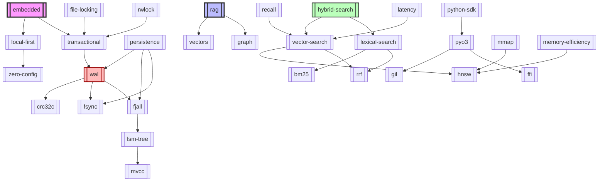

# Glossary of Technical Concepts — VantaDB

> Complete reference of all technical, architectural, and product concepts mentioned across the VantaDB documentation.

---

## Product & Architecture Concepts

| Concept | Short Description | Relevance in VantaDB |
|---------|-------------------|----------------------|
| [[embedded]] | Database operating in-process within the application | Core product identity |
| [[local-first]] | Design philosophy prioritizing local operations over network | Fundamental architectural principle |
| [[transactional]] | ACID guarantee over data mutations | Core durability contract |
| [[zero-config]] | Usage experience without manual setup or config | Competitive advantage over alternatives |
| [[rag]] | Retrieval-Augmented Generation | Primary use case |
| [[vectors]] | High-dimensional numerical representations | Central data type |
| [[graph]] | Node-edge structure with properties | Complementary data model |

---

## Persistence Mechanisms

| Concept | Short Description | Relevance in VantaDB |
|---------|-------------------|----------------------|
| [[persistence]] | Ability to retain data beyond process lifecycle | General durability concept |
| [[wal]] | Write-Ahead Log — mutation journaling | Durability guarantee prior to ACK |
| [[fjall]] | 100% Rust LSM-tree engine | Default canonical backend |
| [[rocksdb]] | LSM-tree engine by Meta (C++) | Alternative backend / benchmarking |
| [[mmap]] | Memory-Mapped I/O | Zero-copy vector reading |
| [[fsync]] | Physical disk synchronization | Real persistence guarantee |
| [[crc32c]] | Hardware-accelerated checksum | WAL record integrity |
| [[lsm-tree]] | Log-Structured Merge-Tree | Underlying storage engine pattern |
| [[mvcc]] | Multi-Version Concurrency Control | Transactional isolation |
| [[crdt]] | Conflict-free Replicated Data Types | Distributed convergence for multi-node scaling |
| [[bincode]] | Compact binary serialization format | WAL and index state persistence |
| [[serde]] | Rust serialization/deserialization framework | JSON for HTTP API, bincode for disk storage |

---

## Indexes & Search

| Concept | Short Description | Relevance in VantaDB |
|---------|-------------------|----------------------|
| [[vector-search]] | Semantic similarity search using vectors | Primary retrieval method |
| [[lexical-search]] | Exact keyword matching search | Complement to vector-search |
| [[hybrid-search]] | Unified vector + lexical retrieval | Key differentiator |
| [[hnsw]] | Hierarchical Navigable Small World | Main vector index for ANN |
| [[bm25]] | Best Matching 25 — lexical scoring | Full-text index |
| [[rrf]] | Reciprocal Rank Fusion | Fusion of hybrid rankings |
| [[vector-similarity]] | Distance metrics between vectors (cosine, L2, dot) | Distance computation |
| [[ann]] | Approximate Nearest Neighbor | Algorithm class for vector search |
| [[payload-indexes]] | Metadata-field filtering | High-performance query filtering |

---

## Concurrency & Safety

| Concept | Short Description | Relevance in VantaDB |
|---------|-------------------|----------------------|
| [[python-sdk]] | Python bindings generated via PyO3 | Primary end-user interface |
| [[gil]] | Global Interpreter Lock (Python) | CPU bottleneck bypassed by PyO3 |
| [[ffi]] | Foreign Function Interface | Python-Rust boundary |
| [[pyo3]] | Rust/Python binding framework | SDK foundation |
| [[file-locking]] | Process-level advisory file locks | Multi-process corruption prevention |
| [[rwlock]] | Read-write lock pattern | Core engine concurrency |

---

## Operations & CI/CD

| Concept | Short Description | Relevance in VantaDB |
|---------|-------------------|----------------------|
| [[ci-cd]] | Continuous Integration / Deployment | Release automation |
| [[benchmarks]] | Standardized performance testing | Validating performance claims |
| [[chaos-testing]] | Controlled failure injection | WAL durability validation |
| [[failpoints]] | Error injection points | Recovery path testing |
| [[oidc]] | OpenID Connect | Secure publishing to PyPI |
| [[sigstore]] | Artifact signing | Verifiable build provenance |
| [[slsa]] | Supply-chain Levels for Software Artifacts | Build security framework |
| [[opentelemetry]] | OpenTelemetry tracing and metrics | System observability |

---

## Use Cases & Protocols

| Concept | Short Description | Relevance in VantaDB |
|---------|-------------------|----------------------|
| [[rag]] | Retrieval-Augmented Generation | Primary use case |
| [[graphrag]] | RAG with graph traversal | Reducing context tokens by 40-60% |
| [[ai-agents]] | Autonomous agent systems with memory | Core target user profile |
| [[mcp]] | Model Context Protocol | Integration with IDEs and agents |
| [[wasm]] | Binary instruction format for stack-based VM | Browser and edge runtime via Rust compilation target |

---

## Performance & Optimization

| Concept | Short Description | Relevance in VantaDB |
|---------|-------------------|----------------------|
| [[recall]] | Quality metric: % of true neighbors retrieved | HNSW index validation |
| [[latency]] | Response time (p50, p95, p99) | Performance metric |
| [[memory-efficiency]] | RAM footprint per indexed vector | Resource optimization |
| [[simd]] | Single Instruction, Multiple Data | Distance computation acceleration |
| [[zero-copy]] | Avoid memory duplication | High-throughput reading |
| [[dashmap]] | Concurrent sharded hash map | Low-contention concurrency |
| [[backpressure]] | Flow control under high load | Out-of-memory (OOM) prevention |

---

## Enterprise Features (Planned)

| Concept | Short Description | Relevance in VantaDB |
|---------|-------------------|----------------------|
| [[rbac]] | Role-Based Access Control | Granular security |
| [[multi-tenancy]] | Tenant isolation | VantaDB Cloud architecture |

---

---

## Competitors & Ecosystem

| Concept | Short Description | Relevance in VantaDB |
|---------|-------------------|----------------------|
| [[qdrant]] | Rust vector search engine, client-server architecture | Competitor — VantaDB differentiates on embedded/local-first |
| [[lancedb]] | Open-source embedded vector database on Lance columnar format | Competitor — VantaDB differentiates on hybrid search + schema-less |

---

## Quick Navigation

### By Category

**New to VantaDB?** Start with:
1. [[embedded]] → Understand the product identity
2. [[local-first]] → Grasp the core philosophy
3. [[rag]] → Learn the primary use case
4. [[persistence]] → Understand durability guarantees
5. [[vector-search]] → Explore similarity search
6. [[hybrid-search]] → Read about the hybrid search differentiator

**Technical Profile?** Deep dive into:
- [[fjall]] vs [[rocksdb]] → Storage backend selection
- [[gil]] + [[ffi]] + [[pyo3]] + [[python-sdk]] → Python-Rust concurrency
- [[mmap]] + [[fsync]] → Persistence and performance
- [[mvcc]] + [[lsm-tree]] → Storage internals
- [[recall]] + [[latency]] + [[memory-efficiency]] → Performance metrics

**Product Profile?** Focus on:
- [[zero-config]] → Core user benefit
- [[transactional]] → Reliability contract
- [[vectors]] + [[graph]] → Multimodal data model
- [[hybrid-search]] + [[rrf]] → Search quality

---

## Concept Relationships

---

## Conventions

- All glossary concepts are linked using Obsidian wikilinks format (`[[Concept]]`).
- Term files are lowercase kebab-case files inside the `glosario/` directory.
- Definitions include: definition, key characteristics, why it matters in VantaDB, trade-offs, and related terms.
