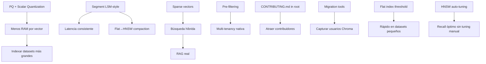

# VantaDB — Research Unificado: Market Validation & Comprehensive Analysis

> **Propósito:** Investigación de mercado sobre estándares de la industria para bases de datos
> vectoriales embebidas + análisis exhaustivo del proyecto VantaDB (cada funcionalidad, crate,
> feature y documento), validado contra internet y competidores.
>
> **Metodología:** Exploración manual del codebase + 4 subagentes paralelos + 5 búsquedas web
> + validación contra FerresDB, Quiver, Qdrant, ChromaDB, LanceDB, SatoriDB, TinyQuant,
> iqdb-quantize, RuVector, Zvec, pgvector, Milvus, Weaviate, TalaDB, Dynoxide, AbsurderSQL,
> MoltenDB, DuckDB, Stoolap, OrioleDB, Kvrocks.
>
> **Fecha:** Julio 2026

---

## 0. Resumen Ejecutivo

| Métrica | Valor |
|---------|-------|
| **Versión** | 0.2.0 (pre-release, PHASE 3 pre-launch ~95%) |
| **Crates en workspace** | 14 (core + 13 integraciones) |
| **Archivos Rust** | ~79 en `src/` + ~48 tests + ~8 benches |
| **Tests** | ~48 archivos, framework VantaHarness + unittest directo |
| **Documentación** | ~100+ archivos en `docs/` |
| **Integraciones** | Python, TS, WASM, MCP, OpenAI, Ollama, Mem0, Letta, CrewAI, DSPy, Haystack, LiteLLM, Enterprise, LangChain, LlamaIndex |
| **SDKs** | 6 (Python, TypeScript, Rust, WASM, MCP, REST) |
| **Backends** | 3 (Fjall default, RocksDB opt, InMemory) |
| **CLI** | 33+ comandos, completions para 4 shells |
| **Fortaleza principal** | Multi-SDK best-in-class, WAL sharded único, MCP server diferenciador, CLI superior |
| **Debilidad principal** | 1 dev, sin PQ, sin segment compaction, sin sparse vectors, sin ACORN filtered search |

---

## 1. Arquitectura Core

### 1.1 Diagrama de arquitectura

```
vantadb/
├── sdk/           → API pública (VantaEmbedded)
├── engine.rs      → InMemoryEngine (HashMap, phase 1)
├── storage/       → StorageEngine (backend + HNSW + WAL + vstore)
├── index/         → CPIndex (HNSW puro)
├── vector/        → Quantización: RaBitQ, TurboQuant, SQ8
├── node.rs        → UnifiedNode, VectorRepresentations
├── wal.rs         → WalWriter/Reader, ShardedWal
├── config.rs      → VantaConfig (928 líneas)
└── planner.rs     → Search planner con RRF fusion
```

### 1.2 Puntos Fuertes del Core

| Aspecto | Detalle |
|---------|---------|
| **HNSW production-ready** | CPIndex con DashMap, xxHash, parking_lot::Mutex, mmap persistencia |
| **3 esquemas de cuantización** | RaBitQ (1-bit), TurboQuant (3-bit), SQ8 (8-bit) — ninguno competidor tiene 3 |
| **QuantizationGovernor** | Auto-transición f32↔SQ8 basada en access frequency — único |
| **ShardedWAL** | Round-robin multi-shard + per-shard sequential gap detection — único en mercado |
| **SIMD distance kernels** | AVX-512 + portable f32x8 dispatch dinámico (bimodal) — estándar industria |
| **MemoryGovernor** | Watermark-based eviction — comparable a Qdrant |
| **MMap vector store** | VantaFile con BFS layout + madvise prefetch |
| **RBAC** | Ya existe en enterprise crate (`check_permission` implementado) |
| **OpenTelemetry** | Feature-gated, integración OTLP + Prometheus |
| **FilterBitset** | Bitset dinámico multi-tenant (crece >128 bits) |

### 1.3 Core Architecture vs Mercado

| Componente | VantaDB | Referencia del mercado |
|---|---|---|
| **HNSW** como índice ANN principal | ✅ | Estándar industria (pgvector, Qdrant, Chroma) |
| **IVF** como alternativa para datasets > RAM | ❌ | Zvec, Milvus, FAISS |
| **Product Quantization (PQ)** para compresión 128x | ❌ | Qdrant, pgvectorscale, Milvus, Quiver, iqdb-quantize |
| **Scalar Quantization (f32→i8)** 4x menos RAM | ⚠️ Interna (SQ8) | Qdrant (pública configurable), Quiver (Int8 index) |
| **Sparse vectors / BM25 híbrido** nativo | ⚠️ BM25 aparte | Qdrant, Weaviate (best-in-class), Quiver (sparse fusion) |
| **Segmentación LSM-style** | ❌ | Zvec, Qdrant, Milvus, RuVector-LSM, SatoriDB (2-tier) |
| **Pre-filtering con payload indexes** | ⚠️ Básico (bitset) | Qdrant (líder), Weaviate, Quiver (9 operators) |
| **Multi-tenancy nativa** | ❌ | Weaviate, Qdrant |
| **Flat index <10K vectores** (brute-force) | ❌ (usa HNSW siempre) | Quiver (FlatIndex), Qdrant (full scan threshold) |
| **Multi-vector (named embeddings)** | ❌ | Quiver (multiple embedding spaces/doc) |
| **Índice FP16** | ❌ | Quiver (Fp16FlatIndex), TinyQuant (FP16 residual) |
| **Data versioning / snapshots** | ❌ | Quiver (create/list/restore/delete snapshots) |

### 1.4 Benchmark vs Quiver (competidor directo más comparable)

| Feature | **VantaDB** | **Quiver** |
|---------|-------------|------------|
| Index types | 1 (HNSW) | **8** (HNSW, Flat, Int8, FP16, IVF, IVF-PQ, mmap, Binary) |
| Cuantización | 3 esquemas (internos) | 3 index types dedicados |
| PQ | ❌ | ✅ IVF-PQ |
| Sparse vectors | ❌ (BM25 aparte) | ✅ Hybrid dense+sparse fusion |
| Multi-vector | ❌ | ✅ Multiple embedding spaces |
| Payload filtering | ⚠️ Básico (bitset) | ✅ 9 filter operators ($eq, $ne, $in...) |
| Data versioning | ❌ | ✅ Snapshots (create/list/restore/delete) |
| WAL | ✅ Sharded + CRC32C | ✅ Auto-compaction |
| CLI | ✅ 33 comandos | ❌ Solo Python API |
| MCP server | ✅ Único | ❌ |
| SDKs | 6 (Python, TS, Rust, WASM, MCP, REST) | 1 (Python) |
| SIMD | ✅ AVX-512 + portable f32x8 | ✅ AVX2/NEON |
| Parallel insert | ❌ (single Mutex) | ✅ Rayon micro-batching |

---

## 2. Interfaces & APIs

### 2.1 APIs existentes (✅ VantaDB)

| API | Estado |
|---|---|
| Python SDK (`pip install vantadb-py`) | ✅ |
| TypeScript SDK | ✅ |
| WASM (browser) | ✅ |
| Rust SDK nativa (`cargo add vantadb`) | ✅ |
| MCP server | ✅ |
| OpenAI SDK compat | ✅ |
| LangChain / LlamaIndex adapter | ✅ |
| REST API (vía server feature) | ✅ |

### 2.2 APIs faltantes (❌ VantaDB)

| API | Competencia que lo tiene | Prioridad |
|---|---|---|
| gRPC streaming | Qdrant | Media |
| Arrow Flight / columnar output | Zvec, LanceDB | Baja |

### 2.3 Herramientas del ecosistema

| Herramienta | Estado VantaDB | Competencia |
|---|---|---|
| CLI `vanta-cli` (33 comandos) | ✅ Superior | Chroma CLI mínimo |
| Dashboard web / TUI | ⚠️ TUI existe, web dashboard no | — |
| Migration tool (Chroma→Vanta, Qdrant→Vanta) | ❌ | Milvus/Zilliz tienen built-in |
| Benchmark suite (ann-benchmarks compatible) | ⚠️ Internos no estandarizados | — |
| VectorDBBench integration | ❌ | — |
| Pre-commit hooks / CI verification | ✅ | — |
| Container image (Docker) | ❌ | Útil para server mode |

---

## 3. Revisión de Integraciones (Workspace Crates)

### 3.1 Estado de cada crate

| Crate | Versión | Estado real | Problemas |
|-------|---------|-------------|-----------|
| **vantadb-python** | 0.2.0 | ✅ Funcional | — |
| **vantadb-server** | 0.2.0 | ✅ Funcional | — |
| **vantadb-mcp** | 0.2.0 | ✅ Funcional ~1500L | — |
| **vantadb-wasm** | 0.2.0 | ✅ Funcional | OPFS sin IndexedDB fallback |
| **vantadb-openai** | **0.1.5** | ⚠️ Stale | v0.1.5 desync, 139L trivial |
| **vantadb-ollama** | **0.1.5** | ⚠️ Stale | v0.1.5 desync, 130L trivial |
| **vantadb-mem0** | **0.1.5** | ⚠️ Stale | v0.1.5 desync, 375L |
| **vantadb-letta** | **0.1.5** | ⚠️ Stale | v0.1.5 desync, 140L trivial |
| **vantadb-crewai** | **0.1.5** | ⚠️ Stale | v0.1.5 desync |
| **vantadb-dspy** | **0.1.5** | ⚠️ Stale | v0.1.5 desync, 106L trivial |
| **vantadb-haystack** | **0.1.5** | ⚠️ Stale | v0.1.5 desync, 154L |
| **vantadb-litellm** | **0.1.5** | ⚠️ Stale | v0.1.5 desync, 130L trivial |
| **vantadb-enterprise** | 0.2.0 | ⚠️ Scaffold | Solo RBAC implementado; encryption, audit, replication, license = stubs |

### 3.2 Problemas detectados

#### 3.2.1 Version desync (9 crates en v0.1.5 vs core v0.2.0)
- `vantadb-openai`, `ollama`, `mem0`, `letta`, `crewai`, `dspy`, `haystack`, `litellm` — todos hardcodean `const VERSION: &str = "0.1.5"`.
- **Fix:** Usar `env!("CARGO_PKG_VERSION")` o heredar del workspace.

#### 3.2.2 Código boilerplate idéntico
Los 9 wrappers repiten el mismo patrón `#[cfg(feature = "python")] mod python;` + `src/python.rs` ~200-300L con nombres cambiados.
- **Fix pospuesto:** Refactorizar a macro o crate compartido.

#### 3.2.3 Enterprise crate — stubs TODO
| Módulo | Líneas | Estado |
|--------|--------|--------|
| `encryption.rs` | 26 | `todo!("AES-256-GCM encryption")` |
| `audit.rs` | 52 | `todo!("audit logging")` |
| `rbac.rs` | 53 | ✅ `check_permission()` funcional |
| `replication.rs` | 48 | `todo!("replication WAL streaming")` |
| `license.rs` | 24 | `todo!("license verification")` |

#### 3.2.4 WASM OPFS sin IndexedDB fallback
- `vantadb-wasm/src/opfs.rs` usa OPFS directamente, sin fallback si no está disponible (Firefox private mode, Safari <15.2).
- Competidores: TalaDB, Dynoxide, MoltenDB todos implementan IndexedDB fallback.
- Tampoco hay multi-tab coordination (Web Locks API + BroadcastChannel).

---

## 4. Documentación

### 4.1 Estructura actual (`docs/`)

```
docs/
├── api/           → 6 archivos (EMBEDDED_SDK, HTTP_API, MCP, openapi, PYTHON_SDK, TS_SDK)
├── architecture/  → 8 archivos (ARCHITECTURE, ADRs, TEXT_INDEX, STORAGE_VERSIONING...)
├── operations/    → 24 archivos (CONFIGURATION, DURABILITY, BENCHMARKS, CI_POLICY...)
├── tutorials/     → 3 archivos (AI agent memory, RAG pipeline, ChromaDB migration)
├── research/      → 5 archivos (incl. este)
├── strategy/      → 3 archivos (ACTION_PLAN, ROADMAP, GO_TO_MARKET)
├── plans/         → 5 archivos de implementación
├── glosario/      → 63 archivos de glosario técnico
├── progreso/      → Progreso detallado
├── Backlog.md     → 629L (TIER 0-3 + PHASE 5)
├── CHANGELOG.md   → 711L (v0.1.0-rc1 → v0.2.2)
├── QUICKSTART.md  → 188L (en docs/ no en raíz)
└── FAQ.md
```

### 4.2 Framework Diátaxis

Estándar industria 2026:
```
docs/
├── tutorials/    → learning-oriented ("Build your first RAG pipeline")
├── how-to/       → task-oriented ("How to configure TLS / compact WAL")
├── reference/    → information-oriented (API docs, config flags, CLI)
└── explanation/  → understanding-oriented (ARCHITECTURE.md, ADRs)
```

| Categoría | Estado | Detalle |
|-----------|--------|---------|
| **Tutorials** (learning) | ⚠️ 3 archivos | ✅ Existen, pero falta learning path estructurado |
| **How-to** (task) | ❌ **Ausente** | No existe directorio `how-to/`. Faltan: compact WAL, TLS setup, backup/restore, performance tuning |
| **Reference** (info) | ⚠️ Parcial | ✅ CONFIGURATION.md + 6 API docs. ❌ rustdoc no expuesto en docs/ |
| **Explanation** (understanding) | ✅ Sólido | ARCHITECTURE.md, ADRs, TEXT_INDEX_DESIGN, STORAGE_VERSIONING, 63 glossary files |

### 4.3 Archivos estándar OSS

| Archivo | Existe | Ubicación | Contenido |
|---------|--------|-----------|-----------|
| `README.md` | ✅ | Raíz | 326L |
| `README_ES.md` | ✅ | Raíz | — |
| `LICENSE` | ✅ | Raíz | Apache 2.0 |
| `CONTRIBUTING.md` | ✅ | `.github/` | 92L — engineering philosophy, CI policy, PR checklist |
| `CODE_OF_CONDUCT.md` | ✅ | `.github/` | — |
| `SECURITY.md` | ✅ | Raíz (no `.github/`) | 151L — basic security policy |
| `SUPPORT.md` | ✅ | `.github/` | — |
| `CHANGELOG.md` | ✅ | `docs/` | 711L |
| `llms.txt` | ✅ | `web/public/` | Estándar AI-ready docs 2025+ (no en raíz del repo) |
| `llms-full.txt` | ❌ | Raíz | Adjunto a llms.txt — no existe |

> **Nota:** Aunque `CODE_OF_CONDUCT.md` y `CONTRIBUTING.md` existen en `.github/` (GitHub los
> reconoce ahí), los estándares `standard-readme` y `repo-governance` recomiendan tenerlos en la
> raíz del repo para máxima visibilidad — LLMs y forks pueden no buscar en `.github/`.

### 4.4 Estructura de README recomendada (estándar 2026)

```markdown
# VantaDB
[] [] [] []

## Why VantaDB?          ← 1 párrafo: problema + audiencia + resultado
## Features              ← bullets, benefits not implementation
## Quick Start           ← `pip install vantadb` / `cargo add vantadb`, 5-line example
## Usage                 ← mínimo ejemplo funcional
## Documentation         ← links a docs/, reference, tutorials
## Repository Overview   ← src/, docs/, web/, integrations/
## Contributing          ← link a CONTRIBUTING.md
## License               ← Apache 2.0
```

**Reglas clave:**
| Regla | Descripción |
|---|---|
| README ≠ documentation hub | Orienta y deriva a `/docs/` |
| AI-ready | Headings descriptivos, ejemplos copiables, secciones explícitas |
| Badges relevantes | Build, version (crates.io + PyPI), license, coverage — máx 6-8 |
| Repository Overview | Crítico para LLMs y devs nuevos |
| Imágenes complementan | No reemplazan texto |

### 4.5 Imágenes para README y web

| Herramienta | Qué genera | Uso |
|---|---|---|
| **Mermaid.js** (GitHub native) | Diagramas de arquitectura, flujos | ` ```mermaid ` en Markdown |
| **readme-aura** (`npx`) | React/JSX → SVG animados | `npx readme-aura init`, build → SVG |
| **readme-ai** (`npx`) | README completo + Mermaid + badges | `npx readme-ai -o README.md` |
| **OG Image Generator** | Open Graph images | readmecodegen.com |
| **Excalidraw** (skill instalada) | Hand-drawn diagrams, SVG animado | Ya instalada |

**Recomendación:**
| Tipo | Herramienta | Razón |
|---|---|---|
| Diagramas de arquitectura | **Mermaid** | Nativo GitHub, 0 setup |
| README hero / OG image | **readme-aura** | JSX component: logo + tagline + stats |
| Diagramas animados para docs | **Excalidraw** | Skill ya instalada |

---

## 5. Revisión de Tests

### 5.1 Cobertura

| Categoría | Archivos | Calidad |
|-----------|----------|---------|
| **core/** | 6 | ✅ Bueno |
| **storage/** | 12 | ✅ Excelente (chaos, crash, WAL, gc, mmap) |
| **logic/** | 5 | ✅ Bueno |
| **api/** | 2 | ⚠️ Bajo |
| **certification/** | 8 | ✅ Excelente (SIFT, competitive, stress) |
| **memory/** | 3 | ✅ Bueno |
| **security/** | 1 | ⚠️ Bajo |
| **Root-level** | 26 | ✅ Muy bueno |
| **Total** | **~46** | |

### 5.2 Framework: VantaHarness

```rust
let mut harness = VantaHarness::new("CORE ENGINE (CRUD & SEARCH)");
harness.execute("Node CRUD: Insert & Get", || {
    // test logic...
    TerminalReporter::success("Verified.");
});
```
Produce JSON métrico (duration, memory delta). Usado en certificación.

### 5.3 Brechas en tests

| Brecha | Impacto | Prioridad |
|--------|---------|-----------|
| No hay miri tests (UB) | UB no detectado en unsafe paths | Media |
| No hay differential fuzzing vs SQLite | Regresiones silenciosas | Alta |
| No hay property-based tests para HNSW | Bugs en select_neighbors | Media |
| No hay coverage report en CI | Cobertura invisible | Baja |
| Security tests: solo 1 archivo | Ataques no cubiertos | Alta |
| No hay regression benchmarks en CI | Performance regressions | Alta |
| No hay tests WASM en CI | WASM puede romperse | Media |
| No hay tests MCP en CI | MCP puede romperse | Media |
| Stub tests para integration crates | Wrappers Python sin coverage | Media |

### 5.4 Comparación con industria 2026

| Aspecto | VantaDB | DuckDB | Stoolap |
|---------|---------|--------|---------|
| Test files | 48 | ~800+ | 160 Rust + 30 SQL |
| Mutation testing | ❌ | ? | ✅ 96 shards diarios |
| Miri | ❌ | ❌ | ✅ 100 min diarios |
| Differential oracle | ❌ | ❌ | ✅ vs SQLite |
| Property-based | ✅ (proptest) | ❌ | ✅ proptest |
| Fuzzing | ✅ (cargo-fuzz) | ✅ OSS-Fuzz | ✅ I/O fault |
| Sanitizers | ❌ | ✅ Thread, Address, UB | ✅ Thread, Address, UB, Miri |

---

## 6. Rendimiento y Optimizaciones

### 6.1 Optimizaciones existentes

| Optimización | Dónde | Detalle |
|-------------|-------|---------|
| SIMD distance (AVX-512 + portable f32x8) | `index/distance.rs` | Runtime dispatch via OnceLock (bimodal: AVX-512 explícito, f32x8 para todo lo demás) |
| SIMD FWHT (AVX-512 + portable f32x8) | `vector/transform.rs` | Fast Walsh-Hadamard para RaBitQ |
| QuantizationGovernor | `vector/governor.rs` | Auto f32↔SQ8 por access frequency |
| MMap vector store | `storage/vfile.rs` | Zero-copy mmap con BFS layout |
| MMap HNSW index | `index/core.rs` | madvise WILLNEED/DONTNEED |
| Batch insert | `storage/engine/ops.rs` | Single lock acquisition |
| ShardedWAL | `wal_sharded.rs` | Multi-shard reduce mutex contention |
| LRU cache | `storage/engine/mod.rs` | Volatile cache hot nodes |
| MemoryGovernor | `memory_governor.rs` | Watermark eviction |
| HnswConfig tuning | `index/core.rs` | M=32, ef_construct=400, ef_search=100 |
| CPU detection | `hardware/mod.rs` | AVX2, AVX-512, NEON |
| Rayon parallel | Feature-gated | batch_put usa rayon |
| Release profile | `Cargo.toml` | thin LTO, opt-level=3, 1 codegen-unit |

### 6.2 Optimizaciones faltantes vs mercado

| Optimización | VantaDB | Referencia | Impacto |
|-------------|---------|------------|---------|
| **HNSW auto-tuning** (ef_search dinámico) | ❌ | FerresDB (PID loop c/60s) | 5-15% recall mejora |
| **PQ compresión** | ❌ | Quiver (IVF-PQ 96x), Qdrant (PQ) | 96x menos RAM |
| **Flat scan threshold** | ❌ | Quiver (Flat <10K) | 10-100x más rápido en small |
| **Parallel HNSW insert** | ❌ (Mutex) | Quiver (rayon micro-batching) | 3-10x insert throughput |
| **IO_uring** | ❌ | SatoriDB (Glommio) | 2-5x IOPS server mode |
| **Page cache warmup** | ❌ | FerresDB (replay last 50 queries) | 2-10x startup time |
| **Selectivity-adaptive routing** | ❌ | RuVector-ACORN | 10x filtered query |
| **Prefetch scheduler** | ❌ | Qdrant | 2x filtered recall |
| **Segment compaction** | ❌ | Zvec, Qdrant, RuVector-LSM | O(1) writes, consistencia |
| **Query router + LRU + Bloom** | ❌ | Qdrant production | Hits <2ms |
| **ef_construct / ef_search público** | ❌ (hardcodeado) | Qdrant configurable | Recall tuning |
| **OpenTelemetry en cada capa** | ❌ (global) | FerresDB (per-span) | Observabilidad |
| **Soft-delete con Roaring Bitmap** | ❌ (tombstone físico) | Qdrant | Write perf |
| **Batch indexing desacoplado** | ✅ Async channel | `src/storage/engine/ops.rs` | Pipeline desacoplado writes→indexing ya implementado |

### 6.3 Bottlenecks identificados

1. **HNSW insert serializado**: `insert_lock: Mutex<()>` — todo insert espera.
2. **Single VantaFile**: Toda la vector store es un solo archivo mmap sin segmentación.
3. **BM25 text index en backend KV**: No hay índice invertido nativo en RAM.
4. **Cosine distance sin asymmetric distance PQ**: No hay re-rank cuantizado.

---

## 7. Seguridad

### 7.1 Features existentes

| Feature | Estado | Dónde |
|---------|--------|-------|
| RBAC | ✅ | `vantadb-enterprise/src/rbac.rs` |
| Auth middleware | ⚠️ Stub | `vantadb-server/src/middleware.rs` |
| Rate limiting | ✅ | `tower_governor` feature-gated |
| TLS | ✅ | `axum-server` + `tls-rustls` |
| Constant-time comparison | ✅ | `subtle` crate |
| File locking | ✅ | `fs2`, multi-process |
| Security audit tests | ⚠️ 1 archivo | `tests/security/security_audit.rs` |
| Cargo audit | ✅ | CI |
| Cargo deny | ✅ | `deny.toml` |
| CodeQL | ✅ | `.github/workflows/codeql.yml` |
| Dependabot | ✅ | 4 ecosistemas |

### 7.2 Brechas de seguridad

| Brecha | Impacto | Prioridad |
|--------|---------|-----------|
| Encryption at rest | ❌ stub | Datos visibles en disco | Alta |
| Encryption in transit server mode | ⚠️ TLS feature-gated | No encriptado por defecto | Media |
| WAL encryption | ❌ | WAL en texto plano | Alta |
| Input validation exhaustiva | ⚠️ Básica | IQL injection tests limitados | Media |
| Fuzzing security | ❌ solo parser | Ataques maliciosos no cubiertos | Alta |

---

## 8. WASM y Web Frontend

### 8.1 WASM (`vantadb-wasm`)

| Aspecto | Estado | Competencia |
|---------|--------|-------------|
| Browser persistence | ⚠️ OPFS básico | TalaDB: OPFS + IndexedDB fallback + Web Locks + BroadcastChannel |
| Multi-tab coordination | ❌ | AbsurderSQL, TalaDB, Dynoxide |
| Export/import | ✅ | AbsurderSQL: standard SQLite export |
| SIMD in WASM | ✅ `simd.rs` | — |
| Worker-based | ❌ (main thread) | MoltenDB, Dynoxide: Web Worker |
| NPM package | ❌ No publish | MoltenDB: `@moltendb-web/core`, TalaDB: npm |
| Bundle size | ❌ No medido | Dynoxide: ~860KB gzip |

### 8.2 Web Frontend (`web/`)

| Aspecto | Estado |
|---------|--------|
| Framework | React 19 SPA (Vite 8) |
| Rutas | 23 lazy-loaded |
| Componentes | 28+ design system (Nb*) |
| Animaciones | GSAP 3.15 + ScrollTrigger |
| CSS | Tailwind v4 + CSS plano (46 archivos) |
| SEO | ✅ route-level head(), JSON-LD, OG, sitemap |
| Tests | Vitest + Playwright (mínimo, 6 tests) |
| **SourceDesign/** | ⚠️ 41 imágenes sueltas en `src/` — mover fuera |
| webV2/ | Astro proto abandonado (solo en git) |

### 8.3 Mejoras web detectadas

1. **SourceDesign en src/**: 41 archivos a `web/_design-assets/`
2. **Rutas excesivas**: 50 archivos de ruta para SPA principalmente estática
3. **No hay SSG**: SEO depende de client-side rendering
4. **Bundle JS ~150KB gzip**: podría reducirse

---

## 9. CI/CD y DevOps

### 9.1 Pipelines existentes

| Workflow | Estado |
|----------|--------|
| `rust_ci.yml` | ✅ Fast Gate: fmt → clippy → nextest |
| `heavy_certification.yml` | ✅ Manual/scheduled |
| `python_wheels.yml` | ✅ Maturin build + publish |
| `bench.yml` | ✅ Criterion benchmarks |
| `nightly_bench.yml` | ✅ Benchmark tracking |
| `cargo-deny.yml` | ✅ License + advisory |
| `codeql.yml` | ✅ CodeQL analysis |
| `docs-check.yml` | ✅ Markdown lint + link check |
| `sbom.yml` | ✅ SBOM generation |
| `web-ci.yml` | ✅ Web frontend CI |
| `release.yml` | ✅ Release pipeline |
| `adapters_publish.yml` | ✅ Publish integration packages |
| `release_wasm.yml` | ✅ Publicar crate WASM a npm/GitHub |

### 9.2 Brechas CI/CD

| Brecha | VantaDB | DuckDB / Stoolap |
|--------|---------|------------------|
| Regression benchmarks (automated) | ✅ `nightly_bench.yml` (no `bench.yml`) | ✅ DuckDB |
| Sanitizers (ASan, TSan, UBSan) | ❌ | ✅ Stoolap |
| Code coverage | ❌ | ✅ Stoolap (Codecov) |
| Fuzzing CI integration | ❌ (manual) | ✅ DuckDB (CIFuzz.yml) |
| Cross-compile matrix | ❌ (solo MSVC) | ✅ DuckDB (6 platforms) |
| Container CI | ❌ | ✅ OrioleDB |
| Mutation testing | ❌ | ✅ Stoolap (96 shards) |

---

## 10. Validación: Fortalezas de VantaDB

| Aspecto | VantaDB | Competencia |
|---------|---------|-------------|
| **Embedded-first** | ✅ | Qdrant/Milvus son server-mode |
| **Multi-SDK** (6 plataformas) | ✅ **Best-in-class** | Chroma solo Python/JS |
| **Rendimiento Rust** (HNSW, SIMD, mmap) | ✅ | Chroma es Python |
| **WAL sharding + per-shard sequential gap detection** | ✅ **Único** | Zvec/Qdrant tienen WAL sin sharding |
| **CLI completa** (33 comandos) | ✅ Superior | Chroma CLI mínimo |
| **RBAC + Auth + Rate limiting** | ✅ | Qdrant Cloud tiene auth |
| **OpenTelemetry + Prometheus** | ✅ | Estándar industria |
| **MCP server** | ✅ **Diferenciador único** | Ningún vector DB tiene MCP |
| **3 esquemas de cuantización + governor** | ✅ Único | Quiver: 3 index types; Qdrant: SQ8 + BQ |
| **VantaHarness certification framework** | ✅ | |

## 11. Validación: Debilidades vs Mercado

| Aspecto | VantaDB | ChromaDB | Qdrant | LanceDB | Quiver |
|---------|---------|----------|--------|---------|--------|
| **Comunidad** | ⬜ 1 dev | ⭐ 20K+ GH | ⭐ 22K+ | ⭐ 4.7K+ | ⭐ <1K |
| **Ecosystem maturity** | ⬜ Nova | ⭐ Masivo | ⭐ Excelente | ⭐ Creciente | ⭐ Nova |
| **Index types** | ⬜ 1 | ❌ | ✅ 4+ | ⚠️ 2 | ✅ **8** |
| **Product Quantization** | ❌ | ❌ | ✅ Scalar+PQ | ✅ IVF-PQ | ✅ IVF-PQ |
| **Segment compaction** | ❌ | ❌ | ✅ On-disk | ✅ Columnar | ❌ |
| **Pre-filtering avanzado** | ⚠️ Básico | ⚠️ Básico | ✅ Best-in-class | ⚠️ Básico | ✅ 9 ops |
| **Hybrid search nativo** | ⚠️ BM25 aparte | ❌ | ✅ Sparse vec | ⚠️ | ✅ Sparse fusion |
| **Server mode** | ⚠️ REST only | ❌ | ✅ gRPC streaming | ❌ | ❌ |
| **Migration tools** | ❌ | ❌ | ❌ | ❌ | ❌ |

## 12. Recomendaciones Priorizadas

### P0 — Crítico (antes de release público)

| # | Acción | Esfuerzo | Impacto |
|---|--------|----------|---------|
| 1 | **Version sync**: 9 crates en v0.1.5 → heredar workspace version | Bajo (1h) | Consistencia releases |
| 2 | **llms.txt mover a raíz** del repo (está en `web/public/`) + crear `llms-full.txt` | Bajo (30min) | AI-readability estándar |
| 3 | **Migration guides**: verificar contenido FROM_LANCEDB.md y FROM_CHROMADB.md | Bajo (30min) | Adopción |
| 4 | **WASM IndexedDB fallback** cuando OPFS no está disponible | Medio (2-3d) | Browser compatibilidad |
| 5 | **Mover SourceDesign/** fuera de `web/src/` | Bajo (10min) | Hygiene |

### P1 — Alta prioridad (previo a v1.0)

| # | Acción | Esfuerzo | Impacto |
|---|--------|----------|---------|
| 1 | **Flat index threshold** (<10K → brute-force) | Medio (2-3d) | 10-100x más rápido en small |
| 2 | **Regression benchmarks en CI** | Medio (3-5d) | Performance regressions visibles |
| 3 | **Sanitizer CI jobs** (ASan + TSan) | Medio (2-3d) | Bug detection |
| 4 | **Code coverage + upload** | Bajo (1d) | Visibilidad |
| 5 | **Enterprise crate completar**: encryption + audit | Alto (semanas) | Enterprise readiness |
| 6 | **Migration tools** (Chroma→Vanta) | Medio | Capturar usuarios Chroma |
| 7 | **Learning path** (tutorials/) | Medio | Onboarding |

### P2 — Media prioridad (post-v1.0)

| # | Acción | Esfuerzo | Impacto |
|---|--------|----------|---------|
| 1 | **Product Quantization (PQ)** | Alto (semanas) | Compresión 96x, datasets >RAM |
| 2 | **Segment LSM-style** — hot/warm/cold tiers | Muy alto (meses) | O(1) writes, compaction |
| 3 | **ACORN filtered search** — γ-augmented graph | Alto (semanas) | Filtered recall 10%→96% |
| 4 | **HNSW auto-tuning** — ef_search dinámico PID | Medio (3-5d) | Recall/latency óptimo |
| 5 | **Parallel HNSW insert** — rayon micro-batching | Medio (2-3d) | 3-10x insert throughput |
| 6 | **CONTRIBUTING.md + CODE_OF_CONDUCT.md** en raíz | Bajo | Atraer contribuidores |
| 7 | **Server Docker image** | Bajo | Adopción enterprise |

### P3 — Baja prioridad (visión)

| # | Acción | Esfuerzo | Impacto |
|---|--------|----------|---------|
| 1 | **Sparse vectors nativos** | Alto (semanas) | RAG real search quality |
| 2 | **Cross-encoder reranking (ONNX)** | Alto (meses) | Search quality final |
| 3 | **WASM multi-tab coordination** | Medio (semanas) | Browser UX |
| 4 | **IVF index** | Medio (semanas) | Indexado rápido |
| 5 | **Docker container CI tests** | Bajo (1-2d) | Container quality |
| 6 | **Pre-filtering con payload indexes** | Medio | Multi-tenancy |
| 7 | **gRPC streaming** | Medio | Server mode |
| 8 | **Dashboard web** | Medio | UX |

### 12.1 Prioridades originales (P1-P9 de Market Validation inicial)

| Prioridad | Feature | Impacto | Esfuerzo estimado |
|---|---|---|---|
| **P1** | PQ + Scalar Quantization | 4-128x compresión en RAM/costo | Alto (nuevo sistema de index) |
| **P2** | Segment LSM-style | Mejora latencia writes y consistencia | Alto (nuevo storage engine) |
| **P3** | Sparse vectors + hybrid search | RAG real con búsqueda híbrida | Alto (nuevo tipo de índice) |
| **P4** | Pre-filtering con payload indexes | Multi-tenancy y filtros complejos | Medio |
| **P5** | `CONTRIBUTING.md` + `CODE_OF_CONDUCT.md` mover a raíz (están en `.github/`) | Atraer contribuidores | Bajo (docs) |
| **P6** | `llms.txt` mover a raíz (está en `web/public/`) + crear `llms-full.txt` | AI-readability | Bajo (docs) |
| **P7** | Migration tools (Chroma→Vanta) | Capturar usuarios de Chroma | Medio |
| **P8** | Learning path (`tutorials/`) | Onboarding | Medio (docs) |
| **P9** | Server Docker image | Adopción enterprise | Bajo (ops) |

### 12.2 Dependencias entre features



---

## 13. Lo que Falta Evaluar e Investigar

### 13.1 Evaluación técnica pendiente

| Área | Razón | Prioridad |
|------|-------|-----------|
| **Performance profiling real** | Requiere ejecutar benchmarks en hardware | Alta |
| **Memory leak detection (Valgrind/Miri)** | No configurado en CI | Media |
| **WAL performance under load** | Requiere benchmark ShardedWal vs single | Media |
| **HNSW recall vs latency landscape** | Sweep existe pero no comparado vs Quiver/Qdrant | Alta |
| **RBAC performance impact** | No medido | Baja |
| **WASM bundle size analysis** | No medido | Media |
| **Cross-browser WASM testing** | No configurado | Media |
| **Python SDK memory usage** | No medido | Baja |
| **Multi-process concurrency** | Tests existen, no benchmark | Baja |

### 13.2 Investigación de mercado pendiente

| Tema | Razón | Prioridad |
|------|-------|-----------|
| **Pricing models** (Qdrant Cloud, Chroma, Pinecone) | No técnico | Media |
| **Adoption metrics** (GH stars, contributors, velocity) | Parcial | Media |
| **Enterprise buyers journey** (SOC2, HIPAA, compliance) | No investigado | Media |
| **Developer experience comparison** (API ergonomics) | Superficial | Alta |
| **Community health** (issue/PR response time) | No investigado | Media |
| **Integrations ecosystem** (LangChain share, etc.) | Superficial | Baja |

---

## 14. Conclusión

VantaDB es un proyecto **sorprendentemente maduro** para ser obra de 1 desarrollador. Su
arquitectura es sólida, el WAL sharded es único en el mercado, la cobertura de SDKs es
best-in-class, y la documentación técnica es extensa.

**Brechas principales vs mercado 2026:**
1. **Solo 1 tipo de índice** (HNSW) — Quiver tiene 8, Qdrant tiene 4+
2. **Sin segmentación LSM** — el gap arquitectónico más grande para escalar writes
3. **Sin filtered search avanzado** (ACORN) — filtered queries colapsan en selectividad baja
4. **Sin CI de regresión/sanitizers** — necesario para proyecto database-quality
5. **Integraciones stale** (v0.1.5 desync)
6. **Sin PQ ni sparse vectors** — features core que el mercado ya tiene

**Diferenciadores clave a proteger:**
- ✅ Multi-SDK (6 plataformas) — nadie más tiene esta cobertura
- ✅ MCP server — único en vector DBs
- ✅ ShardedWAL con per-shard sequential gap detection — único
- ✅ 3 esquemas de cuantización + governor automático
- ✅ CLI de 33 comandos — superior a todos
- ✅ Framework de certificación (VantaHarness + TerminalReporter)

---

## 15. Apéndice: Referencias

### Proyectos analizados (Julio 2026)

| Proyecto | Tipo | Aspectos relevantes |
|----------|------|---------------------|
| **FerresDB** | Rust vector DB | HNSW auto-tuning, PolarQuant, PITR, Raft, OTel per-span, ONNX reranker |
| **Quiver** | Rust vector DB | **8 index types** (HNSW, Flat, Int8, FP16, IVF, IVF-PQ, mmap, Binary), hybrid sparse-dense, 9 filter ops, data snapshots, parallel insert |
| **SatoriDB** | Rust vector DB | Billion-scale, 2-tier HNSW+bucket scan, Glommio io_uring, CPU-pinned workers |
| **TinyQuant** | Rust quantization | 4-bit codec, 8× compression, wgpu GPU, Python/TS bindings, pgvector adapter |
| **iqdb-quantize** | Rust quantization | SQ8/PQ/BQ v1.0 stable, Quantizer trait, asymmetric distance |
| **RuVector** | Rust vector search | ACORN filtered search (96% recall@10 at 1% selectivity), LSM-NSW, Rust embeddable |
| **Qdrant** | Vector DB (server) | Filtered search líder, payload indexes, PQ+SQ8+BQ, gRPC streaming |
| **ChromaDB** | Vector DB (embedded) | Mayor comunidad (20K+ GH), Python/JS, ecosistema masivo |
| **LanceDB** | Vector DB (embedded) | Columnar nativo (Lance), IVF-PQ, multimodal — ~4.7K GH stars |
| **pgvector** | PostgreSQL extension | HNSW + IVFFlat, integración SQL |
| **Milvus/Zilliz** | Vector DB (server) | GPU acceleration, hybrid search, multi-tenant cloud |
| **Vectara** | Vector+hybrid search (cloud) | HNC + hybrid search, re-rank, RAG-focused, competidor directo para RRF claims |
| **Weaviate** | Vector DB (server) | Hybrid search líder, sparse vectors, ACORN-style filtering |
| **TalaDB** | Rust vector DB | WASM+OPFS best practices, IndexedDB fallback, Web Locks, BroadcastChannel |
| **Dynoxide** | Rust database (DynamoDB) | WASM+OPFS+SQLite, Worker-based, npm package, ~860KB gzip |
| **AbsurderSQL** | SQLite+WASM | IndexedDB VFS, multi-tab, export/import, dual-mode persistence |
| **MoltenDB** | Rust document DB | WASM+OPFS+Worker, NPM packages, tiered logs |
| **DuckDB** | OLAP database | CI/CD reference: regression, nightly, extensions, CIFuzz |
| **Stoolap** | Rust relational DB | Testing reference: mutation, Miri, differential oracle, proptest, sanitizers |
| **OrioleDB** | PostgreSQL extension | CI reference: Valgrind, stop events, sanitizers, Docker |
| **Kvrocks** | Apache Redis-compatible | C++ unit + Go integration tests, multi-platform CI matrix |

### Fuentes web

- `dev.to/rafael_ferres` — FerresDB production-grade deep-dive (Mar 2026)
- `techbytes.app/posts/hnsw-index-optimization-billion-scale-search` — HNSW billion-scale (May 2026)
- `github.com/ruvnet/RuVector` — ACORN + LSM-NSW research (Apr-Jun 2026)
- `github.com/jamesgober/iqdb-quantize` — SQ8/PQ/BQ quantization v1.0 stable
- `github.com/better-with-models/TinyQuant` — 4-bit quantization codec, wgpu GPU
- `github.com/rhshriva/Quiver` — 8 index types, hybrid search, data versioning
- `github.com/nubskr/satoriDB` — Billion-scale embedded vector DB, io_uring
- `taladb.dev/guide/web` — WASM+OPFS best practices, multi-tab coordination
- `github.com/npiesco/absurder-sql` — SQLite+WASM+IndexedDB, multi-tab, export
- `github.com/maximilian27/Moltendb` — Document DB WASM+OPFS Worker architecture
- `deepwiki.com/duckdb/duckdb` — DuckDB CI/CD pipeline reference
- `deepwiki.com/apache/kvrocks` — Apache Kvrocks testing infrastructure
- `deepwiki.com/supabase/postgres` — Supabase testing workflows
- `stoolap.io/docs/development/testing` — Stoolap testing infrastructure
- `github.com/orioledb/orioledb` — OrioleDB CI/CD with Valgrind and stop events
- Diátaxis documentation framework — `diataxis.fr`
- standard-readme spec — `github.com/RichardLitt/standard-readme`
- repo-governance spec — `github.com/richardlitt/repo-governance`
- readme-aura CLI — `npmjs.com/package/readme-aura`
- readme-ai CLI — `npmjs.com/package/readme-ai`
- excalidraw skill — instalada en skill manifest (`.agents/skills/hand-drawn-diagrams/`)
